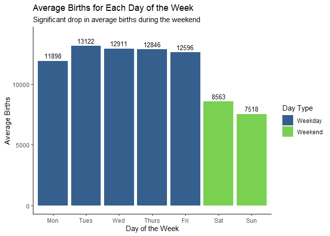
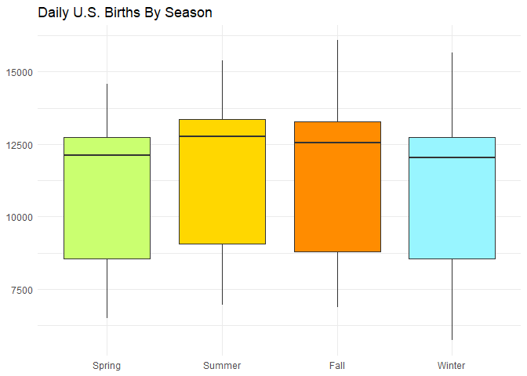
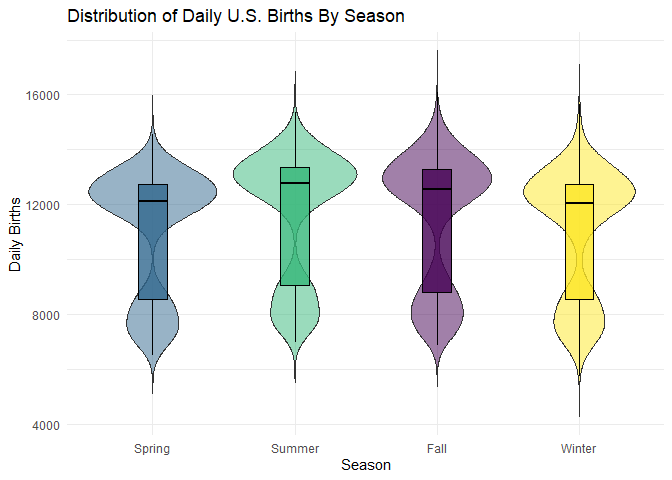

# Data Visualization Project 01


## Data Exploration


``` r
# Reading in the data
usbirths <- read_csv(here("data", "us_births_00_14.csv"))
```

```
## Rows: 5479 Columns: 6
## ── Column specification ────────────────────────────────────────────────────────
## Delimiter: ","
## chr  (1): day_of_week
## dbl  (4): year, month, date_of_month, births
## date (1): date
## 
## ℹ Use `spec()` to retrieve the full column specification for this data.
## ℹ Specify the column types or set `show_col_types = FALSE` to quiet this message.
```

``` r
glimpse(usbirths)
```

```
## Rows: 5,479
## Columns: 6
## $ year          <dbl> 2000, 2000, 2000, 2000, 2000, 2000, 2000, 2000, 2000, 20…
## $ month         <dbl> 1, 1, 1, 1, 1, 1, 1, 1, 1, 1, 1, 1, 1, 1, 1, 1, 1, 1, 1,…
## $ date_of_month <dbl> 1, 2, 3, 4, 5, 6, 7, 8, 9, 10, 11, 12, 13, 14, 15, 16, 1…
## $ date          <date> 2000-01-01, 2000-01-02, 2000-01-03, 2000-01-04, 2000-01…
## $ day_of_week   <chr> "Sat", "Sun", "Mon", "Tues", "Wed", "Thurs", "Fri", "Sat…
## $ births        <dbl> 9083, 8006, 11363, 13032, 12558, 12466, 12516, 8934, 794…
```

``` r
# Checking for missing values
sum(is.na(usbirths))
```

```
## [1] 0
```

``` r
# Summary stats
summary(usbirths)
```

```
##       year          month        date_of_month        date           
##  Min.   :2000   Min.   : 1.000   Min.   : 1.00   Min.   :2000-01-01  
##  1st Qu.:2003   1st Qu.: 4.000   1st Qu.: 8.00   1st Qu.:2003-10-01  
##  Median :2007   Median : 7.000   Median :16.00   Median :2007-07-02  
##  Mean   :2007   Mean   : 6.523   Mean   :15.73   Mean   :2007-07-02  
##  3rd Qu.:2011   3rd Qu.:10.000   3rd Qu.:23.00   3rd Qu.:2011-04-01  
##  Max.   :2014   Max.   :12.000   Max.   :31.00   Max.   :2014-12-31  
##  day_of_week            births     
##  Length:5479        Min.   : 5728  
##  Class :character   1st Qu.: 8740  
##  Mode  :character   Median :12343  
##                     Mean   :11350  
##                     3rd Qu.:13082  
##                     Max.   :16081
```

This dataset contains 6 columns with a total of 5,479 observations. There are no missing values. The minimum number of births in a single day is 5728, the maximum is 16081, and the median is 12343. Given that the data is tidy, no cleaning procedures are necessary.

## Summarize the Data

In order to prepare for the visualizations, three new dataframes are required for analysis of births by day of the week, days in December, and meteorological season.


``` r
# Avg births by day of week
dayweekbirths <- usbirths %>%
  group_by(day_of_week) %>%
  summarize(avg_births = mean(births, na.rm = TRUE)) %>%
  mutate(day_type = ifelse(day_of_week %in% c("Sat", "Sun"), "Weekend", "Weekday"))

# Avg births by day in Dec 1 - Jan 5 with holidays highlighted
winterholbirths <- usbirths %>%
  filter(month == 12 | (month == 1 & date_of_month <= 5)) %>%
  group_by(month, date_of_month) %>%
  summarize(avg_births = mean(births, na.rm = TRUE), .groups = 'drop') %>%
  mutate(avg_births = round(avg_births, 0))

winter_mean <- mean(winterholbirths$avg_births)

winterholbirths <- winterholbirths %>%
  mutate(
    period_diff = round(avg_births - winter_mean, 0),
    date_label = paste(ifelse(month == 12, "Dec", "Jan"), date_of_month),
    is_holiday = ifelse(
      (month == 12 & date_of_month %in% c(24,25,31)) | (month == 1 & date_of_month == 1), "Holiday", "Regular Day"
    ),
    holiday_name = case_when(
      month == 12 & date_of_month == 24 ~ "Christmas Eve",
      month == 12 & date_of_month == 25 ~ "Christmas Day",
      month == 12 & date_of_month == 31 ~ "New Year's Eve",
      month == 1  & date_of_month == 1  ~ "New Year's Day",
      TRUE ~ "Regular Day"
    )
  )

# Fixing order of Dec to Jan
order_levels <- c(paste("Dec", 1:31), paste("Jan", 1:5))
winterholbirths$date_label <- factor(winterholbirths$date_label, levels = order_levels)

# Total births per meteorological season
seasonbirths <- usbirths %>%
  mutate(
    season = case_when(
      month %in% c(3,4,5) ~ "Spring",
      month %in% c(6,7,8) ~ "Summer",
      month %in% c(9,10,11) ~ "Fall",
      month %in% c(12,1,2) ~ "Winter"
    )
  )
```

## Visualizations

### Visualization 1: Births by Day of the Week


``` r
ggplot(dayweekbirths, aes(x = factor(day_of_week, levels = c("Mon", "Tues", "Wed", "Thurs", "Fri", "Sat", "Sun")), y = avg_births, fill = day_type)) +
  geom_col() +
  geom_text(aes(label = round(avg_births, 0)), vjust = -0.5, size = 3.5) +
  scale_fill_viridis_d(begin = 0.3, end = 0.8) +
  labs(
    title = "Average Births for Each Day of the Week",
    subtitle = "Significant drop in average births during the weekend",
    x = "Day of the Week",
    y = "Average Births",
    fill = "Day Type"
  ) +
  theme_classic() +
  expand_limits(y = 14000)
```



### Visualization 2: December Births (Interactive)


``` r
winter_plot <- ggplot(winterholbirths, aes(x = date_label, y = avg_births, fill = is_holiday, text = paste0(holiday_name, "<br>Births: ", avg_births, "<br>+/-: ", period_diff))) +
  geom_col() +
  geom_hline(yintercept = winter_mean, linetype = "dashed", color = "black", alpha = 0.7) +
  scale_fill_manual(values = c("Holiday" = "#35608d", "Regular Day" = "grey80")) +
  labs(
    title = "Effect of Holidays on Daily Births",
    x = "Date",
    y = "Average Births",
    fill = "Day Type"
  ) +
  annotate("text", x = 4, y = 10700, label = "Period Average", size = 2.5, textface = "bold")+
  theme_classic() +
  theme(axis.text.x = element_text(angle = 45, hjust = 1, size = 7))
```

```
## Warning in annotate("text", x = 4, y = 10700, label = "Period Average", :
## Ignoring unknown parameters: `textface`
```

``` r
ggplotly(winter_plot, tooltip = "text")
```

```{=html}
<div class="plotly html-widget html-fill-item" id="htmlwidget-5207f2371ce3fbac5839" style="width:960px;height:576px;"></div>
<script type="application/json" data-for="htmlwidget-5207f2371ce3fbac5839">{"x":{"data":[{"orientation":"v","width":[0.90000000000000213,0.89999999999999858,0.89999999999999858,0.89999999999999858],"base":[0,0,0,0],"x":[32,24,25,31],"y":[7735,8034,6438,10549],"text":["New Year's Day<br>Births: 7735<br>+/-: -3308","Christmas Eve<br>Births: 8034<br>+/-: -3009","Christmas Day<br>Births: 6438<br>+/-: -4605","New Year's Eve<br>Births: 10549<br>+/-: -494"],"type":"bar","textposition":"none","marker":{"autocolorscale":false,"color":"rgba(53,96,141,1)","line":{"width":1.8897637795275593,"color":"transparent"}},"name":"Holiday","legendgroup":"Holiday","showlegend":true,"xaxis":"x","yaxis":"y","hoverinfo":"text","frame":null},{"orientation":"v","width":[0.90000000000000568,0.90000000000000568,0.90000000000000568,0.90000000000000568,0.89999999999999991,0.90000000000000013,0.90000000000000036,0.90000000000000036,0.90000000000000036,0.90000000000000036,0.90000000000000036,0.89999999999999947,0.89999999999999858,0.89999999999999858,0.89999999999999858,0.89999999999999858,0.89999999999999858,0.89999999999999858,0.89999999999999858,0.89999999999999858,0.89999999999999858,0.89999999999999858,0.89999999999999858,0.89999999999999858,0.89999999999999858,0.89999999999999858,0.89999999999999858,0.89999999999999858,0.89999999999999858,0.89999999999999858,0.89999999999999858,0.89999999999999858],"base":[0,0,0,0,0,0,0,0,0,0,0,0,0,0,0,0,0,0,0,0,0,0,0,0,0,0,0,0,0,0,0,0],"x":[33,34,35,36,1,2,3,4,5,6,7,8,9,10,11,12,13,14,15,16,17,18,19,20,21,22,23,26,27,28,29,30],"y":[9606,11341,11444,11112,11350,11248,11406,11322,11580,11303,10970,10963,10888,11229,11252,11970,11253,11193,11243,11350,11749,12061,12446,12440,11976,11477,10367,9874,12189,12193,12068,11918],"text":["Regular Day<br>Births: 9606<br>+/-: -1437","Regular Day<br>Births: 11341<br>+/-: 298","Regular Day<br>Births: 11444<br>+/-: 401","Regular Day<br>Births: 11112<br>+/-: 69","Regular Day<br>Births: 11350<br>+/-: 307","Regular Day<br>Births: 11248<br>+/-: 205","Regular Day<br>Births: 11406<br>+/-: 363","Regular Day<br>Births: 11322<br>+/-: 279","Regular Day<br>Births: 11580<br>+/-: 537","Regular Day<br>Births: 11303<br>+/-: 260","Regular Day<br>Births: 10970<br>+/-: -73","Regular Day<br>Births: 10963<br>+/-: -80","Regular Day<br>Births: 10888<br>+/-: -155","Regular Day<br>Births: 11229<br>+/-: 186","Regular Day<br>Births: 11252<br>+/-: 209","Regular Day<br>Births: 11970<br>+/-: 927","Regular Day<br>Births: 11253<br>+/-: 210","Regular Day<br>Births: 11193<br>+/-: 150","Regular Day<br>Births: 11243<br>+/-: 200","Regular Day<br>Births: 11350<br>+/-: 307","Regular Day<br>Births: 11749<br>+/-: 706","Regular Day<br>Births: 12061<br>+/-: 1018","Regular Day<br>Births: 12446<br>+/-: 1403","Regular Day<br>Births: 12440<br>+/-: 1397","Regular Day<br>Births: 11976<br>+/-: 933","Regular Day<br>Births: 11477<br>+/-: 434","Regular Day<br>Births: 10367<br>+/-: -676","Regular Day<br>Births: 9874<br>+/-: -1169","Regular Day<br>Births: 12189<br>+/-: 1146","Regular Day<br>Births: 12193<br>+/-: 1150","Regular Day<br>Births: 12068<br>+/-: 1025","Regular Day<br>Births: 11918<br>+/-: 875"],"type":"bar","textposition":"none","marker":{"autocolorscale":false,"color":"rgba(204,204,204,1)","line":{"width":1.8897637795275593,"color":"transparent"}},"name":"Regular Day","legendgroup":"Regular Day","showlegend":true,"xaxis":"x","yaxis":"y","hoverinfo":"text","frame":null},{"x":[0.40000000000000002,36.600000000000001],"y":[11042.694444444445,11042.694444444445],"text":"","type":"scatter","mode":"lines","line":{"width":1.8897637795275593,"color":"rgba(0,0,0,0.7)","dash":"dash"},"hoveron":"points","showlegend":false,"xaxis":"x","yaxis":"y","hoverinfo":"text","frame":null},{"x":[4],"y":[10700],"text":"Period Average","hovertext":"","textfont":{"size":9.4488188976377963,"color":"rgba(0,0,0,1)"},"type":"scatter","mode":"text","hoveron":"points","showlegend":false,"xaxis":"x","yaxis":"y","hoverinfo":"text","frame":null}],"layout":{"margin":{"t":45.710806697108069,"r":7.3059360730593621,"b":45.888138937785151,"l":54.794520547945211},"plot_bgcolor":"rgba(255,255,255,1)","paper_bgcolor":"rgba(255,255,255,1)","font":{"color":"rgba(0,0,0,1)","family":"","size":14.611872146118724},"title":{"text":"Effect of Holidays on Daily Births","font":{"color":"rgba(0,0,0,1)","family":"","size":17.534246575342465},"x":0,"xref":"paper"},"xaxis":{"domain":[0,1],"automargin":true,"type":"linear","autorange":false,"range":[0.40000000000000002,36.600000000000001],"tickmode":"array","ticktext":["Dec 1","Dec 2","Dec 3","Dec 4","Dec 5","Dec 6","Dec 7","Dec 8","Dec 9","Dec 10","Dec 11","Dec 12","Dec 13","Dec 14","Dec 15","Dec 16","Dec 17","Dec 18","Dec 19","Dec 20","Dec 21","Dec 22","Dec 23","Dec 24","Dec 25","Dec 26","Dec 27","Dec 28","Dec 29","Dec 30","Dec 31","Jan 1","Jan 2","Jan 3","Jan 4","Jan 5"],"tickvals":[1,2,3,4,5,6,7,8,9,10,11,12,13,14,15,16,17,18,19,20,21,22,23,24,25.000000000000004,26,27,28,29,30,31,32,33,34,35,36],"categoryorder":"array","categoryarray":["Dec 1","Dec 2","Dec 3","Dec 4","Dec 5","Dec 6","Dec 7","Dec 8","Dec 9","Dec 10","Dec 11","Dec 12","Dec 13","Dec 14","Dec 15","Dec 16","Dec 17","Dec 18","Dec 19","Dec 20","Dec 21","Dec 22","Dec 23","Dec 24","Dec 25","Dec 26","Dec 27","Dec 28","Dec 29","Dec 30","Dec 31","Jan 1","Jan 2","Jan 3","Jan 4","Jan 5"],"nticks":null,"ticks":"outside","tickcolor":"rgba(51,51,51,1)","ticklen":3.6529680365296811,"tickwidth":0.66417600664176002,"showticklabels":true,"tickfont":{"color":"rgba(77,77,77,1)","family":"","size":9.2984640929846432},"tickangle":-45,"showline":true,"linecolor":"rgba(0,0,0,1)","linewidth":0.66417600664176002,"showgrid":false,"gridcolor":null,"gridwidth":0,"zeroline":false,"anchor":"y","title":{"text":"Date","font":{"color":"rgba(0,0,0,1)","family":"","size":14.611872146118724}},"hoverformat":".2f"},"yaxis":{"domain":[0,1],"automargin":true,"type":"linear","autorange":false,"range":[-622.30000000000007,13068.299999999999],"tickmode":"array","ticktext":["0","4000","8000","12000"],"tickvals":[0,4000,7999.9999999999991,12000],"categoryorder":"array","categoryarray":["0","4000","8000","12000"],"nticks":null,"ticks":"outside","tickcolor":"rgba(51,51,51,1)","ticklen":3.6529680365296811,"tickwidth":0.66417600664176002,"showticklabels":true,"tickfont":{"color":"rgba(77,77,77,1)","family":"","size":11.68949771689498},"tickangle":-0,"showline":true,"linecolor":"rgba(0,0,0,1)","linewidth":0.66417600664176002,"showgrid":false,"gridcolor":null,"gridwidth":0,"zeroline":false,"anchor":"x","title":{"text":"Average Births","font":{"color":"rgba(0,0,0,1)","family":"","size":14.611872146118724}},"hoverformat":".2f"},"shapes":[],"showlegend":true,"legend":{"bgcolor":"rgba(255,255,255,1)","bordercolor":"transparent","borderwidth":1.8897637795275593,"font":{"color":"rgba(0,0,0,1)","family":"","size":11.68949771689498},"title":{"text":"Day Type","font":{"color":"rgba(0,0,0,1)","family":"","size":14.611872146118724}}},"hovermode":"closest","barmode":"relative"},"config":{"doubleClick":"reset","modeBarButtonsToAdd":["hoverclosest","hovercompare"],"showSendToCloud":false},"source":"A","attrs":{"90d427f52468":{"x":{},"y":{},"fill":{},"text":{},"type":"bar"},"90d41e885af":{"yintercept":{}},"90d423d51203":{"x":{},"y":{}}},"cur_data":"90d427f52468","visdat":{"90d427f52468":["function (y) ","x"],"90d41e885af":["function (y) ","x"],"90d423d51203":["function (y) ","x"]},"highlight":{"on":"plotly_click","persistent":false,"dynamic":false,"selectize":false,"opacityDim":0.20000000000000001,"selected":{"opacity":1},"debounce":0},"shinyEvents":["plotly_hover","plotly_click","plotly_selected","plotly_relayout","plotly_brushed","plotly_brushing","plotly_clickannotation","plotly_doubleclick","plotly_deselect","plotly_afterplot","plotly_sunburstclick"],"base_url":"https://plot.ly"},"evals":[],"jsHooks":[]}</script>
```

By utilizing plotly for interactivity, the reader can explore the distinct drops in birth rates between December 1st and January 5th. Hovering over the specific holiday "valleys" reveals number of births, type of day or holiday, and a calculated field showing exactly how far that day deviates from the period average (e.g., Christmas Day showing a drop of 4,605 births). This allows the base chart to maintain a clean, highly accessible two-color design, while still providing the reader with complex summary statistics without additional clutter. This level of detail would be impossible on a static graph as the amount of information would be too overwhelming to parse.

### Visualization 3: Chart Redesign

#### Original Chart

In the original version of this chart, I removed necessary axis labels and used manual colors that are not colorblind friendly. It is also a very simple visualization that unintentionally hides underlying information.


``` r
ggplot(seasonbirths, aes(x = factor(season, levels = c("Spring", "Summer", "Fall", "Winter")), y = births, fill = season)) +
  geom_boxplot() +
  scale_fill_manual(values = c("Spring" = "darkolivegreen1", 
                               "Summer" = "gold1", 
                               "Fall" = "darkorange", 
                               "Winter" = "cadetblue1")) +
  labs(
    title = "Daily U.S. Births By Season",
    x = NULL,
    y = NULL
  ) +
  theme_minimal() +
  theme(legend.position = "none")
```



#### Redesigned Chart

In this redesigned version, I restored the axis labels for clarity. To increase the complexity and better communicate the story of the data, I upgraded the chart to a Violin plot overlaid with a Boxplot. This shows the density and distribution of births much better. Finally, to meet **Accessibility** standards, I applied the `scale_fill_viridis_d()` colorblind-safe palette, and added descriptive `fig.alt` text to the code chunk.


``` r
ggplot(seasonbirths, aes(x = factor(season, levels = c("Spring", "Summer", "Fall", "Winter")), y = births, fill = season)) +
  geom_violin(alpha = 0.5, trim = FALSE) + 
  geom_boxplot(width = 0.2, color = "black", alpha = 0.8, outlier.shape = NA) +
  scale_fill_viridis_d() + 
  labs(
    title = "Distribution of Daily U.S. Births By Season",
    x = "Season",
    y = "Daily Births"
  ) +
  theme_minimal() +
  theme(legend.position = "none")
```



Compared to the plain boxplots, this visualization is significantly more descriptive. In the original graph, there was no indication that the data is had a bimodal distribution, resulting from the daily birth disparities between weekdays and weekends. This sort of data benefits significantly from this multilayered plot so that you can see how the frequency informs the distribution. From the original graph, there is no way to know that there are large dead zones in the distribution. Wildly different datasets can produce the same boxplots, so the extra level of analysis is important.

## Discussion

### Visualization 1

First, I began with looking at the average number of births for each day of the week to figure out which days had the least and most. I created a bar graph for this visualization with the day of the week as the x-axis and the average number of births as the y-axis. To add complexity to this chart, I mapped a colorblind-safe Viridis fill to differentiate weekdays from weekends, and added text annotations above each bar to display the exact summary statistics. This visualization effectively shows the variation in average births based on the day of the week, particularly between weekdays and weekends. The day of the week with the highest number of births is Tuesday with approximately 12,846 births, while the least is Sunday with 7,518. The weekdays are generally pretty consistent with their birth rates, while the weekends drop considerably. This could be due to scheduled births such as inductions and C-sections which are often scheduled during the week.

### Visualization 2

This visualization tracks the daily average births from December 1st through January 5th, explicitly highlighting the impact of major winter holidays. During this 36-day period, the average number of daily births holds steady at approximately 11,000 (represented by the dashed line). However, in the highlighted holiday bars, birth totals plummet significantly below the period average. For instance, Christmas Day routinely experiences the lowest volume of the season, dropping 4,605 births below the baseline. This drop reflects the logistics of modern maternity care and its reliance on scheduled procedures, such as elective C-sections and planned inductions. Similarly to the last example, hospitals and expecting parents actively avoid scheduling these procedures on major holidays due to reduced staffing levels and personal holiday plans. This time, I extended the analysis through the first week of January, highlighting the post-holiday rebound effect. Immediately following the holidays, regular days see a spike above the period average as delayed procedures are finally performed.

### Visualization 3

In the final visualization, I compared the birth rates by season to analyze the summer baby boom. I created four violin and box plots, one for each season, showing the distribution of birth rates. In the plots, you can see that summer has the highest median number of births with fall close behind. Conversely, spring and winter have very similar but lower medians. Interestingly, while summer has the highest median, winter has the largest range. This phenomenon has been linked to increased time indoors in the fall and winter months leading to more conceptions along with increased male fertility in colder months. I color-coded each plot using a colorblind-safe Viridis palette and restored the X and Y axis labels to increase the visual appeal, clarity, and accessibility of the plot.
