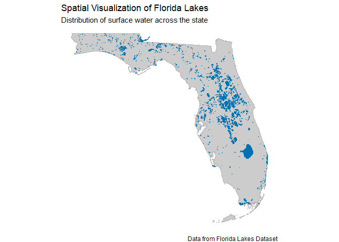
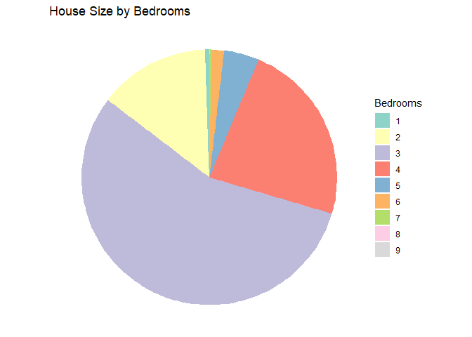
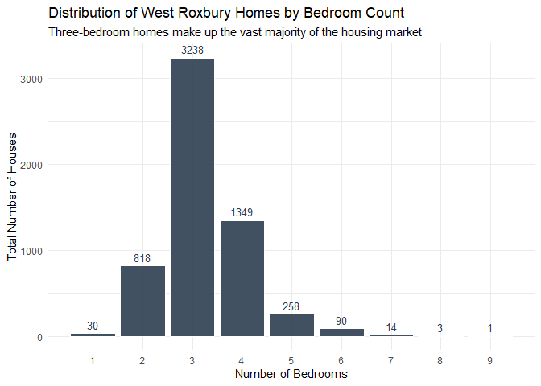

# Data Visualization Project 02


## Data Exploration

### Summer Hits

``` r
glimpse(summerhits)
```

```
## Rows: 600
## Columns: 22
## $ danceability     <dbl> 0.518, 0.543, 0.541, 0.408, 0.554, 0.679, 0.663, 0.68…
## $ energy           <dbl> 0.060, 0.332, 0.676, 0.397, 0.189, 0.279, 0.619, 0.55…
## $ key              <chr> "A#", "C", "C", "A", "E", "G", "F#", "B", "C", "G", "…
## $ loudness         <dbl> -14.887, -11.573, -7.988, -12.536, -14.277, -10.386, …
## $ mode             <chr> "major", "major", "major", "major", "major", "major",…
## $ speechiness      <dbl> 0.0441, 0.0317, 0.1350, 0.0300, 0.0279, 0.0384, 0.033…
## $ acousticness     <dbl> 0.9870, 0.6690, 0.1880, 0.8730, 0.9150, 0.6450, 0.336…
## $ instrumentalness <dbl> 7.87e-06, 0.00e+00, 8.03e-01, 0.00e+00, 1.37e-05, 0.0…
## $ liveness         <dbl> 0.1610, 0.1340, 0.1230, 0.2800, 0.1320, 0.1180, 0.062…
## $ valence          <dbl> 0.336, 0.795, 0.911, 0.697, 0.214, 0.854, 0.979, 0.86…
## $ tempo            <dbl> 127.870, 154.999, 76.231, 72.615, 136.714, 117.287, 1…
## $ track_uri        <chr> "006Ndmw2hHxvnLbJsBFnPx", "5ayybTSXNwcarDtxQKqvWX", "…
## $ duration_ms      <dbl> 216373, 153933, 128360, 162773, 165293, 161253, 15060…
## $ time_signature   <dbl> 4, 4, 4, 4, 3, 3, 4, 4, 4, 4, 3, 4, 4, 4, 4, 4, 4, 3,…
## $ key_mode         <chr> "A# major", "C major", "C major", "A major", "E major…
## $ playlist_name    <chr> "summer_hits_1958", "summer_hits_1958", "summer_hits_…
## $ playlist_img     <chr> "https://mosaic.scdn.co/640/5e8c49f7a8d161c1d6510999b…
## $ track_name       <chr> "Nel blu dipinto di blu", "Poor Little Fool", "Patric…
## $ artist_name      <chr> "Domenico Modugno", "Ricky Nelson", "Pérez Prado", "T…
## $ album_name       <chr> "Tutto Modugno (Mister Volare)", "Ricky Nelson (Expan…
## $ album_img        <chr> "https://i.scdn.co/image/5e8c49f7a8d161c1d6510999bd86…
## $ year             <dbl> 1958, 1958, 1958, 1958, 1958, 1958, 1958, 1958, 1958,…
```

``` r
# Checking for missing values
sum(is.na(summerhits))
```

```
## [1] 0
```

``` r
# Summary
summary(summerhits)
```

```
##   danceability        energy           key               loudness      
##  Min.   :0.2170   Min.   :0.0600   Length:600         Min.   :-23.574  
##  1st Qu.:0.5457   1st Qu.:0.4768   Class :character   1st Qu.:-10.947  
##  Median :0.6480   Median :0.6405   Mode  :character   Median : -8.072  
##  Mean   :0.6407   Mean   :0.6221                      Mean   : -8.587  
##  3rd Qu.:0.7402   3rd Qu.:0.7830                      3rd Qu.: -5.862  
##  Max.   :0.9800   Max.   :0.9890                      Max.   : -1.097  
##      mode            speechiness       acousticness       instrumentalness   
##  Length:600         Min.   :0.02330   Min.   :0.0000488   Min.   :0.0000000  
##  Class :character   1st Qu.:0.03280   1st Qu.:0.0417250   1st Qu.:0.0000000  
##  Mode  :character   Median :0.04140   Median :0.1620000   Median :0.0000032  
##                     Mean   :0.06866   Mean   :0.2665156   Mean   :0.0364316  
##                     3rd Qu.:0.06990   3rd Qu.:0.4472500   3rd Qu.:0.0007132  
##                     Max.   :0.51700   Max.   :0.9870000   Max.   :0.9540000  
##     liveness          valence           tempo         track_uri        
##  Min.   :0.02480   Min.   :0.0695   Min.   : 62.83   Length:600        
##  1st Qu.:0.08595   1st Qu.:0.4790   1st Qu.:100.22   Class :character  
##  Median :0.12400   Median :0.6900   Median :120.01   Mode  :character  
##  Mean   :0.17979   Mean   :0.6488   Mean   :120.48                     
##  3rd Qu.:0.22275   3rd Qu.:0.8482   3rd Qu.:133.84                     
##  Max.   :0.98900   Max.   :0.9860   Max.   :210.75                     
##   duration_ms     time_signature    key_mode         playlist_name     
##  Min.   :103386   Min.   :3.000   Length:600         Length:600        
##  1st Qu.:192887   1st Qu.:4.000   Class :character   Class :character  
##  Median :226927   Median :4.000   Mode  :character   Mode  :character  
##  Mean   :229434   Mean   :3.972                                        
##  3rd Qu.:257854   3rd Qu.:4.000                                        
##  Max.   :557293   Max.   :5.000                                        
##  playlist_img        track_name        artist_name         album_name       
##  Length:600         Length:600         Length:600         Length:600        
##  Class :character   Class :character   Class :character   Class :character  
##  Mode  :character   Mode  :character   Mode  :character   Mode  :character  
##                                                                             
##                                                                             
##                                                                             
##   album_img              year     
##  Length:600         Min.   :1958  
##  Class :character   1st Qu.:1973  
##  Mode  :character   Median :1988  
##                     Mean   :1988  
##                     3rd Qu.:2002  
##                     Max.   :2017
```
The "all_billboard_summer_hits.csv" dataset has 600 rows and 22 columns with zero NA values. The data is tidy, and thus does not need cleaning prior to summarizing. 

### Houses West Roxbury

``` r
glimpse(housewrox)
```

```
## Rows: 5,802
## Columns: 14
## $ `TOTAL VALUE` <dbl> 344.2, 412.6, 330.1, 498.6, 331.5, 337.4, 359.4, 320.4, …
## $ TAX           <dbl> 4330, 5190, 4152, 6272, 4170, 4244, 4521, 4030, 4195, 51…
## $ `LOT SQFT`    <dbl> 9965, 6590, 7500, 13773, 5000, 5142, 5000, 10000, 6835, …
## $ `YR BUILT`    <dbl> 1880, 1945, 1890, 1957, 1910, 1950, 1954, 1950, 1958, 19…
## $ `GROSS AREA`  <dbl> 2436, 3108, 2294, 5032, 2370, 2124, 3220, 2208, 2582, 48…
## $ `LIVING AREA` <dbl> 1352, 1976, 1371, 2608, 1438, 1060, 1916, 1200, 1092, 29…
## $ FLOORS        <dbl> 2.0, 2.0, 2.0, 1.0, 2.0, 1.0, 2.0, 1.0, 1.0, 2.0, 1.5, 1…
## $ ROOMS         <dbl> 6, 10, 8, 9, 7, 6, 7, 6, 5, 8, 6, 6, 6, 9, 6, 7, 7, 7, 7…
## $ BEDROOMS      <dbl> 3, 4, 4, 5, 3, 3, 3, 3, 3, 4, 3, 3, 3, 4, 3, 3, 3, 3, 3,…
## $ `FULL BATH`   <dbl> 1, 2, 1, 1, 2, 1, 1, 1, 1, 2, 2, 2, 1, 2, 1, 2, 1, 1, 1,…
## $ `HALF BATH`   <dbl> 1, 1, 1, 1, 0, 0, 1, 0, 0, 0, 0, 0, 0, 1, 1, 0, 1, 1, 0,…
## $ KITCHEN       <dbl> 1, 1, 1, 1, 1, 1, 1, 1, 1, 1, 1, 1, 1, 1, 1, 1, 1, 1, 1,…
## $ FIREPLACE     <dbl> 0, 0, 0, 1, 0, 1, 0, 0, 1, 0, 1, 1, 0, 1, 1, 0, 0, 1, 0,…
## $ REMODEL       <chr> "None", "Recent", "None", "None", "None", "Old", "None",…
```

``` r
# Checking for missing values
sum(is.na(housewrox)) 
```

```
## [1] 0
```

``` r
# Summary
summary(housewrox)
```

```
##   TOTAL VALUE          TAX           LOT SQFT        YR BUILT      GROSS AREA  
##  Min.   : 105.0   Min.   : 1320   Min.   :  997   Min.   :   0   Min.   : 821  
##  1st Qu.: 325.1   1st Qu.: 4090   1st Qu.: 4772   1st Qu.:1920   1st Qu.:2347  
##  Median : 375.9   Median : 4728   Median : 5683   Median :1935   Median :2700  
##  Mean   : 392.7   Mean   : 4939   Mean   : 6278   Mean   :1937   Mean   :2925  
##  3rd Qu.: 438.8   3rd Qu.: 5520   3rd Qu.: 7022   3rd Qu.:1955   3rd Qu.:3239  
##  Max.   :1217.8   Max.   :15319   Max.   :46411   Max.   :2011   Max.   :8154  
##   LIVING AREA       FLOORS          ROOMS           BEDROOMS      FULL BATH    
##  Min.   : 504   Min.   :1.000   Min.   : 3.000   Min.   :1.00   Min.   :1.000  
##  1st Qu.:1308   1st Qu.:1.000   1st Qu.: 6.000   1st Qu.:3.00   1st Qu.:1.000  
##  Median :1548   Median :2.000   Median : 7.000   Median :3.00   Median :1.000  
##  Mean   :1657   Mean   :1.684   Mean   : 6.995   Mean   :3.23   Mean   :1.297  
##  3rd Qu.:1874   3rd Qu.:2.000   3rd Qu.: 8.000   3rd Qu.:4.00   3rd Qu.:2.000  
##  Max.   :5289   Max.   :3.000   Max.   :14.000   Max.   :9.00   Max.   :5.000  
##    HALF BATH         KITCHEN        FIREPLACE        REMODEL         
##  Min.   :0.0000   Min.   :1.000   Min.   :0.0000   Length:5802       
##  1st Qu.:0.0000   1st Qu.:1.000   1st Qu.:0.0000   Class :character  
##  Median :1.0000   Median :1.000   Median :1.0000   Mode  :character  
##  Mean   :0.6139   Mean   :1.015   Mean   :0.7399                     
##  3rd Qu.:1.0000   3rd Qu.:1.000   3rd Qu.:1.0000                     
##  Max.   :3.0000   Max.   :2.000   Max.   :4.0000
```
The "WestRoxbury.csv" dataset has 5802 rows and 14 columns with zero NA values. The data is tidy, and thus does not need cleaning prior to summarizing. 

## Summarize the Data

### Summer Hits

``` r
# Creating decade variable
summerhits <- summerhits %>%
  mutate(decade = (floor(year/10)*10))

# Grouping by decade and finding total songs, average valence, and average energy
summertrends <- summerhits %>%
  group_by(decade) %>%
  summarize(
    total_songs = n(),
    avg_valence = mean(valence, na.rm = TRUE),
    avg_energy = mean(energy, na.rm = TRUE)
  )

summertrends
```

```
## # A tibble: 7 × 4
##   decade total_songs avg_valence avg_energy
##    <dbl>       <int>       <dbl>      <dbl>
## 1   1950          20       0.765      0.487
## 2   1960         100       0.711      0.546
## 3   1970         100       0.683      0.543
## 4   1980         100       0.646      0.653
## 5   1990         100       0.610      0.626
## 6   2000         100       0.622      0.696
## 7   2010          80       0.585      0.715
```
### Houses West Roxbury

``` r
# Removing houses with no build year
housewrox <- housewrox %>%
  filter(`YR BUILT` != 0)

# Grouping by bedrooms to find total number of houses, average total value, average living area, and average lot sqft
housingmodelsummary <- housewrox %>%
  group_by(BEDROOMS) %>%
  summarize(
    total_houses = n(),
    avg_total_value = mean(`TOTAL VALUE`, na.rm = TRUE),
    avg_living_area = mean(`LIVING AREA`, na.rm = TRUE),
    avg_lot_sqft = mean(`LOT SQFT`, na.rm = TRUE)
  )

housingmodelsummary
```

```
## # A tibble: 9 × 5
##   BEDROOMS total_houses avg_total_value avg_living_area avg_lot_sqft
##      <dbl>        <int>           <dbl>           <dbl>        <dbl>
## 1        1           30            274.           1013.        5716.
## 2        2          818            318.           1198.        5683.
## 3        3         3238            375.           1540.        5999.
## 4        4         1349            443.           1979.        6651.
## 5        5          258            523.           2483.        8404.
## 6        6           90            571.           2739.        9224.
## 7        7           14            625.           2988.       10171.
## 8        8            3            725.           4146.       11827.
## 9        9            1            935.           5289        25200
```

``` r
# Creating BATHROOMS variable to combine full and half baths, changing unit of living area and lot sqft to 100 ft
unithousewrox <- housewrox %>%
  mutate(
    BATHROOMS = `FULL BATH` + 0.5*`HALF BATH`,
    living_area_100 = `LIVING AREA`/100,
    lot_sqft_100 = `LOT SQFT`/100
  )
```
## Visualizations

### Interactive Plot

``` r
cb_palette <- c("#E69F00", "#56B4E9", "#009E73", "#F0E442", "#0072B2", "#D55E00", "#CC79A7") # Color-blind friendly categorical palette

intplot <- plot_ly(summerhits, x = ~valence, y = ~energy, 
                   size = ~tempo, sizes = c(5,25),
                   color = ~as.factor(decade),
                   colors = cb_palette,
                   text = ~paste("Song:", track_name, "<br>Artist:", artist_name, "<br>Year:", year),
          hoverinfo = "text",
          type = 'scatter', mode = 'markers',
          marker = list(opacity = 0.6, sizemode = 'diameter')) %>%
    layout(title = "Mood vs. Energy in Summer Hits Across Decades",
           xaxis = list(title = "Valence (Happiness)"),
           yaxis = list(title = "Energy"))
intplot
```

```
## Warning: `line.width` does not currently support multiple values.
## Warning: `line.width` does not currently support multiple values.
## Warning: `line.width` does not currently support multiple values.
## Warning: `line.width` does not currently support multiple values.
## Warning: `line.width` does not currently support multiple values.
## Warning: `line.width` does not currently support multiple values.
## Warning: `line.width` does not currently support multiple values.
```

```{=html}
<div class="plotly html-widget html-fill-item" id="htmlwidget-472229df3c46b0834094" style="width:672px;height:480px;"></div>
<script type="application/json" data-for="htmlwidget-472229df3c46b0834094">{"x":{"visdat":{"8240ae824c5":["function () ","plotlyVisDat"]},"cur_data":"8240ae824c5","attrs":{"8240ae824c5":{"x":{},"y":{},"text":{},"hoverinfo":"text","mode":"markers","marker":{"opacity":0.59999999999999998,"sizemode":"diameter"},"color":{},"size":{},"colors":["#E69F00","#56B4E9","#009E73","#F0E442","#0072B2","#D55E00","#CC79A7"],"alpha_stroke":1,"sizes":[5,25],"spans":[1,20],"type":"scatter"}},"layout":{"margin":{"b":40,"l":60,"t":25,"r":10},"title":"Mood vs. Energy in Summer Hits Across Decades","xaxis":{"domain":[0,1],"automargin":true,"title":"Valence (Happiness)"},"yaxis":{"domain":[0,1],"automargin":true,"title":"Energy"},"hovermode":"closest","showlegend":true},"source":"A","config":{"modeBarButtonsToAdd":["hoverclosest","hovercompare"],"showSendToCloud":false},"data":[{"x":[0.33600000000000002,0.79500000000000004,0.91100000000000003,0.69699999999999995,0.214,0.85399999999999998,0.97899999999999998,0.86699999999999999,0.96499999999999997,0.873,0.84799999999999998,0.92100000000000004,0.622,0.95999999999999996,0.32400000000000001,0.88900000000000001,0.85899999999999999,0.47899999999999998,0.96399999999999997,0.94699999999999995],"y":[0.059999999999999998,0.33200000000000002,0.67600000000000005,0.39700000000000002,0.189,0.27900000000000003,0.61899999999999999,0.55600000000000005,0.94299999999999995,0.434,0.45600000000000002,0.753,0.12,0.93400000000000005,0.32700000000000001,0.44900000000000001,0.57199999999999995,0.28100000000000003,0.60699999999999998,0.752],"text":["Song: Nel blu dipinto di blu <br>Artist: Domenico Modugno <br>Year: 1958","Song: Poor Little Fool <br>Artist: Ricky Nelson <br>Year: 1958","Song: Patricia <br>Artist: Pérez Prado <br>Year: 1958","Song: Little Star <br>Artist: The Elegants <br>Year: 1958","Song: My True Love <br>Artist: Jack Scott <br>Year: 1958","Song: Just A Dream <br>Artist: Jimmy Clanton <br>Year: 1958","Song: When (Originally Performed By The Kalin Twins) [Full Vocal Version] <br>Artist: Paris Music <br>Year: 1958","Song: Bird Dog <br>Artist: The Everly Brothers <br>Year: 1958","Song: Splish Splash <br>Artist: Bobby Darin <br>Year: 1958","Song: Rebel Rouser <br>Artist: Duane Eddy <br>Year: 1958","Song: Lonely Boy <br>Artist: Paul Anka <br>Year: 1959","Song: The Battle Of New Orleans <br>Artist: Johnny Horton <br>Year: 1959","Song: My Heart Is An Open Book <br>Artist: Carl Dobkins <br>Year: 1959","Song: A Big Hunk O' Love <br>Artist: Elvis Presley <br>Year: 1959","Song: The Three Bells (Les Trois Cloches) <br>Artist: The Browns <br>Year: 1959","Song: Personality <br>Artist: Lloyd Price <br>Year: 1959","Song: There Goes My Baby <br>Artist: The Drifters <br>Year: 1959","Song: Lavender Blue <br>Artist: Sammy Turner <br>Year: 1959","Song: Waterloo <br>Artist: Stonewall Jackson <br>Year: 1959","Song: Tiger <br>Artist: Fabian <br>Year: 1959"],"hoverinfo":["text","text","text","text","text","text","text","text","text","text","text","text","text","text","text","text","text","text","text","text"],"mode":"markers","marker":{"color":"rgba(230,159,0,1)","size":[13.794018428755891,17.462057449584574,6.8120483230913793,6.3231387024154779,14.989791848351485,12.363119502977941,21.540721060566113,15.809824162897762,16.484373415539373,24.400085180603156,10.741037445663565,20.458656985823513,13.883525665726976,8.2755322097606161,10.87800244725225,13.937202966448307,14.068083639239862,12.001169543202115,24.06706958444034,19.180407109200182],"sizemode":"diameter","opacity":0.59999999999999998,"line":{"color":"rgba(230,159,0,1)"}},"type":"scatter","name":"1950","textfont":{"color":"rgba(230,159,0,1)","size":[13.794018428755891,17.462057449584574,6.8120483230913793,6.3231387024154779,14.989791848351485,12.363119502977941,21.540721060566113,15.809824162897762,16.484373415539373,24.400085180603156,10.741037445663565,20.458656985823513,13.883525665726976,8.2755322097606161,10.87800244725225,13.937202966448307,14.068083639239862,12.001169543202115,24.06706958444034,19.180407109200182]},"error_y":{"color":"rgba(230,159,0,1)","width":[]},"error_x":{"color":"rgba(230,159,0,1)","width":[]},"line":{"color":"rgba(230,159,0,1)"},"xaxis":"x","yaxis":"y","frame":null},{"x":[0.30299999999999999,0.753,0.78100000000000003,0.88600000000000001,0.96799999999999997,0.93400000000000005,0.95499999999999996,0.86599999999999999,0.54500000000000004,0.84799999999999998,0.96499999999999997,0.89800000000000002,0.90200000000000002,0.81299999999999994,0.64800000000000002,0.73999999999999999,0.91800000000000004,0.68500000000000005,0.61799999999999999,0.85899999999999999,0.53400000000000003,0.55700000000000005,0.56399999999999995,0.96599999999999997,0.88700000000000001,0.875,0.58199999999999996,0.874,0.89600000000000002,0.53300000000000003,0.33500000000000002,0.94199999999999995,0.84599999999999997,0.41899999999999998,0.40400000000000003,0.72599999999999998,0.55700000000000005,0.96399999999999997,0.71499999999999997,0.874,0.83299999999999996,0.51400000000000001,0.39900000000000002,0.79700000000000004,0.28000000000000003,0.63900000000000001,0.77800000000000002,0.94299999999999995,0.72799999999999998,0.68000000000000005,0.90400000000000003,0.96399999999999997,0.61899999999999999,0.84599999999999997,0.96299999999999997,0.63900000000000001,0.61899999999999999,0.47899999999999998,0.52500000000000002,0.59099999999999997,0.67100000000000004,0.55900000000000005,0.56599999999999995,0.89500000000000002,0.80500000000000005,0.66100000000000003,0.52600000000000002,0.85199999999999998,0.627,0.80300000000000005,0.44,0.89800000000000002,0.56100000000000005,0.80200000000000005,0.89000000000000001,0.65300000000000002,0.435,0.64900000000000002,0.316,0.79500000000000004,0.246,0.96299999999999997,0.95999999999999996,0.92100000000000004,0.73299999999999998,0.92200000000000004,0.61699999999999999,0.71699999999999997,0.71299999999999997,0.53300000000000003,0.58099999999999996,0.96599999999999997,0.81699999999999995,0.161,0.58199999999999996,0.39600000000000002,0.86199999999999999,0.874,0.52700000000000002,0.89200000000000002],"y":[0.223,0.49099999999999999,0.64300000000000002,0.55900000000000005,0.40000000000000002,0.52900000000000003,0.86099999999999999,0.58199999999999996,0.59199999999999997,0.623,0.72199999999999998,0.83099999999999996,0.26200000000000001,0.54400000000000004,0.097900000000000001,0.39600000000000002,0.44600000000000001,0.72799999999999998,0.52200000000000002,0.56499999999999995,0.218,0.27600000000000002,0.46000000000000002,0.55300000000000005,0.89300000000000002,0.67500000000000004,0.28100000000000003,0.83099999999999996,0.54200000000000004,0.28100000000000003,0.90600000000000003,0.64700000000000002,0.39100000000000001,0.48399999999999999,0.35899999999999999,0.95499999999999996,0.0848,0.871,0.52000000000000002,0.73299999999999998,0.48099999999999998,0.625,0.48999999999999999,0.80500000000000005,0.58299999999999996,0.26200000000000001,0.22600000000000001,0.81699999999999995,0.38,0.47699999999999998,0.85299999999999998,0.71399999999999997,0.69599999999999995,0.73399999999999999,0.78400000000000003,0.46999999999999997,0.46400000000000002,0.377,0.70699999999999996,0.27200000000000002,0.85299999999999998,0.68100000000000005,0.39700000000000002,0.91100000000000003,0.68500000000000005,0.34699999999999998,0.49399999999999999,0.45900000000000002,0.67700000000000005,0.42199999999999999,0.72499999999999998,0.72199999999999998,0.78000000000000003,0.79200000000000004,0.60999999999999999,0.47999999999999998,0.66000000000000003,0.505,0.16700000000000001,0.26100000000000001,0.16700000000000001,0.55400000000000005,0.623,0.64800000000000002,0.44800000000000001,0.57099999999999995,0.51800000000000002,0.89100000000000001,0.72199999999999998,0.73699999999999999,0.60499999999999998,0.76800000000000002,0.313,0.187,0.37,0.41199999999999998,0.54100000000000004,0.44800000000000001,0.127,0.48599999999999999],"text":["Song: I'm Sorry <br>Artist: Brenda Lee <br>Year: 1960","Song: It's Now or Never <br>Artist: Elvis Presley <br>Year: 1960","Song: Everybody's Somebody's Fool <br>Artist: Connie Francis <br>Year: 1960","Song: Alley Oop <br>Artist: Hollywood Argyles <br>Year: 1960","Song: Itsy Bitsy Teenie Weenie Yellow Polka-Dot Bikini <br>Artist: Brian Hyland <br>Year: 1960","Song: Only the Lonely <br>Artist: Roy Orbison <br>Year: 1960","Song: Walk - Don't Run <br>Artist: The Ventures <br>Year: 1960","Song: Cathy's Clown <br>Artist: The Everly Brothers <br>Year: 1960","Song: Mule Skinner Blues <br>Artist: The Fendermen <br>Year: 1960","Song: Because They're Young <br>Artist: Duane Eddy <br>Year: 1960","Song: Tossin' And Turnin' <br>Artist: Bobby Lewis <br>Year: 1961","Song: Quarter To Three <br>Artist: Gary U.S. Bonds <br>Year: 1961","Song: The Boll Weevil Song <br>Artist: Brook Benton <br>Year: 1961","Song: I Like It Like That - Part 1 <br>Artist: Chris Kenner <br>Year: 1961","Song: Michael <br>Artist: Michael <br>Year: 1961","Song: Raindrops <br>Artist: Dee Clark <br>Year: 1961","Song: Wooden Heart <br>Artist: Joe Dowell <br>Year: 1961","Song: Moody River <br>Artist: Pat Boone <br>Year: 1961","Song: Dum Dum - Remastered <br>Artist: Brenda Lee <br>Year: 1961","Song: Last Night <br>Artist: The Mar-Keys <br>Year: 1961","Song: Roses Are Red (My Love) - Single Version <br>Artist: Bobby Vinton <br>Year: 1962","Song: I Can't Stop Loving You <br>Artist: Ray Anthony <br>Year: 1962","Song: The Stripper <br>Artist: David Rose <br>Year: 1962","Song: Breaking Up Is Hard to Do <br>Artist: Neil Sedaka <br>Year: 1962","Song: The Loco-Motion - Single Version <br>Artist: Little Eva <br>Year: 1962","Song: The Wah-Watusi <br>Artist: The Orlons <br>Year: 1962","Song: Sealed With A Kiss <br>Artist: Brian Hyland <br>Year: 1962","Song: Palisades Park <br>Artist: Freddy Cannon <br>Year: 1962","Song: Sheila <br>Artist: Tommy Roe <br>Year: 1962","Song: It Keeps Right on A-Hurtin' <br>Artist: Johnny Tillotson <br>Year: 1962","Song: Fingertips - Pt. 2 <br>Artist: Stevie Wonder <br>Year: 1963","Song: Surf City <br>Artist: Jan & Dean <br>Year: 1963","Song: Easier Said Than Done <br>Artist: The Essex <br>Year: 1963","Song: So Much In Love <br>Artist: The Tymes <br>Year: 1963","Song: Sukiyaki - Original Hit Version <br>Artist: Kyu Sakamoto <br>Year: 1963","Song: Wipe Out <br>Artist: The Surfaris <br>Year: 1963","Song: Blowin' In The Wind <br>Artist: Peter, Paul and Mary <br>Year: 1963","Song: My Boyfriend's Back <br>Artist: The Angels <br>Year: 1963","Song: Candy Girl <br>Artist: Frankie Valli & The Four Seasons <br>Year: 1963","Song: (You're The) Devil in Disguise <br>Artist: Elvis Presley <br>Year: 1963","Song: Where Did Our Love Go <br>Artist: The Supremes <br>Year: 1964","Song: I Get Around (Mono) <br>Artist: The Beach Boys <br>Year: 1964","Song: Everybody Loves Somebody <br>Artist: Dean Martin <br>Year: 1964","Song: A Hard Day's Night - Remastered <br>Artist: The Beatles <br>Year: 1964","Song: House Of The Rising Sun <br>Artist: The Animals <br>Year: 1964","Song: Memphis <br>Artist: Johnny Rivers <br>Year: 1964","Song: Under The Boardwalk <br>Artist: The Drifters <br>Year: 1964","Song: The Little Old Lady (From Pasadena) <br>Artist: Jan & Dean <br>Year: 1964","Song: Wishin' And Hopin' <br>Artist: Dusty Springfield <br>Year: 1964","Song: Rag Doll <br>Artist: Frankie Valli & The Four Seasons <br>Year: 1964","Song: (I Can't Get No) Satisfaction - Mono Version / Remastered 2002 <br>Artist: The Rolling Stones <br>Year: 1965","Song: I Can't Help Myself (Sugar Pie, Honey Bunch) <br>Artist: Four Tops <br>Year: 1965","Song: I Got You Babe <br>Artist: Sonny & Cher <br>Year: 1965","Song: Help! <br>Artist: The Beatles <br>Year: 1965","Song: I'm Henry VIII, I Am <br>Artist: Herman's Hermits <br>Year: 1965","Song: Mr. Tambourine Man <br>Artist: The Byrds <br>Year: 1965","Song: What's New Pussycat? <br>Artist: Tom Jones <br>Year: 1965","Song: Yes. I'm Ready <br>Artist: Barbara Mason <br>Year: 1965","Song: Cara, Mia <br>Artist: Jay & The Americans <br>Year: 1965","Song: Save Your Heart For Me <br>Artist: Gary Lewis & The Playboys <br>Year: 1965","Song: Wild Thing <br>Artist: The Troggs <br>Year: 1966","Song: Summer in the City - Remastered <br>Artist: The Lovin' Spoonful <br>Year: 1966","Song: Lil' Red Riding Hood <br>Artist: Sam The Sham & The Pharaohs <br>Year: 1966","Song: Hanky Panky - Single Version <br>Artist: Tommy James & The Shondells <br>Year: 1966","Song: Paperback Writer - Remastered <br>Artist: The Beatles <br>Year: 1966","Song: Sunny <br>Artist: Bobby Hebb <br>Year: 1966","Song: Strangers In The Night <br>Artist: Frank Sinatra <br>Year: 1966","Song: Red Rubber Ball <br>Artist: The Cyrkle <br>Year: 1966","Song: Sunshine Superman <br>Artist: Donovan <br>Year: 1966","Song: See You In September <br>Artist: The Happenings <br>Year: 1966","Song: Light My Fire <br>Artist: The Doors <br>Year: 1967","Song: Windy <br>Artist: The Association <br>Year: 1967","Song: Can't Take My Eyes Off You <br>Artist: Frankie Valli <br>Year: 1967","Song: Little Bit O' Soul - Original Hit Version <br>Artist: Music Explosion <br>Year: 1967","Song: I Was Made To Love Her <br>Artist: Stevie Wonder <br>Year: 1967","Song: All You Need Is Love - Remastered <br>Artist: The Beatles <br>Year: 1967","Song: A Whiter Shade Of Pale <br>Artist: Procol Harum <br>Year: 1967","Song: San Francisco (Be Sure to Wear Flowers In Your Hair) <br>Artist: Scott McKenzie <br>Year: 1967","Song: Ode to Billie Joe <br>Artist: Jimmy Smith <br>Year: 1967","Song: Baby, I Love You <br>Artist: Aretha Franklin <br>Year: 1967","Song: This Guy's In Love With You <br>Artist: Herb Alpert & The Tijuana Brass <br>Year: 1968","Song: Hello, I Love You <br>Artist: The Doors <br>Year: 1968","Song: People Got To Be Free - Single Version <br>Artist: The Rascals <br>Year: 1968","Song: Grazing In the Grass <br>Artist: Hugh Masekela <br>Year: 1968","Song: Stoned Soul Picnic <br>Artist: The 5th Dimension <br>Year: 1968","Song: The Horse <br>Artist: Cliff Nobles <br>Year: 1968","Song: Lady Willpower <br>Artist: Gary Puckett & The Union Gap <br>Year: 1968","Song: Jumpin' Jack Flash - Mono / Remastered <br>Artist: The Rolling Stones <br>Year: 1968","Song: Classical Gas <br>Artist: Mason Williams <br>Year: 1968","Song: Born To Be Wild <br>Artist: Steppenwolf <br>Year: 1968","Song: In the Year 2525 <br>Artist: Zager & Evans <br>Year: 1969","Song: Honky Tonk Women <br>Artist: The Rolling Stones <br>Year: 1969","Song: Crystal Blue Persuasion <br>Artist: Tommy James & The Shondells <br>Year: 1969","Song: Love Theme from \"Romeo and Juliet\" - Remastered <br>Artist: Henry Mancini <br>Year: 1969","Song: Spinning Wheel <br>Artist: Blood, Sweat & Tears <br>Year: 1969","Song: One - Single Version <br>Artist: Three Dog Night <br>Year: 1969","Song: Good Morning Starshine <br>Artist: Oliver <br>Year: 1969","Song: What Does It Take (To Win Your Love) <br>Artist: Alton Ellis <br>Year: 1969","Song: Sweet Caroline <br>Artist: Neil Diamond <br>Year: 1969","Song: A Boy Named Sue - Live at San Quentin State Prison, San Quentin, CA - February 1969 <br>Artist: Johnny Cash <br>Year: 1969"],"hoverinfo":["text","text","text","text","text","text","text","text","text","text","text","text","text","text","text","text","text","text","text","text","text","text","text","text","text","text","text","text","text","text","text","text","text","text","text","text","text","text","text","text","text","text","text","text","text","text","text","text","text","text","text","text","text","text","text","text","text","text","text","text","text","text","text","text","text","text","text","text","text","text","text","text","text","text","text","text","text","text","text","text","text","text","text","text","text","text","text","text","text","text","text","text","text","text","text","text","text","text","text","text"],"mode":"markers","marker":{"color":"rgba(86,180,233,1)","size":[10.257130495331968,13.595128480743099,7.9041177385225909,5.3232806700874109,13.023877610346064,13.172470440302593,17.452457730815773,12.704112330230327,13.930036979198356,12.806599468635284,15.804010248713837,18.809398259881966,15.418128595669309,15.963284455891994,11.043496190534137,12.96952427309172,7.9794282083003765,15.356744478471615,13.769545906260772,13.620682661691037,10.431007091623231,7.7122585704531463,9.2395603058389284,12.260091535346572,14.036580336801398,14.6344670465992,8.9235808303080688,7.609365810128379,14.016164033504371,10.195746378134274,15.283462118292872,16.499246219265686,14.663807032132016,6.734304121794743,16.24924790935702,18.148099323287433,17.467060119928881,14.773054535867116,13.568763055955543,13.123254980699159,14.736142941164539,16.020612353891604,7.4026338383326244,15.233165000236612,12.325261457129145,9.148024959268799,13.242237410509665,16.238025702908985,11.125431818335462,13.050243035133619,14.931382291899055,13.640693343068261,11.449253317649287,9.3344758350741266,10.147882991596866,12.775366580810026,21.450402579755412,19.915123613280059,13.771168393940007,10.803773635927286,23.885756586285922,11.440194428106896,12.982774589138799,13.557676056814111,17.7858789488984,13.875683641944009,7.3340837338849791,9.0524333935005856,14.458291926095685,13.940853563726582,13.354324267683426,14.487091082402094,13.231691240594643,14.319839644134367,23.930239790158257,10.490363099221884,16.760872357542201,11.803090839028942,13.293616187018745,8.8571940427660714,7.831105792957052,12.437213106996301,13.586340005813915,11.039575178642654,9.1683060552592259,14.864184260517439,13.110004664652079,15.076865353803719,17.531959627098246,16.237484873682575,13.42138709175844,12.668282393980572,9.9138391438673352,6.6222172646209803,9.5860966326620307,13.158814502335707,13.407595946484948,12.264823791077671,5,10.233874838596279],"sizemode":"diameter","opacity":0.59999999999999998,"line":{"color":"rgba(86,180,233,1)"}},"type":"scatter","name":"1960","textfont":{"color":"rgba(86,180,233,1)","size":[10.257130495331968,13.595128480743099,7.9041177385225909,5.3232806700874109,13.023877610346064,13.172470440302593,17.452457730815773,12.704112330230327,13.930036979198356,12.806599468635284,15.804010248713837,18.809398259881966,15.418128595669309,15.963284455891994,11.043496190534137,12.96952427309172,7.9794282083003765,15.356744478471615,13.769545906260772,13.620682661691037,10.431007091623231,7.7122585704531463,9.2395603058389284,12.260091535346572,14.036580336801398,14.6344670465992,8.9235808303080688,7.609365810128379,14.016164033504371,10.195746378134274,15.283462118292872,16.499246219265686,14.663807032132016,6.734304121794743,16.24924790935702,18.148099323287433,17.467060119928881,14.773054535867116,13.568763055955543,13.123254980699159,14.736142941164539,16.020612353891604,7.4026338383326244,15.233165000236612,12.325261457129145,9.148024959268799,13.242237410509665,16.238025702908985,11.125431818335462,13.050243035133619,14.931382291899055,13.640693343068261,11.449253317649287,9.3344758350741266,10.147882991596866,12.775366580810026,21.450402579755412,19.915123613280059,13.771168393940007,10.803773635927286,23.885756586285922,11.440194428106896,12.982774589138799,13.557676056814111,17.7858789488984,13.875683641944009,7.3340837338849791,9.0524333935005856,14.458291926095685,13.940853563726582,13.354324267683426,14.487091082402094,13.231691240594643,14.319839644134367,23.930239790158257,10.490363099221884,16.760872357542201,11.803090839028942,13.293616187018745,8.8571940427660714,7.831105792957052,12.437213106996301,13.586340005813915,11.039575178642654,9.1683060552592259,14.864184260517439,13.110004664652079,15.076865353803719,17.531959627098246,16.237484873682575,13.42138709175844,12.668282393980572,9.9138391438673352,6.6222172646209803,9.5860966326620307,13.158814502335707,13.407595946484948,12.264823791077671,5,10.233874838596279]},"error_y":{"color":"rgba(86,180,233,1)","width":[]},"error_x":{"color":"rgba(86,180,233,1)","width":[]},"line":{"color":"rgba(86,180,233,1)"},"xaxis":"x","yaxis":"y","frame":null},{"x":[0.20499999999999999,0.80400000000000005,0.47199999999999998,0.94899999999999995,0.76800000000000002,0.82399999999999995,0.95999999999999996,0.95899999999999996,0.871,0.97299999999999998,0.251,0.44500000000000001,0.97399999999999998,0.54600000000000004,0.93100000000000005,0.64700000000000002,0.82799999999999996,0.74299999999999999,0.20899999999999999,0.60099999999999998,0.55900000000000005,0.77200000000000002,0.42299999999999999,0.53100000000000003,0.90700000000000003,0.81499999999999995,0.443,0.79900000000000004,0.373,0.60499999999999998,0.876,0.89800000000000002,0.84999999999999998,0.50600000000000001,0.42099999999999999,0.20100000000000001,0.59999999999999998,0.60699999999999998,0.91700000000000004,0.36199999999999999,0.44700000000000001,0.58699999999999997,0.64300000000000002,0.80900000000000005,0.94299999999999995,0.96299999999999997,0.75700000000000001,0.88500000000000001,0.751,0.38,0.76500000000000001,0.91800000000000004,0.70399999999999996,0.69399999999999995,0.85399999999999998,0.56100000000000005,0.67900000000000005,0.20799999999999999,0.16600000000000001,0.70699999999999996,0.81499999999999995,0.65500000000000003,0.80800000000000005,0.96099999999999997,0.90400000000000003,0.93400000000000005,0.64400000000000002,0.82699999999999996,0.96099999999999997,0.59199999999999997,0.83099999999999996,0.96999999999999997,0.64300000000000002,0.876,0.16400000000000001,0.79700000000000004,0.45600000000000002,0.34200000000000003,0.29699999999999999,0.30299999999999999,0.95399999999999996,0.13600000000000001,0.871,0.96399999999999997,0.42099999999999999,0.91000000000000003,0.252,0.77400000000000002,0.89200000000000002,0.52200000000000002,0.96799999999999997,0.96799999999999997,0.80200000000000005,0.96499999999999997,0.89700000000000002,0.68400000000000005,0.92600000000000005,0.34499999999999997,0.51900000000000002,0.91200000000000003],"y":[0.24099999999999999,0.621,0.35599999999999998,0.70299999999999996,0.751,0.82699999999999996,0.622,0.45900000000000002,0.59499999999999997,0.44900000000000001,0.26400000000000001,0.28199999999999997,0.48799999999999999,0.42999999999999999,0.50700000000000001,0.58299999999999996,0.377,0.71899999999999997,0.38500000000000001,0.253,0.46400000000000002,0.76800000000000002,0.22,0.45100000000000001,0.72999999999999998,0.86799999999999999,0.503,0.39900000000000002,0.33400000000000002,0.439,0.79500000000000004,0.871,0.498,0.48699999999999999,0.52100000000000002,0.39800000000000002,0.56399999999999995,0.62,0.69299999999999995,0.39100000000000001,0.308,0.58899999999999997,0.23999999999999999,0.45000000000000001,0.65900000000000003,0.69099999999999995,0.54600000000000004,0.58099999999999996,0.42699999999999999,0.46300000000000002,0.60599999999999998,0.48599999999999999,0.57099999999999995,0.625,0.875,0.45300000000000001,0.435,0.52700000000000002,0.44700000000000001,0.40999999999999998,0.93000000000000005,0.376,0.439,0.72499999999999998,0.55300000000000005,0.71799999999999997,0.36899999999999999,0.33100000000000002,0.82499999999999996,0.55600000000000005,0.65600000000000003,0.71299999999999997,0.67700000000000005,0.58499999999999996,0.499,0.52700000000000002,0.48099999999999998,0.35299999999999998,0.20899999999999999,0.45100000000000001,0.59999999999999998,0.076600000000000001,0.372,0.52100000000000002,0.34899999999999998,0.52200000000000002,0.72199999999999998,0.82299999999999995,0.61499999999999999,0.76000000000000001,0.61099999999999999,0.55600000000000005,0.876,0.73499999999999999,0.69999999999999996,0.875,0.56200000000000006,0.51400000000000001,0.59799999999999998,0.63600000000000001],"text":["Song: (They Long To Be) Close To You <br>Artist: Carpenters <br>Year: 1970","Song: Mama Told Me (Not To Come) <br>Artist: Three Dog Night <br>Year: 1970","Song: Make It With You <br>Artist: Bread <br>Year: 1970","Song: The Love You Save <br>Artist: The Jackson 5 <br>Year: 1970","Song: War <br>Artist: Edwin Starr <br>Year: 1970","Song: Ball Of Confusion (That's What The World Is Today) <br>Artist: The Temptations <br>Year: 1970","Song: Band of Gold <br>Artist: Freeda Payne <br>Year: 1970","Song: Spill The Wine <br>Artist: Eric Burdon <br>Year: 1970","Song: Signed, Sealed, Delivered (I'm Yours) <br>Artist: Stevie Wonder <br>Year: 1970","Song: In the Summertime <br>Artist: Mungo Jerry <br>Year: 1970","Song: How Can You Mend A Broken Heart <br>Artist: Bee Gees <br>Year: 1971","Song: You've Got A Friend <br>Artist: James Taylor <br>Year: 1971","Song: Mr. Big Stuff <br>Artist: Jean Knight <br>Year: 1971","Song: Take Me Home, Country Roads <br>Artist: John Denver <br>Year: 1971","Song: Don't Pull Your Love <br>Artist: Hamilton <br>Year: 1971","Song: Draggin' The Line <br>Artist: Tommy James & The Shondells <br>Year: 1971","Song: Treat Her Like A Lady <br>Artist: Cornelius Brothers & Sister Rose <br>Year: 1971","Song: Signs <br>Artist: Five Man Electrical Band <br>Year: 1971","Song: Indian Reservation (The Lament of the Cherokee Reservation Indian) <br>Artist: Paul Revere & The Raiders <br>Year: 1971","Song: It's Too Late <br>Artist: The Hit Co., The Tribute Co. <br>Year: 1971","Song: Alone Again (Naturally) <br>Artist: Gilbert O'Sullivan <br>Year: 1972","Song: Brandy (You're a Fine Girl) <br>Artist: Looking Glass <br>Year: 1972","Song: Lean on Me <br>Artist: Bill Withers <br>Year: 1972","Song: (If Loving You Is Wrong) I Don't Want to Be Right <br>Artist: Luther Ingram <br>Year: 1972","Song: Too Late To Turn Back Now <br>Artist: Cornelius Brothers & Sister Rose <br>Year: 1972","Song: Long Cool Woman (In A Black Dress) - 1999 Remastered Version <br>Artist: The Hollies <br>Year: 1972","Song: Daddy Don't You Walk So Fast - Re-Recorded In Stereo <br>Artist: Wayne Newton <br>Year: 1972","Song: I'm Still in Love with You <br>Artist: Al Green <br>Year: 1972","Song: Song Sung Blue - Single Version <br>Artist: Neil Diamond <br>Year: 1972","Song: Where Is The Love <br>Artist: Roberta Flack <br>Year: 1972","Song: Bad, Bad Leroy Brown <br>Artist: Jim Croce <br>Year: 1973","Song: Will It Go Round In Circles <br>Artist: Billy Preston <br>Year: 1973","Song: Brother Louie <br>Artist: Stories <br>Year: 1973","Song: Touch Me In The Morning <br>Artist: Diana Ross <br>Year: 1973","Song: The Morning After - Single Version <br>Artist: Maureen McGovern <br>Year: 1973","Song: Live And Let Die <br>Artist: Wings <br>Year: 1973","Song: Give Me Love (Give Me Peace On Earth) <br>Artist: George Harrison <br>Year: 1973","Song: Let's Get It On <br>Artist: Marvin Gaye <br>Year: 1973","Song: Kodachrome <br>Artist: Paul Simon <br>Year: 1973","Song: Yesterday Once More <br>Artist: Carpenters <br>Year: 1973","Song: Annie's Song <br>Artist: John Denver <br>Year: 1974","Song: (You're) Having My Baby - feat. Odia Coates <br>Artist: Paul Anka <br>Year: 1974","Song: Feel Like Makin' Love <br>Artist: Roberta Flack <br>Year: 1974","Song: The Night Chicago Died <br>Artist: Paper Lace <br>Year: 1974","Song: Rock Your Baby <br>Artist: George McCrae <br>Year: 1974","Song: Billy, Don't Be A Hero <br>Artist: Bo Donaldson & The Heywoods <br>Year: 1974","Song: Tell Me Something Good <br>Artist: Rufus Featuring Chaka Khan <br>Year: 1974","Song: Rock the Boat <br>Artist: Hues Corporation <br>Year: 1974","Song: Sundown <br>Artist: Gordon Lightfoot <br>Year: 1974","Song: Don't Let The Sun Go Down On Me <br>Artist: Elton John <br>Year: 1974","Song: One Of These Nights <br>Artist: Eagles <br>Year: 1975","Song: Love Will Keep Us Together <br>Artist: Captain & Tennille <br>Year: 1975","Song: Jive Talkin' <br>Artist: Bee Gees <br>Year: 1975","Song: Rhinestone Cowboy <br>Artist: Glen Campbell <br>Year: 1975","Song: The Hustle - Original Mix <br>Artist: Van McCoy <br>Year: 1975","Song: Please Mr. Please <br>Artist: Olivia Newton-John <br>Year: 1975","Song: Listen To What The Man Said <br>Artist: Wings <br>Year: 1975","Song: I'm Not In Love <br>Artist: 10cc <br>Year: 1975","Song: Someone Saved My Life Tonight <br>Artist: Elton John <br>Year: 1975","Song: Fallin' in Love <br>Artist: Hamilton <br>Year: 1975","Song: Don't Go Breaking My Heart - Remastered <br>Artist: Elton John <br>Year: 1976","Song: Kiss and Say Goodbye <br>Artist: The Manhattans <br>Year: 1976","Song: Afternoon Delight <br>Artist: Starland Vocal Band <br>Year: 1976","Song: You Should Be Dancing - Edit <br>Artist: Bee Gees <br>Year: 1976","Song: Love Is Alive <br>Artist: Gary Wright <br>Year: 1976","Song: You'll Never Find Another Love Like Mine <br>Artist: Lou Rawls <br>Year: 1976","Song: Let 'Em In <br>Artist: Wings <br>Year: 1976","Song: Silly Love Songs <br>Artist: Wings <br>Year: 1976","Song: (Shake, Shake, Shake) Shake Your Booty <br>Artist: KC & The Sunshine Band <br>Year: 1976","Song: I'd Really Love To See You Tonight <br>Artist: England Dan <br>Year: 1976","Song: I Just Want To Be Your Everything <br>Artist: Andy Gibb <br>Year: 1977","Song: Best of My Love <br>Artist: The Emotions <br>Year: 1977","Song: (Your Love Has Lifted Me) Higher And Higher <br>Artist: Rita Coolidge <br>Year: 1977","Song: Da Doo Ron Ron <br>Artist: Shaun Cassidy <br>Year: 1977","Song: I'm In You <br>Artist: Peter Frampton <br>Year: 1977","Song: Undercover Angel <br>Artist: Alan O'Day <br>Year: 1977","Song: Looks Like We Made It <br>Artist: Barry Manilow <br>Year: 1977","Song: Easy <br>Artist: Commodores <br>Year: 1977","Song: My Heart Belongs to Me <br>Artist: Barbra Streisand <br>Year: 1977","Song: Do You Wanna Make Love - Re-Recording <br>Artist: Peter McCann <br>Year: 1977","Song: Shadow Dancing <br>Artist: Andy Gibb <br>Year: 1978","Song: Three Times A Lady <br>Artist: Commodores <br>Year: 1978","Song: Grease <br>Artist: Frankie Valli <br>Year: 1978","Song: Miss You - Remastered <br>Artist: The Rolling Stones <br>Year: 1978","Song: Baker Street <br>Artist: Gerry Rafferty <br>Year: 1978","Song: Boogie Oogie Oogie - Digitally Remastered 99 <br>Artist: A Taste Of Honey <br>Year: 1978","Song: Last Dance - Single Version <br>Artist: Donna Summer <br>Year: 1978","Song: Hot Blooded <br>Artist: Foreigner <br>Year: 1978","Song: Use ta Be My Girl <br>Artist: The O'Jays <br>Year: 1978","Song: Still The Same <br>Artist: Bob Seger <br>Year: 1978","Song: Bad Girls <br>Artist: Donna Summer <br>Year: 1979","Song: Ring My Bell <br>Artist: Anita Ward <br>Year: 1979","Song: Good Times <br>Artist: CHIC <br>Year: 1979","Song: Hot Stuff <br>Artist: Donna Summer <br>Year: 1979","Song: My Sharona <br>Artist: The Knack <br>Year: 1979","Song: The Main Event/Fight <br>Artist: Barbra Streisand <br>Year: 1979","Song: Makin' It (Re-Recorded) <br>Artist: David Naughton <br>Year: 1979","Song: After The Love Has Gone - (Live) <br>Artist: Earth Wind & Fire Experience <br>Year: 1979","Song: Gold <br>Artist: John Stewart <br>Year: 1979","Song: Boogie Wonderland (In the Style of Earth, Wind & Fire With the Emotions) [Karaoke Version] <br>Artist: Ameritz Karaoke Entertainment <br>Year: 1979"],"hoverinfo":["text","text","text","text","text","text","text","text","text","text","text","text","text","text","text","text","text","text","text","text","text","text","text","text","text","text","text","text","text","text","text","text","text","text","text","text","text","text","text","text","text","text","text","text","text","text","text","text","text","text","text","text","text","text","text","text","text","text","text","text","text","text","text","text","text","text","text","text","text","text","text","text","text","text","text","text","text","text","text","text","text","text","text","text","text","text","text","text","text","text","text","text","text","text","text","text","text","text","text","text"],"mode":"markers","marker":{"color":"rgba(0,158,115,1)","size":[8.5490565910181786,12.824582040413464,7.8470602551361868,11.882457528004814,11.256042076513815,7.3358414288708165,10.931003711440566,12.664090967475884,11.22873020058004,7.6935999621419544,5.7723041353154718,8.9010012101053935,9.1075979745945475,18.71515876717978,10.20507568228987,11.992786690192737,14.228574712177446,17.336720276363735,14.313755315337239,10.835276938365748,19.728537530168133,13.448563760385611,6.6672412977197286,15.498171321178194,12.070936513409185,15.288464788637178,17.155001656289507,9.7442891813873622,11.264019307603384,12.049708966272537,16.51019801110052,9.8089182739435241,10.535522339627233,15.05171679477559,7.3870849980732949,17.380662651009658,7.2261883032159053,19.103744566356365,14.859046382866532,19.349686657066947,16.396353458940922,6.6845478329648929,9.3336645912345109,10.951555222044199,10.588658811122151,13.021443878827213,6.3929056726225486,10.999553815888211,10.800799075182024,15.385678842084625,11.386111505465756,14.048613787089051,10.822837866158288,12.072829415701625,11.448306866503067,16.217744606918558,11.835405385307022,14.588902184274037,14.030496008004272,8.2852671358360208,14.299288133530736,13.973708939231077,16.388917057077766,13.137046125972647,9.8021579086133812,11.461827597163349,8.4116859675096833,13.417330872560353,11.665044178987433,12.61798527592431,9.6327431534400123,12.113797229602287,12.404222524185206,15.914745032821573,9.8274416749481155,10.447908004948587,15.420021497961747,14.414214344143156,15.341601260132098,11.743329209510483,10.285388822411964,6.7432278040305293,11.328107570933135,11.376376579390351,11.886513747202899,13.261842469967076,13.589314566559176,12.501842199552463,11.578646710068213,12.142325971295488,12.88177473110647,13.54104555810196,11.450334976102109,12.791456250295766,16.413659994186084,15.081327194921613,14.08065791875393,13.98952819410361,13.276850480999995,14.326059180238101],"sizemode":"diameter","opacity":0.59999999999999998,"line":{"color":"rgba(0,158,115,1)"}},"type":"scatter","name":"1970","textfont":{"color":"rgba(0,158,115,1)","size":[8.5490565910181786,12.824582040413464,7.8470602551361868,11.882457528004814,11.256042076513815,7.3358414288708165,10.931003711440566,12.664090967475884,11.22873020058004,7.6935999621419544,5.7723041353154718,8.9010012101053935,9.1075979745945475,18.71515876717978,10.20507568228987,11.992786690192737,14.228574712177446,17.336720276363735,14.313755315337239,10.835276938365748,19.728537530168133,13.448563760385611,6.6672412977197286,15.498171321178194,12.070936513409185,15.288464788637178,17.155001656289507,9.7442891813873622,11.264019307603384,12.049708966272537,16.51019801110052,9.8089182739435241,10.535522339627233,15.05171679477559,7.3870849980732949,17.380662651009658,7.2261883032159053,19.103744566356365,14.859046382866532,19.349686657066947,16.396353458940922,6.6845478329648929,9.3336645912345109,10.951555222044199,10.588658811122151,13.021443878827213,6.3929056726225486,10.999553815888211,10.800799075182024,15.385678842084625,11.386111505465756,14.048613787089051,10.822837866158288,12.072829415701625,11.448306866503067,16.217744606918558,11.835405385307022,14.588902184274037,14.030496008004272,8.2852671358360208,14.299288133530736,13.973708939231077,16.388917057077766,13.137046125972647,9.8021579086133812,11.461827597163349,8.4116859675096833,13.417330872560353,11.665044178987433,12.61798527592431,9.6327431534400123,12.113797229602287,12.404222524185206,15.914745032821573,9.8274416749481155,10.447908004948587,15.420021497961747,14.414214344143156,15.341601260132098,11.743329209510483,10.285388822411964,6.7432278040305293,11.328107570933135,11.376376579390351,11.886513747202899,13.261842469967076,13.589314566559176,12.501842199552463,11.578646710068213,12.142325971295488,12.88177473110647,13.54104555810196,11.450334976102109,12.791456250295766,16.413659994186084,15.081327194921613,14.08065791875393,13.98952819410361,13.276850480999995,14.326059180238101]},"error_y":{"color":"rgba(0,158,115,1)","width":[]},"error_x":{"color":"rgba(0,158,115,1)","width":[]},"line":{"color":"rgba(0,158,115,1)"},"xaxis":"x","yaxis":"y","frame":null},{"x":[0.53900000000000003,0.61399999999999999,0.76100000000000001,0.80500000000000005,0.17799999999999999,0.90300000000000002,0.80000000000000004,0.877,0.184,0.86599999999999999,0.82199999999999995,0.59599999999999997,0.17299999999999999,0.45100000000000001,0.61299999999999999,0.20899999999999999,0.309,0.77500000000000002,0.92400000000000004,0.51800000000000002,0.55200000000000005,0.96899999999999997,0.96299999999999997,0.77900000000000003,0.95799999999999996,0.25600000000000001,0.73899999999999999,0.23599999999999999,0.92800000000000005,0.77700000000000002,0.72899999999999998,0.57799999999999996,0.89400000000000002,0.73099999999999998,0.84099999999999997,0.98599999999999999,0.34200000000000003,0.77600000000000002,0.63700000000000001,0.90600000000000003,0.83999999999999997,0.78900000000000003,0.79200000000000004,0.495,0.26700000000000002,0.85399999999999998,0.81999999999999995,0.89100000000000001,0.63600000000000001,0.59299999999999997,0.47299999999999998,0.71499999999999997,0.94799999999999995,0.77800000000000002,0.45800000000000002,0.47099999999999997,0.79100000000000004,0.91000000000000003,0.47899999999999998,0.84899999999999998,0.97099999999999997,0.312,0.44600000000000001,0.83399999999999996,0.94199999999999995,0.253,0.91000000000000003,0.57399999999999995,0.35999999999999999,0.64700000000000002,0.16800000000000001,0.86699999999999999,0.58699999999999997,0.47499999999999998,0.88600000000000001,0.80000000000000004,0.82599999999999996,0.90700000000000003,0.56999999999999995,0.80000000000000004,0.95399999999999996,0.34200000000000003,0.70199999999999996,0.184,0.59099999999999997,0.40699999999999997,0.69599999999999995,0.746,0.96399999999999997,0.152,0.126,0.19900000000000001,0.72399999999999998,0.21299999999999999,0.57299999999999995,0.46500000000000002,0.84599999999999997,0.89300000000000002,0.92400000000000004,0.46500000000000002],"y":[0.68400000000000005,0.61799999999999999,0.53200000000000003,0.373,0.38200000000000001,0.71699999999999997,0.61599999999999999,0.80300000000000005,0.22800000000000001,0.84299999999999997,0.83199999999999996,0.64900000000000002,0.30299999999999999,0.74299999999999999,0.28299999999999997,0.45800000000000002,0.29999999999999999,0.27400000000000002,0.83699999999999997,0.63900000000000001,0.438,0.72399999999999998,0.53500000000000003,0.57099999999999995,0.73799999999999999,0.41699999999999998,0.51200000000000001,0.50700000000000001,0.88600000000000001,0.81799999999999995,0.46000000000000002,0.624,0.51000000000000001,0.70399999999999996,0.40799999999999997,0.63900000000000001,0.39600000000000002,0.96699999999999997,0.78300000000000003,0.872,0.98899999999999999,0.71699999999999997,0.40600000000000003,0.94199999999999995,0.34899999999999998,0.70499999999999996,0.88800000000000001,0.84599999999999997,0.79500000000000004,0.55200000000000005,0.93799999999999994,0.64300000000000002,0.82599999999999996,0.81399999999999995,0.81699999999999995,0.59999999999999998,0.82799999999999996,0.67000000000000004,0.55400000000000005,0.83899999999999997,0.90600000000000003,0.58499999999999996,0.66700000000000004,0.93100000000000005,0.90500000000000003,0.40799999999999997,0.96099999999999997,0.50700000000000001,0.74299999999999999,0.89700000000000002,0.45200000000000001,0.82399999999999995,0.78300000000000003,0.94199999999999995,0.751,0.59999999999999998,0.64600000000000002,0.79100000000000004,0.65600000000000003,0.67400000000000004,0.64500000000000002,0.67000000000000004,0.879,0.20699999999999999,0.95599999999999996,0.38400000000000001,0.90100000000000002,0.61899999999999999,0.88600000000000001,0.66900000000000004,0.252,0.441,0.67900000000000005,0.371,0.90400000000000003,0.35599999999999998,0.64900000000000002,0.58599999999999997,0.56899999999999995,0.67600000000000005],"text":["Song: It's Still Rock and Roll to Me <br>Artist: Billy Joel <br>Year: 1980","Song: Magic <br>Artist: Olivia Newton-John <br>Year: 1980","Song: Coming Up <br>Artist: Paul McCartney <br>Year: 1980","Song: Little Jeannie <br>Artist: Elton John <br>Year: 1980","Song: Sailing <br>Artist: Christopher Cross <br>Year: 1980","Song: Take Your Time (Do It Right) <br>Artist: The S.O.S Band <br>Year: 1980","Song: Emotional Rescue <br>Artist: The Rolling Stones <br>Year: 1980","Song: Cupid/I've Loved You For A Long Time - Remastered Single Version <br>Artist: The Spinners <br>Year: 1980","Song: The Rose <br>Artist: Bette Midler <br>Year: 1980","Song: Upside Down <br>Artist: Diana Ross <br>Year: 1980","Song: Jessie's Girl <br>Artist: Rick Springfield <br>Year: 1981","Song: Bette Davis Eyes <br>Artist: Kim Carnes <br>Year: 1981","Song: Endless Love <br>Artist: Lionel Richie <br>Year: 1981","Song: Believe It or Not (Theme From \"Greatest American Hero\") <br>Artist: Joey Scarbury <br>Year: 1981","Song: Slow Hand <br>Artist: The Pointer Sisters <br>Year: 1981","Song: The One That You Love <br>Artist: Air Supply <br>Year: 1981","Song: I Don't Need You <br>Artist: Kenny Rogers <br>Year: 1981","Song: Elvira <br>Artist: The Oak Ridge Boys <br>Year: 1981","Song: Queen of Hearts - Rerecorded <br>Artist: Juice Newton <br>Year: 1981","Song: All Those Years Ago - 2004 Digital Remaster <br>Artist: George Harrison <br>Year: 1981","Song: Eye of the Tiger <br>Artist: Survivor <br>Year: 1982","Song: Hurts So Good <br>Artist: John Mellencamp <br>Year: 1982","Song: Abracadabra <br>Artist: Steve Miller Band <br>Year: 1982","Song: Hold Me <br>Artist: Fleetwood Mac <br>Year: 1982","Song: Don't You Want Me - 2002 - Remaster <br>Artist: The Human League <br>Year: 1982","Song: Hard To Say I'm Sorry - Remastered Version <br>Artist: Chicago <br>Year: 1982","Song: Rosanna <br>Artist: Toto <br>Year: 1982","Song: Even the Nights Are Better <br>Artist: Air Supply <br>Year: 1982","Song: Let It Whip <br>Artist: Dazz Band <br>Year: 1982","Song: Keep the Fire Burnin' <br>Artist: REO Speedwagon <br>Year: 1982","Song: Every Breath You Take - Remastered 2003 <br>Artist: The Police <br>Year: 1983","Song: Flashdance... What A Feeling <br>Artist: Irene Cara <br>Year: 1983","Song: Sweet Dreams (Are Made of This) <br>Artist: Eurythmics <br>Year: 1983","Song: Maniac <br>Artist: Michael Sembello <br>Year: 1983","Song: Electric Avennue <br>Artist: Eddie Grant <br>Year: 1983","Song: She Works Hard For The Money <br>Artist: Donna Summer <br>Year: 1983","Song: Never Gonna Let You Go <br>Artist: Sérgio Mendes <br>Year: 1983","Song: Is There Something I Should Know <br>Artist: Duran Duran <br>Year: 1983","Song: Stand Back <br>Artist: Stevie Nicks <br>Year: 1983","Song: Wanna Be Startin' Somethin' <br>Artist: Michael Jackson <br>Year: 1983","Song: When Doves Cry <br>Artist: Prince <br>Year: 1984","Song: Ghostbusters <br>Artist: Ray Parker, Jr. <br>Year: 1984","Song: What's Love Got to Do with It <br>Artist: Tina Turner <br>Year: 1984","Song: Dancing In the Dark <br>Artist: Bruce Springsteen <br>Year: 1984","Song: Stuck On You <br>Artist: Lionel Richie <br>Year: 1984","Song: Jump (For My Love) <br>Artist: The Pointer Sisters <br>Year: 1984","Song: The Reflex - Single Version;2010 Remastered Version <br>Artist: Duran Duran <br>Year: 1984","Song: State of Shock <br>Artist: The Jacksons <br>Year: 1984","Song: Eyes Without A Face <br>Artist: Billy Idol <br>Year: 1984","Song: Missing You <br>Artist: John Waite <br>Year: 1984","Song: Shout <br>Artist: Tears For Fears <br>Year: 1985","Song: Everytime You Go Away <br>Artist: Paul Young <br>Year: 1985","Song: The Power Of Love <br>Artist: Huey Lewis & The News <br>Year: 1985","Song: A View To A Kill <br>Artist: Duran Duran <br>Year: 1985","Song: Sussudio <br>Artist: Phil Collins <br>Year: 1985","Song: St. Elmos Fire (Man In Motion) <br>Artist: John Parr <br>Year: 1985","Song: If You Love Somebody Set Them Free <br>Artist: Sting <br>Year: 1985","Song: Raspberry Beret <br>Artist: Prince <br>Year: 1985","Song: Never Surrender <br>Artist: Corey Hart <br>Year: 1985","Song: Freeway Of Love <br>Artist: Aretha Franklin <br>Year: 1985","Song: Papa Don't Preach <br>Artist: Madonna <br>Year: 1986","Song: Glory Of Love <br>Artist: Peter Cetera <br>Year: 1986","Song: Sledgehammer <br>Artist: Peter Gabriel <br>Year: 1986","Song: Invisible Touch <br>Artist: Genesis <br>Year: 1986","Song: Higher Love - Single Version <br>Artist: Steve Winwood <br>Year: 1986","Song: There'll Be Sad Songs (To Make You Cry) <br>Artist: Billy Ocean <br>Year: 1986","Song: Venus <br>Artist: Bananarama <br>Year: 1986","Song: Holding Back The Years <br>Artist: Simply Red <br>Year: 1986","Song: Mad About You <br>Artist: Belinda Carlisle <br>Year: 1986","Song: Danger Zone <br>Artist: Kenny Loggins <br>Year: 1986","Song: Alone <br>Artist: Heart <br>Year: 1987","Song: I Wanna Dance with Somebody (Who Loves Me) <br>Artist: Whitney Houston <br>Year: 1987","Song: I Still Haven't Found What I'm Looking For <br>Artist: U2 <br>Year: 1987","Song: Shakedown <br>Artist: Bob Seger <br>Year: 1987","Song: La Bamba <br>Artist: Los Lobos <br>Year: 1987","Song: I Want Your Sex - Pts. 1 & 2 Remastered <br>Artist: George Michael <br>Year: 1987","Song: Who's That Girl <br>Artist: Madonna <br>Year: 1987","Song: Only In My Dreams <br>Artist: Debbie Gibson <br>Year: 1987","Song: Heart And Soul <br>Artist: T'Pau <br>Year: 1987","Song: Luka <br>Artist: Suzanne Vega <br>Year: 1987","Song: Roll With It <br>Artist: Steve Winwood <br>Year: 1988","Song: The Flame <br>Artist: Cheap Trick <br>Year: 1988","Song: Monkey - Remastered <br>Artist: George Michael <br>Year: 1988","Song: Hold On To The Nights <br>Artist: Richard Marx <br>Year: 1988","Song: Pour Some Sugar On Me - Remastered 2017 <br>Artist: Def Leppard <br>Year: 1988","Song: Hands To Heaven <br>Artist: Breathe <br>Year: 1988","Song: Sweet Child O' Mine <br>Artist: Guns N' Roses <br>Year: 1988","Song: Make Me Lose Control <br>Artist: Eric Carmen <br>Year: 1988","Song: I Don't Wanna Go On With You Like That <br>Artist: Elton John <br>Year: 1988","Song: I Don't Wanna Live Without Your Love <br>Artist: Chicago <br>Year: 1988","Song: Right Here Waiting <br>Artist: Richard Marx <br>Year: 1989","Song: Toy Soldiers <br>Artist: Martika <br>Year: 1989","Song: Cold Hearted <br>Artist: Paula Abdul <br>Year: 1989","Song: If You Don't Know Me By Now <br>Artist: Simply Red <br>Year: 1989","Song: On Our Own <br>Artist: Bobby Brown <br>Year: 1989","Song: Don't Wanna Lose You <br>Artist: Gloria Estefan <br>Year: 1989","Song: Baby Don't Forget My Number <br>Artist: Milli Vanilli <br>Year: 1989","Song: Good Thing <br>Artist: Fine Young Cannibals <br>Year: 1989","Song: So Alive <br>Artist: Love and Rockets <br>Year: 1989","Song: Batdance <br>Artist: Prince <br>Year: 1989"],"hoverinfo":["text","text","text","text","text","text","text","text","text","text","text","text","text","text","text","text","text","text","text","text","text","text","text","text","text","text","text","text","text","text","text","text","text","text","text","text","text","text","text","text","text","text","text","text","text","text","text","text","text","text","text","text","text","text","text","text","text","text","text","text","text","text","text","text","text","text","text","text","text","text","text","text","text","text","text","text","text","text","text","text","text","text","text","text","text","text","text","text","text","text","text","text","text","text","text","text","text","text","text","text"],"mode":"markers","marker":{"color":"rgba(240,228,66,1)","size":[15.579430912446506,10.541741875730965,15.08822276755836,15.932457189986547,16.785344880037314,12.588104461165081,11.839191189891903,13.111762359637915,14.565240905618541,11.086897735953652,14.312268034964609,12.273477058700252,9.1592471657168346,12.341756748534692,11.510367020233774,11.249146503877069,14.784411949621756,13.716815056685665,8.0920558947005485,13.510083084889907,11.237924297429034,13.465059051791158,13.742369237633602,13.370684351782371,12.413010999114393,16.071720715787482,7.1109916779902775,12.095679450517505,14.364593262619913,10.638415099952002,12.376640233638227,13.394751252357679,13.469250478295848,17.690693005049994,12.859871147436808,14.960181448205461,14.426788623657224,13.386503606654903,12.090271158253394,13.015494757336686,13.604728199511902,12.10581999851272,9.7337430114723418,16.613496393345098,14.319974851440969,14.67624610433948,13.63596108733716,12.94113073870512,8.0723156279365345,24.705383278912393,9.7438835594675552,18.713671486807147,12.562415072910539,13.469791307522259,10.310131759520283,11.54051824960621,13.413409860668873,12.831612820356812,10.5860898722967,13.563489970998035,12.938156177959858,16.109849176249483,9.5322841246340957,14.224383285672758,9.8366357717971091,7.2878428350268045,13.556459191054685,8.1470852684879098,15.960715517066543,17.755592512219359,20.178237031929207,12.569581060160491,10.142609906639356,19.581161565971023,17.666220482554877,9.9161376680795819,10.552152838339383,13.385962777428492,20.822364640585178,13.398266642329352,12.358657661860047,9.6334191899730257,9.6285517269353242,16.047789022518774,7.9930841462672637,13.915434590085248,13.425984140182935,11.246577565051616,14.745066623400328,16.208144888149754,20.528559163337189,14.099992563598137,13.05173031550625,8.7557885628139331,10.269839982152636,7.6209936384962242,10.066623400328556,18.776137262457659,12.571609169759533,11.40585177222977],"sizemode":"diameter","opacity":0.59999999999999998,"line":{"color":"rgba(240,228,66,1)"}},"type":"scatter","name":"1980","textfont":{"color":"rgba(240,228,66,1)","size":[15.579430912446506,10.541741875730965,15.08822276755836,15.932457189986547,16.785344880037314,12.588104461165081,11.839191189891903,13.111762359637915,14.565240905618541,11.086897735953652,14.312268034964609,12.273477058700252,9.1592471657168346,12.341756748534692,11.510367020233774,11.249146503877069,14.784411949621756,13.716815056685665,8.0920558947005485,13.510083084889907,11.237924297429034,13.465059051791158,13.742369237633602,13.370684351782371,12.413010999114393,16.071720715787482,7.1109916779902775,12.095679450517505,14.364593262619913,10.638415099952002,12.376640233638227,13.394751252357679,13.469250478295848,17.690693005049994,12.859871147436808,14.960181448205461,14.426788623657224,13.386503606654903,12.090271158253394,13.015494757336686,13.604728199511902,12.10581999851272,9.7337430114723418,16.613496393345098,14.319974851440969,14.67624610433948,13.63596108733716,12.94113073870512,8.0723156279365345,24.705383278912393,9.7438835594675552,18.713671486807147,12.562415072910539,13.469791307522259,10.310131759520283,11.54051824960621,13.413409860668873,12.831612820356812,10.5860898722967,13.563489970998035,12.938156177959858,16.109849176249483,9.5322841246340957,14.224383285672758,9.8366357717971091,7.2878428350268045,13.556459191054685,8.1470852684879098,15.960715517066543,17.755592512219359,20.178237031929207,12.569581060160491,10.142609906639356,19.581161565971023,17.666220482554877,9.9161376680795819,10.552152838339383,13.385962777428492,20.822364640585178,13.398266642329352,12.358657661860047,9.6334191899730257,9.6285517269353242,16.047789022518774,7.9930841462672637,13.915434590085248,13.425984140182935,11.246577565051616,14.745066623400328,16.208144888149754,20.528559163337189,14.099992563598137,13.05173031550625,8.7557885628139331,10.269839982152636,7.6209936384962242,10.066623400328556,18.776137262457659,12.571609169759533,11.40585177222977]},"error_y":{"color":"rgba(240,228,66,1)","width":[]},"error_x":{"color":"rgba(240,228,66,1)","width":[]},"line":{"color":"rgba(240,228,66,1)"},"xaxis":"x","yaxis":"y","frame":null},{"x":[0.35399999999999998,0.90900000000000003,0.59899999999999998,0.88200000000000001,0.188,0.38300000000000001,0.72199999999999998,0.70699999999999996,0.84399999999999997,0.54000000000000004,0.29799999999999999,0.39500000000000002,0.93600000000000005,0.72299999999999998,0.80800000000000005,0.93000000000000005,0.44400000000000001,0.47399999999999998,0.31900000000000001,0.39600000000000002,0.65700000000000003,0.505,0.90000000000000002,0.27900000000000003,0.96499999999999997,0.070800000000000002,0.45800000000000002,0.27400000000000002,0.84099999999999997,0.73199999999999998,0.83599999999999997,0.627,0.56799999999999995,0.58199999999999996,0.312,0.80700000000000005,0.80400000000000005,0.58199999999999996,0.56699999999999995,0.754,0.23000000000000001,0.56999999999999995,0.752,0.76200000000000001,0.16,0.77800000000000002,0.20699999999999999,0.94499999999999995,0.24399999999999999,0.90300000000000002,0.75700000000000001,0.52900000000000003,0.69499999999999995,0.223,0.42299999999999999,0.96199999999999997,0.56499999999999995,0.46999999999999997,0.38,0.84699999999999998,0.96499999999999997,0.89300000000000002,0.60199999999999998,0.53400000000000003,0.77100000000000002,0.82199999999999995,0.92300000000000004,0.122,0.48799999999999999,0.161,0.37,0.629,0.66200000000000003,0.89600000000000002,0.61199999999999999,0.69999999999999996,0.751,0.91800000000000004,0.85699999999999998,0.61099999999999999,0.76100000000000001,0.64200000000000002,0.752,0.88700000000000001,0.251,0.108,0.76500000000000001,0.58099999999999996,0.626,0.17999999999999999,0.91200000000000003,0.81399999999999995,0.46100000000000002,0.77400000000000002,0.48399999999999999,0.75700000000000001,0.78000000000000003,0.69399999999999995,0.52900000000000003,0.58199999999999996],"y":[0.46300000000000002,0.88100000000000001,0.93899999999999995,0.63,0.45300000000000001,0.46400000000000002,0.65200000000000002,0.88,0.874,0.78500000000000003,0.372,0.44,0.84899999999999998,0.60799999999999998,0.89000000000000001,0.56799999999999995,0.752,0.59099999999999997,0.66800000000000004,0.53400000000000003,0.76000000000000001,0.42299999999999999,0.59699999999999998,0.51100000000000001,0.58199999999999996,0.308,0.34499999999999997,0.628,0.751,0.64200000000000002,0.72199999999999998,0.67400000000000004,0.53300000000000003,0.69999999999999996,0.317,0.55100000000000005,0.69199999999999995,0.501,0.83299999999999996,0.70599999999999996,0.40699999999999997,0.626,0.77100000000000002,0.58399999999999996,0.35399999999999998,0.56599999999999995,0.23200000000000001,0.88500000000000001,0.50900000000000001,0.72699999999999998,0.505,0.35499999999999998,0.68000000000000005,0.53200000000000003,0.71199999999999997,0.68400000000000005,0.377,0.752,0.47599999999999998,0.89900000000000002,0.72099999999999997,0.55500000000000005,0.41899999999999998,0.50900000000000001,0.83199999999999996,0.51400000000000001,0.95899999999999996,0.45300000000000001,0.53100000000000003,0.504,0.34699999999999998,0.88600000000000001,0.93700000000000006,0.86199999999999999,0.83299999999999996,0.86399999999999999,0.67900000000000005,0.86699999999999999,0.73999999999999999,0.56499999999999995,0.70699999999999996,0.52700000000000002,0.40200000000000002,0.52100000000000002,0.37,0.317,0.84699999999999998,0.45800000000000002,0.69299999999999995,0.52800000000000002,0.80000000000000004,0.625,0.57599999999999996,0.69199999999999995,0.70199999999999996,0.73599999999999999,0.86099999999999999,0.59699999999999998,0.80200000000000005,0.53200000000000003],"text":["Song: Vision of Love <br>Artist: Mariah Carey <br>Year: 1990","Song: She Ain't Worth It <br>Artist: Glenn Medeiros <br>Year: 1990","Song: Cradle Of Love <br>Artist: Billy Idol <br>Year: 1990","Song: Step by Step <br>Artist: New Kids On The Block <br>Year: 1990","Song: If Wishes Came True <br>Artist: Sweet Sensation <br>Year: 1990","Song: Hold On <br>Artist: En Vogue <br>Year: 1990","Song: It Must Have Been Love <br>Artist: Roxette <br>Year: 1990","Song: The Power <br>Artist: SNAP! <br>Year: 1990","Song: Rub You The Right Way <br>Artist: Johnny Gill <br>Year: 1990","Song: Unskinny Bop <br>Artist: Poison <br>Year: 1990","Song: (Everything I Do) I Do It For You <br>Artist: Bryan Adams <br>Year: 1991","Song: Rush, Rush <br>Artist: Paula Abdul <br>Year: 1991","Song: Unbelievable <br>Artist: EMF <br>Year: 1991","Song: Right Here Right Now <br>Artist: Jesus Jones <br>Year: 1991","Song: Every Heartbeat <br>Artist: Amy Grant <br>Year: 1991","Song: It Ain't Over 'Til It's Over <br>Artist: Lenny Kravitz <br>Year: 1991","Song: Summertime - Single Edit <br>Artist: DJ Jazzy Jeff & The Fresh Prince <br>Year: 1991","Song: I Wanna Sex You Up - Single Mix <br>Artist: Color Me Badd <br>Year: 1991","Song: Fading Like A Flower <br>Artist: Roxette <br>Year: 1991","Song: P. A. S. S. I. O. N (Passion) [Originally Performed By Rhythm Syndicate] [Karaoke Version] <br>Artist: Party City <br>Year: 1991","Song: Baby Got Back <br>Artist: Sir Mix-A-Lot <br>Year: 1992","Song: End Of The Road <br>Artist: Boyz II Men <br>Year: 1992","Song: Baby-Baby-Baby <br>Artist: TLC <br>Year: 1992","Song: I'll Be There <br>Artist: Mariah Carey <br>Year: 1992","Song: Achy Breaky Heart <br>Artist: Billy Ray Cyrus <br>Year: 1992","Song: This Used To Be My Playground <br>Artist: Madonna <br>Year: 1992","Song: Under The Bridge <br>Artist: Red Hot Chili Peppers <br>Year: 1992","Song: November Rain <br>Artist: Guns N' Roses <br>Year: 1992","Song: Life Is A Highway <br>Artist: Tom Cochrane <br>Year: 1992","Song: Just Another Day <br>Artist: Jon Secada <br>Year: 1992","Song: (I Can't Help) Falling in Love With You <br>Artist: UB40 <br>Year: 1993","Song: Whoomp! (There It Is) - Original Radio Edit <br>Artist: Viper <br>Year: 1993","Song: Weak <br>Artist: SWV <br>Year: 1993","Song: That's The Way Love Goes <br>Artist: Janet Jackson <br>Year: 1993","Song: Lately <br>Artist: Jodeci <br>Year: 1993","Song: I'm Gonna Be (500 Miles) <br>Artist: The Proclaimers <br>Year: 1993","Song: Slam <br>Artist: Onyx <br>Year: 1993","Song: Knockin' da Boots <br>Artist: H-Town <br>Year: 1993","Song: Show Me Love <br>Artist: Robin S <br>Year: 1993","Song: If I Had No Loot <br>Artist: Tony! Toni! Toné! <br>Year: 1993","Song: I Swear <br>Artist: All-4-One <br>Year: 1994","Song: Stay (I Missed You) - Storytellers <br>Artist: Lisa Loeb <br>Year: 1994","Song: Don't Turn Around <br>Artist: Ace of Base <br>Year: 1994","Song: Fantastic Voyage <br>Artist: Coolio <br>Year: 1994","Song: Can You Feel The Love Tonight <br>Artist: Elton John <br>Year: 1994","Song: Regulate <br>Artist: Warren G <br>Year: 1994","Song: Any Time, Any Place <br>Artist: Janet Jackson <br>Year: 1994","Song: Wild Night <br>Artist: John Mellencamp <br>Year: 1994","Song: I'll Make Love To You <br>Artist: Boyz II Men <br>Year: 1994","Song: Back & Forth <br>Artist: Aaliyah <br>Year: 1994","Song: Waterfalls <br>Artist: TLC <br>Year: 1995","Song: Don't Take It Personal (Just One of Dem Days) <br>Artist: Monica <br>Year: 1995","Song: One More Chance/Stay With Me - Remix <br>Artist: The Notorious B.I.G. <br>Year: 1995","Song: Kiss From A Rose <br>Artist: Seal <br>Year: 1995","Song: I Can Love You Like That <br>Artist: All-4-One <br>Year: 1995","Song: In the Summertime - feat. Rayvon <br>Artist: Shaggy <br>Year: 1995","Song: Water Runs Dry <br>Artist: Boyz II Men <br>Year: 1995","Song: Total Eclipse of the Heart (Total Bromance Mix Edit) <br>Artist: Nicki French <br>Year: 1995","Song: Have You Ever Really Loved A Woman? <br>Artist: Bryan Adams <br>Year: 1995","Song: Run-Around <br>Artist: Blues Traveler <br>Year: 1995","Song: Macarena <br>Artist: Los Del Rio <br>Year: 1996","Song: You're Makin' Me High <br>Artist: Toni Braxton <br>Year: 1996","Song: Give Me One Reason <br>Artist: Tracy Chapman <br>Year: 1996","Song: Tha Crossroads <br>Artist: Bone Thugs-N-Harmony <br>Year: 1996","Song: California Love - Original Mix (Explicit) <br>Artist: 2Pac <br>Year: 1996","Song: Twisted <br>Artist: Keith Sweat <br>Year: 1996","Song: C'mon N' Ride It (The Train) <br>Artist: Quad City DJ's <br>Year: 1996","Song: I Love You Always Forever <br>Artist: Donna Lewis <br>Year: 1996","Song: Always Be My Baby <br>Artist: Mariah Carey <br>Year: 1996","Song: Because You Loved Me (Theme from \"Up Close and Personal\") <br>Artist: Céline Dion <br>Year: 1996","Song: I'll Be Missing You (feat. Faith Evans & 112) <br>Artist: Diddy <br>Year: 1997","Song: Bitch <br>Artist: Meredith Brooks <br>Year: 1997","Song: MMMBop <br>Artist: Hanson <br>Year: 1997","Song: Quit Playing Games (With My Heart) <br>Artist: Backstreet Boys <br>Year: 1997","Song: Return Of The Mack <br>Artist: Mark Morrison <br>Year: 1997","Song: Semi-Charmed Life <br>Artist: Third Eye Blind <br>Year: 1997","Song: Say You'll Be There - Single Mix <br>Artist: Spice Girls <br>Year: 1997","Song: Mo Money Mo Problems (feat. Mase & Puff Daddy) <br>Artist: The Notorious B.I.G. <br>Year: 1997","Song: Do You Know (What It Takes) <br>Artist: Robyn <br>Year: 1997","Song: Look into My Eyes <br>Artist: Bone Thugs-N-Harmony <br>Year: 1997","Song: The Boy Is Mine <br>Artist: Brandy <br>Year: 1998","Song: You're Still The One <br>Artist: Shania Twain <br>Year: 1998","Song: Too Close <br>Artist: Next <br>Year: 1998","Song: My Way <br>Artist: Usher <br>Year: 1998","Song: Adia <br>Artist: Sarah McLachlan <br>Year: 1998","Song: My All <br>Artist: Mariah Carey <br>Year: 1998","Song: Come With Me originally by Puff Daddy featuring Jimmy Page <br>Artist: Studio Group <br>Year: 1998","Song: Make It Hot (feat. Missy Elliott & Mocha) <br>Artist: Nicole <br>Year: 1998","Song: Crush <br>Artist: Jennifer Paige <br>Year: 1998","Song: All My Life <br>Artist: K-Ci & JoJo <br>Year: 1998","Song: Genie in a Bottle <br>Artist: Christina Aguilera <br>Year: 1999","Song: If You Had My Love <br>Artist: Jennifer Lopez <br>Year: 1999","Song: Bills, Bills, Bills <br>Artist: Destiny's Child <br>Year: 1999","Song: Last Kiss <br>Artist: Pearl Jam <br>Year: 1999","Song: I Want It That Way <br>Artist: Backstreet Boys <br>Year: 1999","Song: Where My Girls At <br>Artist: 702 <br>Year: 1999","Song: All Star <br>Artist: Smash Mouth <br>Year: 1999","Song: Wild Wild West - Album Version With Intro <br>Artist: Will Smith <br>Year: 1999","Song: It's Not Right But It's Okay <br>Artist: Whitney Houston <br>Year: 1999","Song: Tell Me It's Real <br>Artist: K-Ci & JoJo <br>Year: 1999"],"hoverinfo":["text","text","text","text","text","text","text","text","text","text","text","text","text","text","text","text","text","text","text","text","text","text","text","text","text","text","text","text","text","text","text","text","text","text","text","text","text","text","text","text","text","text","text","text","text","text","text","text","text","text","text","text","text","text","text","text","text","text","text","text","text","text","text","text","text","text","text","text","text","text","text","text","text","text","text","text","text","text","text","text","text","text","text","text","text","text","text","text","text","text","text","text","text","text","text","text","text","text","text","text"],"mode":"markers","marker":{"color":"rgba(0,114,178,1)","size":[24.271503032023848,10.36259219448219,15.979509332684337,13.452890394196903,15.937730274944057,9.6125972647561877,7.4039859113986513,11.229135822499849,11.630836730416911,9.2599766091359577,14.247909357021653,8.6753402153852388,10.5766253608345,10.953583331643241,13.670438950520888,18.096179717551934,9.3521879922391022,23.789759398597901,10.758479188215331,11.914772074282896,13.876359678477026,16.733425274301826,21.406730619722691,7.5954394575482871,12.973039663063393,6.7686467776718651,7.9410293332251678,7.0221604775522071,10.436280176580743,10.822702658851686,19.815611035620364,13.810243305548232,13.765760101675895,9.7114338058828693,13.530228973573731,14.341878435110631,9.799859384401131,13.82498090196794,12.764820410895005,10.933302235652816,7.7552544939528527,18.438389410563747,9.4339884127338252,10.661805963994293,13.2865854070754,9.3908572819275165,13.917733114297496,16.019801110051986,15.759662252148104,9.0709567945051752,19.733404993205831,20.263688049702207,8.8040575712711515,14.31740591261552,8.812170009667323,19.978400632770196,8.6194995977582636,14.357292068063357,16.187728584852728,17.09862020943612,10.433846445061892,8.9611684615436626,10.055536401187121,16.014122403174667,8.8782863825961158,20.281129792253971,14.891631343757815,10.535927961547042,7.1791361605181141,12.719525963183052,11.361909397583846,9.5293095638888339,10.680734986918694,10.029982220239184,9.4156002190358361,10.299720796911863,10.974946086086492,10.618269211268178,23.560312599292864,15.978157259618309,9.0989447069719631,14.590119050033465,9.9842821506074184,8.6843991049276301,6.7810858498793269,11.086492114033842,18.698933890387437,7.87329047261714,12.059308685041341,13.81159537861426,20.276532743829478,9.2172511002494577,13.763055955543839,11.65544446021863,9.8947749136363328,8.9683344487936125,10.571217068570387,10.974405256860081,13.802266074458664,14.661102885999957],"sizemode":"diameter","opacity":0.59999999999999998,"line":{"color":"rgba(0,114,178,1)"}},"type":"scatter","name":"1990","textfont":{"color":"rgba(0,114,178,1)","size":[24.271503032023848,10.36259219448219,15.979509332684337,13.452890394196903,15.937730274944057,9.6125972647561877,7.4039859113986513,11.229135822499849,11.630836730416911,9.2599766091359577,14.247909357021653,8.6753402153852388,10.5766253608345,10.953583331643241,13.670438950520888,18.096179717551934,9.3521879922391022,23.789759398597901,10.758479188215331,11.914772074282896,13.876359678477026,16.733425274301826,21.406730619722691,7.5954394575482871,12.973039663063393,6.7686467776718651,7.9410293332251678,7.0221604775522071,10.436280176580743,10.822702658851686,19.815611035620364,13.810243305548232,13.765760101675895,9.7114338058828693,13.530228973573731,14.341878435110631,9.799859384401131,13.82498090196794,12.764820410895005,10.933302235652816,7.7552544939528527,18.438389410563747,9.4339884127338252,10.661805963994293,13.2865854070754,9.3908572819275165,13.917733114297496,16.019801110051986,15.759662252148104,9.0709567945051752,19.733404993205831,20.263688049702207,8.8040575712711515,14.31740591261552,8.812170009667323,19.978400632770196,8.6194995977582636,14.357292068063357,16.187728584852728,17.09862020943612,10.433846445061892,8.9611684615436626,10.055536401187121,16.014122403174667,8.8782863825961158,20.281129792253971,14.891631343757815,10.535927961547042,7.1791361605181141,12.719525963183052,11.361909397583846,9.5293095638888339,10.680734986918694,10.029982220239184,9.4156002190358361,10.299720796911863,10.974946086086492,10.618269211268178,23.560312599292864,15.978157259618309,9.0989447069719631,14.590119050033465,9.9842821506074184,8.6843991049276301,6.7810858498793269,11.086492114033842,18.698933890387437,7.87329047261714,12.059308685041341,13.81159537861426,20.276532743829478,9.2172511002494577,13.763055955543839,11.65544446021863,9.8947749136363328,8.9683344487936125,10.571217068570387,10.974405256860081,13.802266074458664,14.661102885999957]},"error_y":{"color":"rgba(0,114,178,1)","width":[]},"error_x":{"color":"rgba(0,114,178,1)","width":[]},"line":{"color":"rgba(0,114,178,1)"},"xaxis":"x","yaxis":"y","frame":null},{"x":[0.52700000000000002,0.90800000000000003,0.79100000000000004,0.74099999999999999,0.59899999999999998,0.68300000000000005,0.45100000000000001,0.29099999999999998,0.66000000000000003,0.91500000000000004,0.72599999999999998,0.86899999999999999,0.42399999999999999,0.67000000000000004,0.499,0.77500000000000002,0.63700000000000001,0.85999999999999999,0.48199999999999998,0.216,0.91100000000000003,0.42699999999999999,0.58099999999999996,0.65500000000000003,0.78100000000000003,0.30399999999999999,0.91300000000000003,0.68999999999999995,0.26800000000000002,0.91300000000000003,0.83699999999999997,0.32100000000000001,0.89100000000000001,0.42899999999999999,0.85099999999999998,0.72599999999999998,0.432,0.372,0.84999999999999998,0.81200000000000006,0.70199999999999996,0.87,0.53600000000000003,0.69099999999999995,0.069500000000000006,0.16600000000000001,0.82799999999999996,0.875,0.55400000000000005,0.81899999999999995,0.77800000000000002,0.91500000000000004,0.58199999999999996,0.46200000000000002,0.42499999999999999,0.57399999999999995,0.81000000000000005,0.61099999999999999,0.52400000000000002,0.39100000000000001,0.878,0.75600000000000001,0.61199999999999999,0.73899999999999999,0.60899999999999999,0.434,0.84399999999999997,0.33400000000000002,0.51100000000000001,0.90400000000000003,0.55100000000000005,0.29199999999999998,0.64200000000000002,0.313,0.80500000000000005,0.59399999999999997,0.76900000000000002,0.89500000000000002,0.40500000000000003,0.57299999999999995,0.69599999999999995,0.55200000000000005,0.44,0.41599999999999998,0.22500000000000001,0.44600000000000001,0.65500000000000003,0.72899999999999998,0.88900000000000001,0.78000000000000003,0.59999999999999998,0.39500000000000002,0.67100000000000004,0.58099999999999996,0.45400000000000001,0.88800000000000001,0.84999999999999998,0.83299999999999996,0.17299999999999999,0.58999999999999997],"y":[0.82999999999999996,0.873,0.80000000000000004,0.75900000000000001,0.48699999999999999,0.68500000000000005,0.82599999999999996,0.44600000000000001,0.93999999999999995,0.84099999999999997,0.629,0.53900000000000003,0.85499999999999998,0.72199999999999998,0.64000000000000001,0.53700000000000003,0.83499999999999996,0.66100000000000003,0.60899999999999999,0.45300000000000001,0.76700000000000002,0.77600000000000002,0.53600000000000003,0.65000000000000002,0.47099999999999997,0.84299999999999997,0.84999999999999998,0.72799999999999998,0.82499999999999996,0.67700000000000005,0.59299999999999997,0.46300000000000002,0.749,0.78800000000000003,0.80500000000000005,0.82399999999999995,0.78000000000000003,0.56000000000000005,0.78500000000000003,0.59099999999999997,0.46700000000000003,0.73299999999999998,0.53600000000000003,0.92200000000000004,0.66800000000000004,0.44500000000000001,0.70999999999999996,0.68200000000000005,0.72499999999999998,0.34599999999999997,0.46899999999999997,0.91800000000000004,0.64300000000000002,0.64100000000000001,0.88900000000000001,0.92900000000000005,0.81299999999999994,0.66200000000000003,0.70799999999999996,0.432,0.96999999999999997,0.82399999999999995,0.74099999999999999,0.45400000000000001,0.57699999999999996,0.82299999999999995,0.80800000000000005,0.40600000000000003,0.74199999999999999,0.72299999999999998,0.82099999999999995,0.64700000000000002,0.68899999999999995,0.29299999999999998,0.80800000000000005,0.55000000000000004,0.66100000000000003,0.86699999999999999,0.39400000000000002,0.61399999999999999,0.76000000000000001,0.46899999999999997,0.433,0.61899999999999999,0.65600000000000003,0.81899999999999995,0.88,0.79400000000000004,0.70899999999999996,0.79000000000000004,0.748,0.85099999999999998,0.88300000000000001,0.86099999999999999,0.76800000000000002,0.80400000000000005,0.64900000000000002,0.73299999999999998,0.71499999999999997,0.878],"text":["Song: Bent <br>Artist: Matchbox Twenty <br>Year: 2000","Song: It's Gonna Be Me <br>Artist: *NSYNC <br>Year: 2000","Song: Doesn't Really Matter <br>Artist: Janet Jackson <br>Year: 2000","Song: Everything You Want <br>Artist: Vertical Horizon <br>Year: 2000","Song: I Wanna Know <br>Artist: Joe <br>Year: 2000","Song: Jumpin', Jumpin' <br>Artist: Destiny's Child <br>Year: 2000","Song: Higher <br>Artist: Creed <br>Year: 2000","Song: Incomplete <br>Artist: Sisqo <br>Year: 2000","Song: Absolutely (Story of a Girl) - Radio Mix <br>Artist: Nine Days <br>Year: 2000","Song: Try Again <br>Artist: Aaliyah Tribute <br>Year: 2000","Song: U Remind Me <br>Artist: Usher <br>Year: 2001","Song: Let Me Blow Ya Mind <br>Artist: Eve <br>Year: 2001","Song: Hanging By A Moment <br>Artist: Lifehouse <br>Year: 2001","Song: Hit 'Em up Style (Oops!) <br>Artist: Blu Cantrell <br>Year: 2001","Song: Drops of Jupiter <br>Artist: Train <br>Year: 2001","Song: Peaches & Cream (feat. P. Diddy) <br>Artist: 112 <br>Year: 2001","Song: Bootylicious <br>Artist: Destiny's Child <br>Year: 2001","Song: Where the Party At <br>Artist: Jagged Edge <br>Year: 2001","Song: Fallin' <br>Artist: Alicia Keys <br>Year: 2001","Song: All or Nothing <br>Artist: O-Town <br>Year: 2001","Song: Hot In Herre <br>Artist: Nelly <br>Year: 2002","Song: Complicated <br>Artist: Avril Lavigne <br>Year: 2002","Song: Dilemma <br>Artist: Nelly <br>Year: 2002","Song: Without Me <br>Artist: Eminem <br>Year: 2002","Song: I Need a Girl Part 2 (feat. Loon, Ginuwine & Mario Winans) <br>Artist: Diddy <br>Year: 2002","Song: Hero (feat. Josey Scott) <br>Artist: Chad Kroeger <br>Year: 2002","Song: The Middle <br>Artist: Jimmy Eat World <br>Year: 2002","Song: Foolish <br>Artist: Ashanti <br>Year: 2002","Song: A Thousand Miles <br>Artist: Vanessa Carlton <br>Year: 2002","Song: Just a Friend 2002 - Radio Edit <br>Artist: Mario <br>Year: 2002","Song: Crazy in Love - Beyonce Feat. Jay Z <br>Artist: Rhythm Spectacle <br>Year: 2003","Song: Magic Stick (as made famous by Lil Kim feat. 50 Cent) <br>Artist: Urban All Stars <br>Year: 2003","Song: Right Thurr <br>Artist: Chingy <br>Year: 2003","Song: Unwell <br>Artist: Matchbox Twenty <br>Year: 2003","Song: Rock Wit U (Awww Baby) <br>Artist: Ashanti <br>Year: 2003","Song: Get Busy <br>Artist: Sean Paul <br>Year: 2003","Song: Bring Me To Life (In The Style Of Evanescence feat Paul Mccoy) <br>Artist: Music Factory Karaoke <br>Year: 2003","Song: This Is The Night <br>Artist: Clay Aiken <br>Year: 2003","Song: P.I.M.P. <br>Artist: 50 Cent <br>Year: 2003","Song: Never Leave You Uh Ooh, Uh Ooh! (Lumidee) <br>Artist: Starlite Karaoke <br>Year: 2003","Song: Confessions Part II - Confessions Special Edition Version <br>Artist: Usher <br>Year: 2004","Song: Slow Motion <br>Artist: Juvenile <br>Year: 2004","Song: Burn - Radio Mix <br>Artist: Usher <br>Year: 2004","Song: Lean Back <br>Artist: Terror Squad <br>Year: 2004","Song: The Reason <br>Artist: Hoobastank <br>Year: 2004","Song: If I Ain't Got You <br>Artist: Alicia Keys <br>Year: 2004","Song: Move Ya Body <br>Artist: Nina Sky <br>Year: 2004","Song: Turn Me On <br>Artist: Kevin Lyttle <br>Year: 2004","Song: Dip It Low <br>Artist: Christina Milian <br>Year: 2004","Song: Sunshine <br>Artist: Lil' Flip <br>Year: 2004","Song: We Belong Together <br>Artist: Mariah Carey <br>Year: 2005","Song: Hollaback Girl <br>Artist: Gwen Stefani <br>Year: 2005","Song: Don't Cha <br>Artist: The Pussycat Dolls <br>Year: 2005","Song: Pon de Replay <br>Artist: Rihanna <br>Year: 2005","Song: Behind These Hazel Eyes <br>Artist: Kelly Clarkson <br>Year: 2005","Song: Don't Phunk With My Heart <br>Artist: The Black Eyed Peas <br>Year: 2005","Song: Lose Control (feat. Ciara & Fat Man Scoop) <br>Artist: Missy Elliott <br>Year: 2005","Song: Let Me Hold You <br>Artist: Bow Wow <br>Year: 2005","Song: Just A Lil Bit <br>Artist: 50 Cent <br>Year: 2005","Song: You And Me <br>Artist: Lifehouse <br>Year: 2005","Song: Promiscuous <br>Artist: Nelly Furtado <br>Year: 2006","Song: Hips Don't Lie <br>Artist: Shakira <br>Year: 2006","Song: Crazy <br>Artist: Gnarls Barkley <br>Year: 2006","Song: Me & U <br>Artist: Cassie <br>Year: 2006","Song: It's Goin' Down (feat. Nitti) <br>Artist: Yung Joc <br>Year: 2006","Song: Buttons <br>Artist: The Pussycat Dolls <br>Year: 2006","Song: Ridin' <br>Artist: Chamillionaire <br>Year: 2006","Song: Unfaithful <br>Artist: Rihanna <br>Year: 2006","Song: Ain't No Other Man <br>Artist: Christina Aguilera <br>Year: 2006","Song: Over My Head <br>Artist: Echosmith <br>Year: 2006","Song: Umbrella <br>Artist: Rihanna <br>Year: 2007","Song: Big Girls Don't Cry (Personal) <br>Artist: Fergie <br>Year: 2007","Song: Party Like A Rock Star <br>Artist: Shop Boyz <br>Year: 2007","Song: Hey There Delilah <br>Artist: Plain White T's <br>Year: 2007","Song: The Way I Are <br>Artist: Timbaland <br>Year: 2007","Song: Buy U a Drank (Shawty Snappin') <br>Artist: T-Pain <br>Year: 2007","Song: Beautiful Girls <br>Artist: Sean Kingston <br>Year: 2007","Song: Makes Me Wonder <br>Artist: Maroon 5 <br>Year: 2007","Song: Bartender <br>Artist: T-Pain <br>Year: 2007","Song: Make Me Better <br>Artist: Fabolous <br>Year: 2007","Song: I Kissed a Girl <br>Artist: Katy Perry <br>Year: 2008","Song: Take A Bow <br>Artist: Rihanna <br>Year: 2008","Song: Lollipop <br>Artist: Lil Wayne <br>Year: 2008","Song: Viva La Vida <br>Artist: Coldplay <br>Year: 2008","Song: Bleeding Love <br>Artist: Leona Lewis <br>Year: 2008","Song: Forever <br>Artist: Chris Brown <br>Year: 2008","Song: Pocketful of Sunshine <br>Artist: Natasha Bedingfield <br>Year: 2008","Song: Disturbia <br>Artist: Rihanna <br>Year: 2008","Song: Leavin' <br>Artist: Jesse McCartney <br>Year: 2008","Song: Dangerous <br>Artist: Kardinal Offishall <br>Year: 2008","Song: I Gotta Feeling <br>Artist: The Black Eyed Peas <br>Year: 2009","Song: Boom Boom Pow <br>Artist: The Black Eyed Peas <br>Year: 2009","Song: Knock You Down <br>Artist: Keri Hilson <br>Year: 2009","Song: Best I Ever Had <br>Artist: Drake <br>Year: 2009","Song: You Belong With Me <br>Artist: Taylor Swift <br>Year: 2009","Song: Fire Burning <br>Artist: Sean Kingston <br>Year: 2009","Song: LoveGame <br>Artist: Lady Gaga <br>Year: 2009","Song: I Know You Want Me (Calle Ocho) <br>Artist: Pitbull <br>Year: 2009","Song: Use Somebody <br>Artist: Kings of Leon <br>Year: 2009","Song: Waking Up In Vegas <br>Artist: Katy Perry <br>Year: 2009"],"hoverinfo":["text","text","text","text","text","text","text","text","text","text","text","text","text","text","text","text","text","text","text","text","text","text","text","text","text","text","text","text","text","text","text","text","text","text","text","text","text","text","text","text","text","text","text","text","text","text","text","text","text","text","text","text","text","text","text","text","text","text","text","text","text","text","text","text","text","text","text","text","text","text","text","text","text","text","text","text","text","text","text","text","text","text","text","text","text","text","text","text","text","text","text","text","text","text","text","text","text","text","text","text"],"mode":"markers","marker":{"color":"rgba(213,94,0,1)","size":[9.413031280210383,18.823865441688469,9.9301992279662805,9.2007558088439083,14.904881659804897,8.5381047991833476,17.57576679443757,12.660845992117416,9.5516187694783028,9.0862352201512984,9.2125188445183568,8.6788556053569135,13.348915975419311,8.6894017752719357,7.2265939251357141,24.053008024553648,10.482250660825711,14.013189472759109,9.4825278358042482,13.659081536766248,10.980760000270415,7.0494723534859816,19.237329385279978,11.681945092312787,23.514747736967703,16.432859431723692,18.43108821600719,8.5667687481831525,9.340424956564652,14.399206333110241,23.355743944402757,9.0797452694343601,8.9545433035201221,7.4187235078183633,9.3461036634419727,10.05310266966827,9.353540065305129,9.8955861574759503,7.9445447231968416,10.023086647602437,15.164614895788969,19.885783627747244,12.716957024357596,13.621493905530656,7.7142866800521901,12.512658784080692,12.874879158469724,10.874757471893782,7.9395420528525351,9.2130596737447696,15.430702875183373,11.380568005895039,12.731559413470706,9.8870680971599718,8.6802076784229421,14.203561360455918,13.468304027149626,16.991400815300061,9.6025919240675783,15.421779192947584,11.966150850791976,10.029035769092962,11.643275802624373,10.024438720668465,7.862879510008721,25,15.845113269921105,15.957200127094868,13.799426721020003,10.708452484772279,20.039649542661284,11.799169827137458,16.117285578112643,10.575138080461869,12.021991468418953,7.3217798689841205,14.08322685757938,11.917746635028157,10.700069631762901,8.1992752888366098,14.081469162593548,7.5932761406426401,16.525611644053242,15.165966968854995,10.571487483183592,12.731694620777308,11.380703213201642,13.396508947343516,7.2184814867395426,12.325261457129145,13.806863122883161,14.094178649414214,17.485313106320262,18.378357366432084,14.081469162593548,13.131908248321739,10.707370826319455,13.683959681181172,15.032246942624779,14.215730018050175],"sizemode":"diameter","opacity":0.59999999999999998,"line":{"color":"rgba(213,94,0,1)"}},"type":"scatter","name":"2000","textfont":{"color":"rgba(213,94,0,1)","size":[9.413031280210383,18.823865441688469,9.9301992279662805,9.2007558088439083,14.904881659804897,8.5381047991833476,17.57576679443757,12.660845992117416,9.5516187694783028,9.0862352201512984,9.2125188445183568,8.6788556053569135,13.348915975419311,8.6894017752719357,7.2265939251357141,24.053008024553648,10.482250660825711,14.013189472759109,9.4825278358042482,13.659081536766248,10.980760000270415,7.0494723534859816,19.237329385279978,11.681945092312787,23.514747736967703,16.432859431723692,18.43108821600719,8.5667687481831525,9.340424956564652,14.399206333110241,23.355743944402757,9.0797452694343601,8.9545433035201221,7.4187235078183633,9.3461036634419727,10.05310266966827,9.353540065305129,9.8955861574759503,7.9445447231968416,10.023086647602437,15.164614895788969,19.885783627747244,12.716957024357596,13.621493905530656,7.7142866800521901,12.512658784080692,12.874879158469724,10.874757471893782,7.9395420528525351,9.2130596737447696,15.430702875183373,11.380568005895039,12.731559413470706,9.8870680971599718,8.6802076784229421,14.203561360455918,13.468304027149626,16.991400815300061,9.6025919240675783,15.421779192947584,11.966150850791976,10.029035769092962,11.643275802624373,10.024438720668465,7.862879510008721,25,15.845113269921105,15.957200127094868,13.799426721020003,10.708452484772279,20.039649542661284,11.799169827137458,16.117285578112643,10.575138080461869,12.021991468418953,7.3217798689841205,14.08322685757938,11.917746635028157,10.700069631762901,8.1992752888366098,14.081469162593548,7.5932761406426401,16.525611644053242,15.165966968854995,10.571487483183592,12.731694620777308,11.380703213201642,13.396508947343516,7.2184814867395426,12.325261457129145,13.806863122883161,14.094178649414214,17.485313106320262,18.378357366432084,14.081469162593548,13.131908248321739,10.707370826319455,13.683959681181172,15.032246942624779,14.215730018050175]},"error_y":{"color":"rgba(213,94,0,1)","width":[]},"error_x":{"color":"rgba(213,94,0,1)","width":[]},"line":{"color":"rgba(213,94,0,1)"},"xaxis":"x","yaxis":"y","frame":null},{"x":[0.42499999999999999,0.61399999999999999,0.377,0.32600000000000001,0.82399999999999995,0.65900000000000003,0.625,0.72999999999999998,0.82199999999999995,0.67900000000000005,0.17599999999999999,0.29899999999999999,0.52200000000000002,0.76500000000000001,0.65300000000000002,0.28999999999999998,0.40100000000000002,0.63700000000000001,0.81399999999999995,0.76000000000000001,0.626,0.505,0.754,0.57499999999999996,0.77300000000000002,0.39100000000000001,0.75,0.23300000000000001,0.73499999999999999,0.68999999999999995,0.83599999999999997,0.17599999999999999,0.86299999999999999,0.48399999999999999,0.84699999999999998,0.877,0.51200000000000001,0.93700000000000006,0.76900000000000002,0.57799999999999996,0.375,0.89900000000000002,0.625,0.13700000000000001,0.76000000000000001,0.33100000000000002,0.72099999999999997,0.96199999999999997,0.74299999999999999,0.081500000000000003,0.59399999999999997,0.28299999999999997,0.28999999999999998,0.58699999999999997,0.96499999999999997,0.81699999999999995,0.61899999999999999,0.27400000000000002,0.107,0.33000000000000002,0.39100000000000001,0.69999999999999996,0.42199999999999999,0.73199999999999998,0.46500000000000002,0.246,0.27500000000000002,0.56599999999999995,0.59299999999999997,0.56200000000000006,0.81299999999999994,0.85999999999999999,0.81699999999999995,0.61899999999999999,0.93100000000000005,0.72199999999999998,0.40000000000000002,0.73299999999999998,0.63100000000000001,0.504],"y":[0.754,0.92400000000000004,0.86699999999999999,0.745,0.78000000000000003,0.67300000000000004,0.81999999999999995,0.93500000000000005,0.59799999999999998,0.94999999999999996,0.42899999999999999,0.39000000000000001,0.75600000000000001,0.81499999999999995,0.86599999999999999,0.66700000000000004,0.77000000000000002,0.69899999999999995,0.78300000000000003,0.86899999999999999,0.58499999999999996,0.746,0.51700000000000002,0.68300000000000005,0.79400000000000004,0.85299999999999998,0.93300000000000005,0.80300000000000005,0.63800000000000001,0.72699999999999998,0.60799999999999998,0.79900000000000004,0.79300000000000004,0.622,0.92200000000000004,0.94499999999999995,0.51200000000000001,0.69199999999999995,0.442,0.80100000000000005,0.70699999999999996,0.80700000000000005,0.80500000000000005,0.42799999999999999,0.68000000000000005,0.26400000000000001,0.621,0.75700000000000001,0.85599999999999998,0.79900000000000004,0.68000000000000005,0.48099999999999998,0.79300000000000004,0.78300000000000003,0.77000000000000002,0.873,0.86599999999999999,0.80900000000000005,0.56100000000000005,0.71399999999999997,0.60999999999999999,0.83199999999999996,0.86899999999999999,0.69799999999999995,0.92800000000000005,0.748,0.32500000000000001,0.71299999999999997,0.58499999999999996,0.52400000000000002,0.81499999999999995,0.56000000000000005,0.66700000000000004,0.68100000000000005,0.65200000000000002,0.78000000000000003,0.61099999999999999,0.76900000000000002,0.46899999999999997,0.81200000000000006],"text":["Song: California Gurls - feat. Snoop Dogg <br>Artist: Katy Perry <br>Year: 2010","Song: Love The Way You Lie <br>Artist: Eminem <br>Year: 2010","Song: Airplanes (feat. Hayley Williams of Paramore) <br>Artist: B.o.B <br>Year: 2010","Song: OMG <br>Artist: Usher <br>Year: 2010","Song: Dynamite <br>Artist: Taio Cruz <br>Year: 2010","Song: Billionaire (feat. Bruno Mars) <br>Artist: Travie McCoy <br>Year: 2010","Song: Cooler Than Me - Single Mix <br>Artist: Mike Posner <br>Year: 2010","Song: I Like It <br>Artist: Enrique Iglesias <br>Year: 2010","Song: Find Your Love <br>Artist: Drake <br>Year: 2010","Song: Not Afraid <br>Artist: Eminem <br>Year: 2010","Song: Party Rock Anthem (LMFAO Feat. Lauren Bennett And Goonrock) <br>Artist: Ameritz Audio Karaoke <br>Year: 2011","Song: Give Me Everything (Tonight) (Pitbull feat. Ne-Yo, Afrojack & Nayer) inst <br>Artist: Idolmakers United <br>Year: 2011","Song: Rolling in the Deep <br>Artist: Adele <br>Year: 2011","Song: Last Friday Night (T.G.I.F.) <br>Artist: Katy Perry <br>Year: 2011","Song: Super Bass <br>Artist: Nicki Minaj <br>Year: 2011","Song: How To Love <br>Artist: Lil Wayne <br>Year: 2011","Song: The Edge Of Glory <br>Artist: Lady Gaga <br>Year: 2011","Song: Good Life <br>Artist: OneRepublic <br>Year: 2011","Song: Tonight Tonight <br>Artist: Hot Chelle Rae <br>Year: 2011","Song: E.T. - feat. Kanye West <br>Artist: Katy Perry <br>Year: 2011","Song: Call Me Maybe <br>Artist: Carly Rae Jepsen <br>Year: 2012","Song: Payphone <br>Artist: Maroon 5 <br>Year: 2012","Song: Somebody That I Used To Know <br>Artist: Gotye <br>Year: 2012","Song: Wide Awake <br>Artist: Katy Perry <br>Year: 2012","Song: Lights - Single Version <br>Artist: Ellie Goulding <br>Year: 2012","Song: Where Have You Been <br>Artist: Rihanna <br>Year: 2012","Song: Whistle <br>Artist: Flo Rida <br>Year: 2012","Song: Titanium (feat. Sia) <br>Artist: David Guetta <br>Year: 2012","Song: We Are Young (feat. Janelle Monáe) <br>Artist: fun. <br>Year: 2012","Song: Starships <br>Artist: Nicki Minaj <br>Year: 2012","Song: Blurred Lines <br>Artist: Robin Thicke <br>Year: 2013","Song: Radioactive <br>Artist: Imagine Dragons <br>Year: 2013","Song: Get Lucky <br>Artist: Daft Punk <br>Year: 2013","Song: We Can't Stop <br>Artist: Miley Cyrus <br>Year: 2013","Song: Can't Hold Us - feat. Ray Dalton <br>Artist: Macklemore & Ryan Lewis <br>Year: 2013","Song: Cruise <br>Artist: Florida Georgia Line <br>Year: 2013","Song: Mirrors <br>Artist: Justin Timberlake <br>Year: 2013","Song: Treasure <br>Artist: Bruno Mars <br>Year: 2013","Song: Cups (Pitch Perfect’s “When I’m Gone”) - Pop Version <br>Artist: Anna Kendrick <br>Year: 2013","Song: Come & Get It <br>Artist: Selena Gomez <br>Year: 2013","Song: Fancy <br>Artist: Iggy Azalea <br>Year: 2014","Song: Rude <br>Artist: MAGIC! <br>Year: 2014","Song: Problem <br>Artist: Ariana Grande <br>Year: 2014","Song: Stay With Me <br>Artist: Sam Smith <br>Year: 2014","Song: Am I Wrong <br>Artist: Nico & Vinz <br>Year: 2014","Song: All of Me <br>Artist: John Legend <br>Year: 2014","Song: Wiggle (feat. Snoop Dogg) <br>Artist: Jason Derulo <br>Year: 2014","Song: Happy <br>Artist: Pharrell Williams <br>Year: 2014","Song: Summer <br>Artist: Calvin Harris <br>Year: 2014","Song: Turn Down for What <br>Artist: DJ Snake <br>Year: 2014","Song: Cheerleader - Felix Jaehn Remix Radio Edit <br>Artist: OMI <br>Year: 2015","Song: See You Again (feat. Charlie Puth) <br>Artist: Wiz Khalifa <br>Year: 2015","Song: Bad Blood <br>Artist: Taylor Swift <br>Year: 2015","Song: Can't Feel My Face <br>Artist: The Weeknd <br>Year: 2015","Song: Watch Me (Whip / Nae Nae) <br>Artist: Silentó <br>Year: 2015","Song: Trap Queen <br>Artist: Fetty Wap <br>Year: 2015","Song: Shut Up and Dance <br>Artist: WALK THE MOON <br>Year: 2015","Song: Lean On <br>Artist: Major Lazer <br>Year: 2015","Song: The Hills <br>Artist: The Weeknd <br>Year: 2015","Song: Fight Song <br>Artist: Rachel Platten <br>Year: 2015","Song: One Dance <br>Artist: Drake <br>Year: 2016","Song: CAN'T STOP THE FEELING! (Original Song from DreamWorks Animation's \"TROLLS\") <br>Artist: Justin Timberlake <br>Year: 2016","Song: Don't Let Me Down <br>Artist: The Chainsmokers <br>Year: 2016","Song: Cheap Thrills <br>Artist: Sia <br>Year: 2016","Song: This Is What You Came For <br>Artist: Calvin Harris <br>Year: 2016","Song: Panda <br>Artist: Desiigner <br>Year: 2016","Song: Needed Me <br>Artist: Rihanna <br>Year: 2016","Song: Ride <br>Artist: Twenty One Pilots <br>Year: 2016","Song: Work from Home <br>Artist: Fifth Harmony <br>Year: 2016","Song: Send My Love (To Your New Lover) <br>Artist: Adele <br>Year: 2016","Song: Despacito - Remix <br>Artist: Luis Fonsi <br>Year: 2017","Song: That's What I Like <br>Artist: Bruno Mars <br>Year: 2017","Song: I'm the One <br>Artist: DJ Khaled <br>Year: 2017","Song: Wild Thoughts <br>Artist: DJ Khaled <br>Year: 2017","Song: Shape of You <br>Artist: Ed Sheeran <br>Year: 2017","Song: Believer <br>Artist: Imagine Dragons <br>Year: 2017","Song: HUMBLE. <br>Artist: Kendrick Lamar <br>Year: 2017","Song: Unforgettable <br>Artist: French Montana <br>Year: 2017","Song: Body Like A Back Road <br>Artist: Sam Hunt <br>Year: 2017","Song: Congratulations <br>Artist: Post Malone <br>Year: 2017"],"hoverinfo":["text","text","text","text","text","text","text","text","text","text","text","text","text","text","text","text","text","text","text","text","text","text","text","text","text","text","text","text","text","text","text","text","text","text","text","text","text","text","text","text","text","text","text","text","text","text","text","text","text","text","text","text","text","text","text","text","text","text","text","text","text","text","text","text","text","text","text","text","text","text","text","text","text","text","text","text","text","text","text","text"],"mode":"markers","marker":{"color":"rgba(204,121,167,1)","size":[13.407866361098153,20.025993604694396,9.0838014886324459,14.081739577206751,12.727908816192427,8.2378093712184199,14.077818565315269,13.953292635934046,9.4959133591579281,12.00806511583886,14.08119874798034,13.939636697967158,10.694390924885582,13.54523698460665,13.677740145077442,17.330365532953401,13.807944781335985,9.3451572122957511,10.02281623298923,17.013845228196132,12.739266229947066,11.379215932829011,13.955320745533086,18.113080630877292,12.733181901149937,13.809702476321823,10.565538361693067,13.548887581884925,21.39483237674164,13.407866361098153,12.730207340404675,14.929489389606614,12.195732857403616,7.322050283597326,16.255873067380563,16.517363998350469,6.9023668039020833,12.191406223592322,14.077142528782256,7.3424665868943553,9.3448867976825465,15.98329513726922,10.432629579302466,7.8924899101547439,12.721689280088695,12.720472414329272,7.5847580803266608,18.126195739617771,13.804699805977517,10.027683696026934,12.463037702557447,7.3250248443425896,19.5039581939008,11.103663441972405,15.431649326329595,16.525882058666447,13.816733256265168,9.7563226316750171,11.823371935019368,20.291270340249188,10.56526794707986,11.788218035302627,18.111593350504659,8.6704727523475356,13.26576348185856,16.139865198315317,11.497927948026312,6.6441208482906422,10.704125850960986,18.682168184368681,8.4515721229575256,14.631762900467141,7.4546886513747195,9.7041326113263153,9.481851799271233,13.399618715395381,16.788860270008993,9.7533480709297535,9.8855808167873391,13.145158564368819],"sizemode":"diameter","opacity":0.59999999999999998,"line":{"color":"rgba(204,121,167,1)"}},"type":"scatter","name":"2010","textfont":{"color":"rgba(204,121,167,1)","size":[13.407866361098153,20.025993604694396,9.0838014886324459,14.081739577206751,12.727908816192427,8.2378093712184199,14.077818565315269,13.953292635934046,9.4959133591579281,12.00806511583886,14.08119874798034,13.939636697967158,10.694390924885582,13.54523698460665,13.677740145077442,17.330365532953401,13.807944781335985,9.3451572122957511,10.02281623298923,17.013845228196132,12.739266229947066,11.379215932829011,13.955320745533086,18.113080630877292,12.733181901149937,13.809702476321823,10.565538361693067,13.548887581884925,21.39483237674164,13.407866361098153,12.730207340404675,14.929489389606614,12.195732857403616,7.322050283597326,16.255873067380563,16.517363998350469,6.9023668039020833,12.191406223592322,14.077142528782256,7.3424665868943553,9.3448867976825465,15.98329513726922,10.432629579302466,7.8924899101547439,12.721689280088695,12.720472414329272,7.5847580803266608,18.126195739617771,13.804699805977517,10.027683696026934,12.463037702557447,7.3250248443425896,19.5039581939008,11.103663441972405,15.431649326329595,16.525882058666447,13.816733256265168,9.7563226316750171,11.823371935019368,20.291270340249188,10.56526794707986,11.788218035302627,18.111593350504659,8.6704727523475356,13.26576348185856,16.139865198315317,11.497927948026312,6.6441208482906422,10.704125850960986,18.682168184368681,8.4515721229575256,14.631762900467141,7.4546886513747195,9.7041326113263153,9.481851799271233,13.399618715395381,16.788860270008993,9.7533480709297535,9.8855808167873391,13.145158564368819]},"error_y":{"color":"rgba(204,121,167,1)","width":[]},"error_x":{"color":"rgba(204,121,167,1)","width":[]},"line":{"color":"rgba(204,121,167,1)"},"xaxis":"x","yaxis":"y","frame":null}],"highlight":{"on":"plotly_click","persistent":false,"dynamic":false,"selectize":false,"opacityDim":0.20000000000000001,"selected":{"opacity":1},"debounce":0},"shinyEvents":["plotly_hover","plotly_click","plotly_selected","plotly_relayout","plotly_brushed","plotly_brushing","plotly_clickannotation","plotly_doubleclick","plotly_deselect","plotly_afterplot","plotly_sunburstclick"],"base_url":"https://plot.ly"},"evals":[],"jsHooks":[]}</script>
```

``` r
htmlwidgets::saveWidget(intplot,"interactive_plot.html")
```

```
## Warning: `line.width` does not currently support multiple values.
## Warning: `line.width` does not currently support multiple values.
## Warning: `line.width` does not currently support multiple values.
## Warning: `line.width` does not currently support multiple values.
## Warning: `line.width` does not currently support multiple values.
## Warning: `line.width` does not currently support multiple values.
## Warning: `line.width` does not currently support multiple values.
```
### Spatial Visualization


``` r
flboundary <- usstates[usstates$NAME == "Florida", ]

ggplot() +
  geom_sf(data = flboundary,
          fill = "grey80",
          color = "grey70",
          size = 0.4) +
  geom_sf(data = floridalakes,
          fill = "#0072B2",
          color = "#0072B2",
          size = 0.2) +
  labs(
    title = "Spatial Visualization of Florida Lakes",
    subtitle = "Distribution of surface water across the state",
    caption = "Data from Florida Lakes Dataset"
  ) +
  theme_void()
```



### Model Visualization

``` r
housemodel <- lm(`TOTAL VALUE`~ living_area_100 + lot_sqft_100 + `YR BUILT` + BEDROOMS + BATHROOMS, data = unithousewrox)

housemodel
```

```
## 
## Call:
## lm(formula = `TOTAL VALUE` ~ living_area_100 + lot_sqft_100 + 
##     `YR BUILT` + BEDROOMS + BATHROOMS, data = unithousewrox)
## 
## Coefficients:
##     (Intercept)  living_area_100     lot_sqft_100       `YR BUILT`  
##       208.49359         11.62575          0.84876         -0.06011  
##        BEDROOMS        BATHROOMS  
##         3.23514         27.58807
```

``` r
houseresults <- tidy(housemodel, conf.int = TRUE)
houseresults
```

```
## # A tibble: 6 × 7
##   term            estimate std.error statistic   p.value conf.low conf.high
##   <chr>              <dbl>     <dbl>     <dbl>     <dbl>    <dbl>     <dbl>
## 1 (Intercept)     208.       52.4         3.98 7.04e-  5  106.    311.     
## 2 living_area_100  11.6       0.180      64.7  0           11.3    12.0    
## 3 lot_sqft_100      0.849     0.0264     32.2  7.40e-209    0.797   0.901  
## 4 `YR BUILT`       -0.0601    0.0269     -2.24 2.54e-  2   -0.113  -0.00742
## 5 BEDROOMS          3.24      0.997       3.24 1.19e-  3    1.28    5.19   
## 6 BATHROOMS        27.6       1.47       18.7  4.77e- 76   24.7    30.5
```

``` r
houseresultsnoint <- houseresults %>%
  filter(term != "(Intercept)")

ggplot(houseresultsnoint, aes(x = estimate, y = term, color = term)) + # 1. Map color to the variable
  geom_pointrange(aes(xmin = conf.low, xmax = conf.high)) +
  geom_vline(xintercept = 0, linetype = "dashed", color = "grey", size = 1) +
  
  # Assign the Okabe-Ito colors to model terms
  scale_color_manual(
    values = c(
      "lot_sqft_100" = "#E69F00",    
      "living_area_100" = "#56B4E9", 
      "BEDROOMS" = "#009E73",        
      "BATHROOMS" = "#D55E00",       
      "`YR BUILT`" = "#CC79A7"      
    )
  ) +
  
  labs(
    title = "West Roxbury Housing Value Prediction",
    subtitle = "Multiple Linear Regression Coefficients w/ 95% Confidence Int.",
    x = "Value Impact per Additional Unit (in $ Thousands)",
    y = "Property Features",
    caption = "Data from West Roxbury Housing Dataset"
  ) +
  scale_y_discrete(labels = c(
    "lot_sqft_100" = "+100 sq. ft. Lot Size",
    "living_area_100" = "+100 sq. ft. Living Area",
    "BEDROOMS" = "+1 Bedroom",
    "BATHROOMS" = "+1 Bathroom",
    "`YR BUILT`" = "+1 Year (Newer Construction)"
  )) +
  annotate(
    "label", 
    x = 18, 
    y = "BATHROOMS", 
    label = "Adding a bathroom\nincreases value by ~$27.6k",
    size = 3.5, 
    fill = "#F8F9F9", 
    color = "#2C3E50"
  ) +
  theme_minimal() +
  theme(legend.position = "none") # 3. Hide the redundant legend
```

```
## Warning: Using `size` aesthetic for lines was deprecated in ggplot2 3.4.0.
## ℹ Please use `linewidth` instead.
## This warning is displayed once every 8 hours.
## Call `lifecycle::last_lifecycle_warnings()` to see where this warning was
## generated.
```


### Redesign (Bad)

``` r
# Data Prep for the Pie Chart
pie_data <- housewrox %>%
  count(BEDROOMS) %>%
  mutate(prop = n / sum(n))

# Pie Chart
ggplot(pie_data, aes(x = "", y = prop, fill = as.factor(BEDROOMS))) +
  geom_bar(stat = "identity", width = 1) +
  coord_polar("y", start = 0) +
  scale_fill_brewer(palette = "Set3") +
  labs(
    title = "House Size by Bedrooms", 
    fill = "Bedrooms"
  ) +
  theme_void()
```



``` r
# The Clean Bar Chart Redesign
ggplot(housewrox, aes(x = BEDROOMS)) +
  geom_bar(fill = "#2C3E50", color = "white", alpha = 0.9) +
  geom_text(stat = "count", 
            aes(label = ..count..), 
            vjust = -0.5, 
            size = 3.5, 
            color = "#2C3E50") +
  scale_x_continuous(breaks = min(housewrox$BEDROOMS, na.rm=TRUE):max(housewrox$BEDROOMS, na.rm=TRUE)) +
  labs(
    title = "Distribution of West Roxbury Homes by Bedroom Count",
    subtitle = "Three-bedroom homes make up the vast majority of the housing market",
    x = "Number of Bedrooms",
    y = "Total Number of Houses"
  ) +
  theme_minimal() +
  theme(panel.grid.minor.x = element_blank())
```

```
## Warning: The dot-dot notation (`..count..`) was deprecated in ggplot2 3.4.0.
## ℹ Please use `after_stat(count)` instead.
## This warning is displayed once every 8 hours.
## Call `lifecycle::last_lifecycle_warnings()` to see where this warning was
## generated.
```



## Discussion
### Interactive Plot
For the interactive plot, I wanted to see how energy and valence were related for summer hits across decades. I started by using the data summary to check for any unexpected values. Thankfully this data was tidy, so I did not have to do any cleaning. I wanted to get an idea of the energy and valence trends between decades, so I had to create a decade variable. I then grouped by this variable and summarized the data to find total songs, average valence, and average energy per decade. Decades from 1960-2000 had 100 songs each while 1950 and 2010 have 20 and 80 respectively. Interestingly, the average valence and energy had opposite paths across the decades. Valence started at 0.765 in 1950 and dropped steadily to 0.585 by 2010. Conversely, energy started at 0.487 in 1950 and rose to 0.715 by 2010. The reduced valence trend makes logical sense as the 1950s music was impacted by post-WWII optimism. Later decades saw the introduction of moodier music genres like punk and metal. The increase in energy is also expected as digital production technology became mainstream allowing for louder, more energetic tracks to be produced.

For this visualization, I created an interactive bubble chart plotting valence and energy against each other with the bubbles color-coded (Okabe-Ito palette) by decade and sized by tempo. This shows the shift towards the upward right quadrant in music over time. In the 1950s, there are few observations in the upper portion of the graph. As the decades progress, more and more observations cluster at the top of the chart. Modern summer hits are significantly higher-energy than those of the past. Interestingly, the spread of happiness stays relatively consistent, suggesting that happiness is not a requirement to be a summer hit, but high energy often is.

During the plotting process, I originally dealt with a lot of crowding making it extremely difficult to look at individual points. To deal with this, I reduced the size of the bubbles and increased the transparency. Furthermore, the interactive nature of the chart allows decades to be added or removed, so the crowding issue is reduced. In the future, side-by-side box plots could be used to analyze the energy distributions by decade to reduce the noise of individual dots.

When creating this plot, I used a categorical color palette instead of a gradient to distinguish clearly between the different decades. I also added (Happiness) to the valence label so that the reader would not need to know the definition of valence to understand the graph.

### Spatial Visualization
This visualization is fairly simple as it shows the bodies of water in the state of Florida. This data did not require any cleaning or preparation. However, I did have to source a secondary shapefile for the state of Florida through the tigris package.

This map shows that the lakes in Florida are not evenly distributed, with the southern portion of the state nearly bare. The western side of the Panhandle is also noticeably sparse. Conversely, the central area of Florida is densely populated with lakes.

My original rendition of this plot was just a collection of lakes without the state of Florida for context. This made it difficult to see the distribution across the state. Because of this, I had to source a secondary shapefile and properly order the plots so that the landmass sat behind the lakes. I also had to map the color and fill to the same color to prevent smaller lakes looking darker than larger lakes. To maintain the same theme and accessibility, I used another color from the Okabe-Ito package.

In future explorations, it could be interesting to color code cities or counties based on the square miles of lake within. It would also be interesting to create an interactive feature that shows the names of the lakes when you hover over them. When creating this visualization, I intentionally used the theme theme_void() to remove latitude and longitude as they are not necessary for this graph and were distracting. I also chose blue for the lake color as it is understood as lakes without having to be labeled.

### Model Visualization
For this visualization, I wanted to plot the value impact of various property features. For data cleaning and prep, I checked the data using the summary. I then removed observations with a year of 0 as they could not be used for my model. Finally, I grouped the data by number of bedrooms and summarized it to show the total number of houses, average total value, average living area, and average lot sqft per bedroom number. I ended up turning the lot sqft and living area into 100 sq. ft. units to fix the scaling issue of having the regression with 1 sq. ft.

My next step was to perform a multiple linear regression to predict total value based on lot size, living size, number of bedrooms, number of bathrooms, and year built. I created a bathrooms variable that combined the full and half bathroom variables into one that could be used for the regression.

After completing the regression, I used the broom package to tidy the results and removed the y intercept. I then created a coefficient plot with the five property features.

When looking at this plot, you can see the biggest drivers of real estate value in West Roxbury. Surprisingly, bathroom space is the most value-inducing attribute, increasing value by $27k per bathroom. Indoor living space is also highly valued, adding $11.7k for 100 sq. ft. of additional space. Yard space, however, is not nearly as important adding less than $1000 per 100 sq. ft. of space.

Furthermore, there is an interesting relationship between living space and bedrooms. While adding living space is extremely beneficial for value, adding bedrooms does reap the same benefits. This could be because adding a bedroom does not necessarily mean adding more space; it could just result in smaller bedrooms overall. Finally, each year added to the construction date results in a $35 decrease in value. This could be due to historic homes in the area being highly valued over new builds.

When creating the visualizations, I dealt with the scaling issue that I mentioned earlier. Originally, I did not change the units of the lot and living areas, so they were based on a 1 sq. ft. increase. This made their impacts on price look extremely insignificant. To better showcase their effects, I changed their units to 100 sq. ft.

In the future, it would be interesting to explore how additions affect price. For example, would adding an extra bedroom to a 2 bed house be more or less valuable than adding one to a 5 bed house.

When designing my visualization, I added descriptive labeling instead of using variable names. This made it clear that we were looking at the impacts of a unit increase in the variables. Furthermore, I added a vertical line at zero to distinguish between positive and negative coefficients and applied the Okabe-Ito color scheme for consistency.

### Redesign
For this exercise, I created a highly ineffective pie chart for bedroom count distribution. It suffers from the classic pie chart issues like difficulty comparing angles and areas of the slices, and some of the wedges are invisible because they are so small. The pie chart also uses a random color palette that does not go with the rest of the project and is not colorblind friendly. 

To fix these issues, I redesigned the visualization in the form of a bar graph with bedroom counts on the x axis and number of houses on the y. I also labeled the bars, so it was extremely easy to understand the graph. Finally, I applied a monochromatic fill that matches with the rest of the project. 
