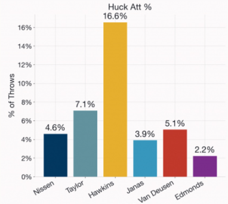

# Data Visualization Project 03

In this exercise you will explore methods to create different types of data visualizations (such as plotting text data, or exploring the distributions of continuous variables).

## PART 1: Density Plots

Using the dataset obtained from FSU's [Florida Climate Center](https://climatecenter.fsu.edu/climate-data-access-tools/downloadable-data), for a station at Tampa International Airport (TPA) for 2022, attempt to recreate the charts shown below which were generated using data from 2016. You can read the 2022 dataset using the code below:

```{r, message=FALSE, warning=FALSE}
library(tidyverse)
library(lubridate)
library(viridis)
library(ggridges)
library(plotly)
library(tidytext)
weather_tpa <- read_csv("https://raw.githubusercontent.com/aalhamadani/datasets/master/tpa_weather_2022.csv")
# random sample 
sample_n(weather_tpa, 4)
```

See Slides from Week 4 of Visualizing Relationships and Models (slide 10) for a reminder on how to use this type of dataset with the `lubridate` package for dates and times (example included in the slides uses data from 2016).

Using the 2022 data:

```{r}
# Adding date and full name months
weather_tpa_new <- weather_tpa %>%
  mutate(
    date = make_date(year, month, day),
    month_name = month(date, label = TRUE, abbr = FALSE)
  )
```

(a) Create a plot like the one below:

```{r, echo = FALSE, out.width="80%", fig.align='center'}
knitr::include_graphics("https://raw.githubusercontent.com/aalhamadani/dataviz_final_project/main/figures/tpa_max_temps_facet.png")
```

Hint: the option `binwidth = 3` was used with the `geom_histogram()` function.

```{r warning=FALSE,fig.alt="A grid of twelve faceted histograms arranged in three rows and four columns, displaying the distribution of daily maximum temperatures for each month of the year. The X-axis represents maximum temperatures ranging from 60 to 100 degrees Fahrenheit with intervals marked every 10 degrees, and the Y-axis tracks the number of days, ranging from 0 to over 15. Each month is color-coded using a sequential Viridis palette, shifting from deep purple in January to bright yellow in December. The plots reveal a distinct seasonal shift: winter months (December through February) display wider, lower-temperature distributions clustered between 60 and 80 degrees, while summer months (June through August) exhibit narrow, highly concentrated peaks tightly clustered between 85 and 95 degrees."}
# Creating plot (a)
ggplot(weather_tpa_new, aes(x = max_temp, fill = month_name)) +
  geom_histogram(binwidth = 3, color = "white") +
  facet_wrap(~month_name, ncol = 4) +
  scale_fill_viridis_d() +
  labs(
    x = "Maximum temperatures",
    y ="Number of Days"
  ) +
  scale_x_continuous(breaks = seq(60, 90, by = 10), limits = c(50,100)) +
  theme_bw() +
  theme(
    legend.position = "none",
    axis.title = element_text(size = 14),
    strip.text = element_text(size = 12),
    axis.text = element_text(size = 12, color = "black"),
    panel.border = element_rect(color = "black", fill = NA, linewidth = 1)
  )
```

(b) Create a plot like the one below:

```{r, echo = FALSE, out.width="80%", fig.align='center'}
knitr::include_graphics("https://raw.githubusercontent.com/aalhamadani/dataviz_final_project/main/figures/tpa_max_temps_density.png")
```

Hint: check the `kernel` parameter of the `geom_density()` function, and use `bw = 0.5`.

```{r warning=FALSE, fig.alt ="A kernel density estimate plot showing the distribution of daily maximum temperatures, rendered as a single, highly detailed dark grey polygon with a solid black perimeter outline. The X-axis represents maximum temperature with major text breaks at 60, 70, 80, and 90 degrees Fahrenheit, and thin vertical minor gridlines spaced every 5 degrees. The Y-axis represents data density ranging from 0.00 to 0.06 with major horizontal gridlines spaced every 0.02 units and thin minor gridlines every 0.01 units. The distribution curve is highly jagged and multi-modal, featuring numerous micro-peaks due to a narrow bandwidth. The density remains low below 65 degrees, climbs steadily with fluctuating peaks throughout the 70s and low 80s, and reaches its highest, narrowest concentrations with major twin peaks fluctuating between 86 and 94 degrees Fahrenheit."}
# Creating plot (b)
ggplot(weather_tpa_new, aes(x = max_temp)) +
  geom_density(
    fill = "grey40",
    color = "black",
    linewidth = 1,
    bw = 0.5,
    kernel = "optcosine"
  ) +
  scale_x_continuous(breaks = seq(60,90, by = 10), 
                     minor_breaks = seq(55,100, by = 5),
                     limits = c(55,97)) +
  labs(
    x = "Maximum temperature",
    y = "density"
  ) +
  theme_minimal() +
  theme(
    axis.title = element_text(size = 14),
    axis.text = element_text(size = 12, color = "black")
  )
```

(c) Create a plot like the one below:

```{r, echo = FALSE, out.width="80%", fig.align='center'}
knitr::include_graphics("https://raw.githubusercontent.com/aalhamadani/dataviz_final_project/main/figures/tpa_max_temps_density_facet.png")
```

Hint: default options for `geom_density()` were used.

```{r fig.alt = "A grid of twelve faceted density plots showing the distribution of daily maximum temperatures for each month in 2022. The grid is arranged in three rows and four columns, progressing chronologically from January to December. The X-axis represents maximum temperatures ranging from 50 to 100 degrees, and the Y-axis represents data density from 0.00 to 0.25. Each density curve is filled with a color from the sequential Viridis palette, starting with dark purple in January and transitioning to bright yellow in December, and is bordered by a solid black outline. The visual highlights a clear seasonal shift: winter and spring months exhibit wide, flat distributions spread across lower temperatures, whereas summer months—particularly July and August—feature extremely narrow, highly concentrated peaks tightly clustered in the low to mid-90s."}
ggplot(weather_tpa_new, aes(x = max_temp, fill = month_name)) +
  geom_density(color = "black", linewidth = 0.8) +
  facet_wrap(~month_name, ncol = 4) +
  scale_fill_viridis_d() +
  labs(
    title = "Density plot for each month in 2022",
    x = "Maximum temperatures",
    y = NULL
  ) +
  scale_y_continuous(breaks = seq(0,0.25, by = 0.05))+
  theme_bw() +
  theme(
    legend.position = "none",
    axis.title.x = element_text(size = 16),
    axis.text = element_text(size = 12, color = "black"),
    strip.text = element_text(size = 14),
    panel.border = element_rect(color = "black", fill = NA, linewidth = 0.8),
    strip.background = element_rect(color = "black", fill = "grey85", linewidth = 0.8)
  )
```

(d) Generate a plot like the chart below:

```{r, echo = FALSE, out.width="80%", fig.align='center'}
knitr::include_graphics("https://raw.githubusercontent.com/aalhamadani/dataviz_final_project/main/figures/tpa_max_temps_ridges_plasma.png")
```

Hint: use the`{ggridges}` package, and the `geom_density_ridges()` function paying close attention to the `quantile_lines` and `quantiles` parameters. The plot above uses the `plasma` option (color scale) for the *viridis* palette.

```{r fig.alt= "A ridgeline plot displaying the distribution of daily maximum temperatures for each month, stacked vertically from January at the bottom to December at the top. The X-axis represents maximum temperature in Fahrenheit, ranging from 50 to 100 degrees. Each month's distribution is rendered as a density curve filled with a continuous color gradient, transitioning from deep purple at cooler temperatures to bright yellow at hotter temperatures. A vertical black line cuts through each density curve to mark the median value. The visualization clearly shows the seasonal temperature shift: summer months (June through September) display highly concentrated, steep peaks centered in the low 90s, while winter months exhibit broader, flatter distributions spanning the 60s, 70s, and 80s."}
ggplot(weather_tpa_new, aes(x = max_temp, y = month_name, fill = after_stat(x))) +
  geom_density_ridges_gradient(
    quantile_lines = TRUE,
    quantiles = 2,
    color = "black",
    linewidth = 0.8
  ) +
  
  scale_fill_viridis_c(option = "plasma", name = NULL) +
  scale_x_continuous(breaks = seq(50,100, by = 10),
                     minor_breaks = seq(50,100, by = 5),
                     limits = c(50,100)) +
  labs(
    x = "Maximum temperature (in Fahrenheit degrees)",
    y = NULL
  ) +
  theme_minimal() +
  theme(
    axis.title.x = element_text(size = 16),
    axis.text = element_text(size = 14, color = "black")
  )
```

(e) Create a plot of your choice that uses the attribute for precipitation *(values of -99.9 for temperature or -99.99 for precipitation represent missing data)*.

```{r fig.alt= "An interactive time-series lollipop chart displaying daily precipitation totals at Tampa International Airport for the year 2022. The X-axis represents the date from January through December, marked by monthly intervals. The Y-axis measures precipitation in inches. The data is visualized using vertical steel-blue lines capped with circular points for each day. Hover-tooltips provide precise date and rainfall measurements for individual data points. The chart reveals a distinct wet season, with numerous high-precipitation spikes clustered between June and September, contrasted by sparse, low-volume rainfall during the winter and spring months."}
precip_data <- weather_tpa_new %>%
  filter(precipitation != -99.99)

precip_plot <- ggplot(precip_data, aes(x = date, y = precipitation)) +
  geom_segment(aes(x = date, xend = date, y = 0, yend = precipitation)) +
  geom_point(color = "#35608d", size = 1.5, alpha = 0.8) +
  scale_x_date(date_breaks = "1 month", date_labels = "%b") +
  labs(
    title = "Daily Precipitation at TPA (2022)",
    x = "Date",
    y = "Precipitation (inches)"
  ) +
  theme_minimal() +
  theme(
    axis.title = element_text(size = 14),
    axis.text = element_text(size = 12, color = "black"),
    panel.grid.minor = element_blank()
  )

ggplotly(precip_plot, tooltip = c("x","y"))
```

This lollipop chart allows you to inspect the individual days that had peaks in precipitation without having to rely on static data labels. This keeps the graph clean while maintaining functionality as the information pops up when you scroll over each lollipop point. This graph effectively showcases Florida's wet summer season and drier fall-spring.

## PART 2

### Option (A): Visualizing Text Data

Review the set of slides (and additional resources linked in it) for visualizing text data: Week 6 PowerPoint slides of Visualizing Text Data.

Choose any dataset with text data, and create at least one visualization with it. For example, you can create a frequency count of most used bigrams, a sentiment analysis of the text data, a network visualization of terms commonly used together, and/or a visualization of a topic modeling approach to the problem of identifying words/documents associated to different topics in the text data you decide to use.

Make sure to include a copy of the dataset in the `data/` folder, and reference your sources if different from the ones listed below:

- [Billboard Top 100 Lyrics](https://raw.githubusercontent.com/aalhamadani/dataviz_final_project/main/data/BB_top100_2015.csv)

- [RateMyProfessors comments](https://raw.githubusercontent.com/aalhamadani/dataviz_final_project/main/data/rmp_wit_comments.csv)

- [FL Poly News Articles](https://raw.githubusercontent.com/aalhamadani/dataviz_final_project/main/data/flpoly_news_SP23.csv)

(to get the "raw" data from any of the links listed above, simply click on the `raw` button of the GitHub page and copy the URL to be able to read it in your computer using the `read_csv()` function)

```{r}
url <- "https://raw.githubusercontent.com/aalhamadani/dataviz_final_project/main/data/flpoly_news_SP23.csv"

poly_news <- read_csv(url)
```

```{r fig.alt="Bar graph showcasing the top 25 most frequent terms that come up in Florida Poly news articles. The most common are engineering, science, and research."}
wordcount <- poly_news %>%
  unnest_tokens(output = word, input = news_summary) %>%
  anti_join(stop_words, by = "word") %>%
  filter(!str_detect(word, "^[0-9]+$")) %>%
  filter(!word %in% c(
    "florida", "poly", "polytechnic", "university", "university's", "student", "students", "campus", "lakeland", "fla", "dr", "annual", "senior", "degree", "fall", "semester", "year")) %>%
  count(word, sort = TRUE) %>%
  slice_head(n = 25)

ggplot(wordcount, aes(x = n, y = reorder(word, n))) +
  geom_col(fill = "#35608d", color = "black", alpha = 0.8)+
  labs(
    title = "Top 25 Most Frequent Terms in FL Poly News Articles",
    x = "Count",
    y = NULL
  ) +
  theme_minimal()
```

## Redesigned Graph

I found this graph on Instagram and thought that it could benefit from some changes several days ago before I knew I needed one for the project. This shows the percentage of total attempted throws that were hucks. However, it suffers from multiple design issues that can be resolved.


```{r}
# Creating the dataframe
huck_data <- tibble(
  player = c("Nissen", "Taylor", "Hawkins", "Janas", "Van Deusen", "Edmonds"),
  huck_att_pct = c(4.6, 7.1, 16.6, 3.9, 5.1, 2.2)
)
```

```{r fig.alt = "Horizontal bar graph with the huck attempt percentages of 6 ultimate frisbee players. The highest huck percentage is 16.6% by Hawkins"}
ggplot(huck_data, aes(x = huck_att_pct, y = fct_reorder(player, huck_att_pct, .desc = TRUE), fill = player)) +
  geom_col() +
  scale_fill_viridis_d() +
  geom_text(aes(label = paste0(huck_att_pct, "%")), hjust = -0.2, size = 3) +
  labs(
    title = "Huck Attempt Percentage by Player",
    x = "Percentage (%) of Total Throws",
    y = NULL
  ) +
  scale_x_continuous(breaks = seq(0,18, by = 2), limits = c(0,18)) +
  theme_minimal() +
  theme(panel.grid.major.y = element_blank(), 
        legend.position = "none",
        plot.title = element_text(hjust = 0.12, face = "bold", size = 16)
  )
              
```
The redesign makes the title more descriptive, as it was just Huck Att % before. It also switches the plot to a horizontal bar graph, which allows for the player names to stay straight instead of diagonal. I also changed the colors to the viridis colorblind friendly palette because it was not accessibly colored before. Furthermore, I removed unnecessary horizontal grid lines and extra outlines for a cleaner look. Finally, I ordered the players by descending huck attempts to better compare between them. 
