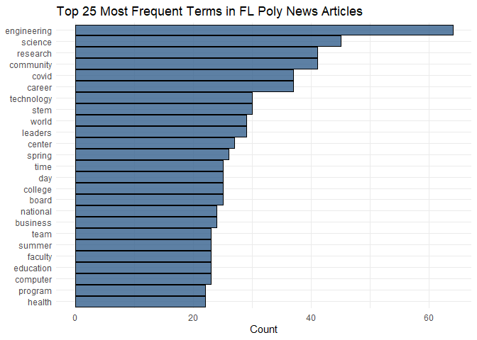
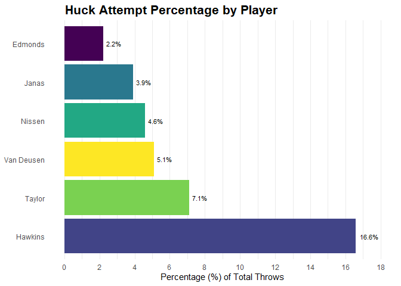

# Data Visualization Project 03

In this exercise you will explore methods to create different types of data visualizations (such as plotting text data, or exploring the distributions of continuous variables).

## PART 1: Density Plots

Using the dataset obtained from FSU's [Florida Climate Center](https://climatecenter.fsu.edu/climate-data-access-tools/downloadable-data), for a station at Tampa International Airport (TPA) for 2022, attempt to recreate the charts shown below which were generated using data from 2016. You can read the 2022 dataset using the code below:


``` r
library(tidyverse)
library(lubridate)
library(viridis)
library(ggridges)
library(plotly)
library(tidytext)
weather_tpa <- read_csv("https://raw.githubusercontent.com/aalhamadani/datasets/master/tpa_weather_2022.csv")
# random sample 
sample_n(weather_tpa, 4)
```

```
## # A tibble: 4 × 7
##    year month   day precipitation max_temp min_temp ave_temp
##   <dbl> <dbl> <dbl>         <dbl>    <dbl>    <dbl>    <dbl>
## 1  2022     8     7          0.24       96       78     87  
## 2  2022     5     8          0          89       75     82  
## 3  2022     6    20          0.1        95       78     86.5
## 4  2022     5    19          0          90       77     83.5
```

See Slides from Week 4 of Visualizing Relationships and Models (slide 10) for a reminder on how to use this type of dataset with the `lubridate` package for dates and times (example included in the slides uses data from 2016).

Using the 2022 data:


``` r
# Adding date and full name months
weather_tpa_new <- weather_tpa %>%
  mutate(
    date = make_date(year, month, day),
    month_name = month(date, label = TRUE, abbr = FALSE)
  )
```

(a) Create a plot like the one below:


Hint: the option `binwidth = 3` was used with the `geom_histogram()` function.


``` r
# Creating plot (a)
ggplot(weather_tpa_new, aes(x = max_temp, fill = month_name)) +
  geom_histogram(binwidth = 3, color = "white") +
  facet_wrap(~month_name, ncol = 4) +
  scale_fill_viridis_d() +
  labs(
    x = "Maximum temperatures",
    y ="Number of Days"
  ) +
  scale_x_continuous(breaks = seq(60, 90, by = 10), limits = c(50,100)) +
  theme_bw() +
  theme(
    legend.position = "none",
    axis.title = element_text(size = 14),
    strip.text = element_text(size = 12),
    axis.text = element_text(size = 12, color = "black"),
    panel.border = element_rect(color = "black", fill = NA, linewidth = 1)
  )
```


(b) Create a plot like the one below:


Hint: check the `kernel` parameter of the `geom_density()` function, and use `bw = 0.5`.


``` r
# Creating plot (b)
ggplot(weather_tpa_new, aes(x = max_temp)) +
  geom_density(
    fill = "grey40",
    color = "black",
    linewidth = 1,
    bw = 0.5,
    kernel = "optcosine"
  ) +
  scale_x_continuous(breaks = seq(60,90, by = 10), 
                     minor_breaks = seq(55,100, by = 5),
                     limits = c(55,97)) +
  labs(
    x = "Maximum temperature",
    y = "density"
  ) +
  theme_minimal() +
  theme(
    axis.title = element_text(size = 14),
    axis.text = element_text(size = 12, color = "black")
  )
```


(c) Create a plot like the one below:


Hint: default options for `geom_density()` were used.


``` r
ggplot(weather_tpa_new, aes(x = max_temp, fill = month_name)) +
  geom_density(color = "black", linewidth = 0.8) +
  facet_wrap(~month_name, ncol = 4) +
  scale_fill_viridis_d() +
  labs(
    title = "Density plot for each month in 2022",
    x = "Maximum temperatures",
    y = NULL
  ) +
  scale_y_continuous(breaks = seq(0,0.25, by = 0.05))+
  theme_bw() +
  theme(
    legend.position = "none",
    axis.title.x = element_text(size = 16),
    axis.text = element_text(size = 12, color = "black"),
    strip.text = element_text(size = 14),
    panel.border = element_rect(color = "black", fill = NA, linewidth = 0.8),
    strip.background = element_rect(color = "black", fill = "grey85", linewidth = 0.8)
  )
```


(d) Generate a plot like the chart below:


Hint: use the`{ggridges}` package, and the `geom_density_ridges()` function paying close attention to the `quantile_lines` and `quantiles` parameters. The plot above uses the `plasma` option (color scale) for the *viridis* palette.


``` r
ggplot(weather_tpa_new, aes(x = max_temp, y = month_name, fill = after_stat(x))) +
  geom_density_ridges_gradient(
    quantile_lines = TRUE,
    quantiles = 2,
    color = "black",
    linewidth = 0.8
  ) +
  
  scale_fill_viridis_c(option = "plasma", name = NULL) +
  scale_x_continuous(breaks = seq(50,100, by = 10),
                     minor_breaks = seq(50,100, by = 5),
                     limits = c(50,100)) +
  labs(
    x = "Maximum temperature (in Fahrenheit degrees)",
    y = NULL
  ) +
  theme_minimal() +
  theme(
    axis.title.x = element_text(size = 16),
    axis.text = element_text(size = 14, color = "black")
  )
```

```
## Picking joint bandwidth of 1.87
```


(e) Create a plot of your choice that uses the attribute for precipitation *(values of -99.9 for temperature or -99.99 for precipitation represent missing data)*.


``` r
precip_data <- weather_tpa_new %>%
  filter(precipitation != -99.99)

precip_plot <- ggplot(precip_data, aes(x = date, y = precipitation)) +
  geom_segment(aes(x = date, xend = date, y = 0, yend = precipitation)) +
  geom_point(color = "#35608d", size = 1.5, alpha = 0.8) +
  scale_x_date(date_breaks = "1 month", date_labels = "%b") +
  labs(
    title = "Daily Precipitation at TPA (2022)",
    x = "Date",
    y = "Precipitation (inches)"
  ) +
  theme_minimal() +
  theme(
    axis.title = element_text(size = 14),
    axis.text = element_text(size = 12, color = "black"),
    panel.grid.minor = element_blank()
  )

ggplotly(precip_plot, tooltip = c("x","y"))
```

```{=html}
<div class="plotly html-widget html-fill-item" id="htmlwidget-6808a4f14a96b82fec68" style="width:672px;height:480px;"></div>
<script type="application/json" data-for="htmlwidget-6808a4f14a96b82fec68">{"x":{"data":[{"x":[18993,18993,null,18994,18994,null,18995,18995,null,18996,18996,null,18997,18997,null,18998,18998,null,18999,18999,null,19000,19000,null,19001,19001,null,19002,19002,null,19003,19003,null,19004,19004,null,19005,19005,null,19006,19006,null,19007,19007,null,19008,19008,null,19009,19009,null,19010,19010,null,19011,19011,null,19012,19012,null,19013,19013,null,19014,19014,null,19015,19015,null,19016,19016,null,19017,19017,null,19018,19018,null,19019,19019,null,19020,19020,null,19021,19021,null,19022,19022,null,19023,19023,null,19024,19024,null,19025,19025,null,19026,19026,null,19027,19027,null,19028,19028,null,19029,19029,null,19030,19030,null,19031,19031,null,19032,19032,null,19033,19033,null,19034,19034,null,19035,19035,null,19036,19036,null,19037,19037,null,19038,19038,null,19039,19039,null,19040,19040,null,19041,19041,null,19042,19042,null,19043,19043,null,19044,19044,null,19045,19045,null,19046,19046,null,19047,19047,null,19048,19048,null,19049,19049,null,19050,19050,null,19051,19051,null,19052,19052,null,19053,19053,null,19054,19054,null,19055,19055,null,19056,19056,null,19057,19057,null,19058,19058,null,19059,19059,null,19060,19060,null,19061,19061,null,19062,19062,null,19063,19063,null,19064,19064,null,19065,19065,null,19066,19066,null,19067,19067,null,19068,19068,null,19069,19069,null,19070,19070,null,19071,19071,null,19072,19072,null,19073,19073,null,19074,19074,null,19075,19075,null,19076,19076,null,19077,19077,null,19078,19078,null,19079,19079,null,19080,19080,null,19081,19081,null,19082,19082,null,19083,19083,null,19084,19084,null,19085,19085,null,19086,19086,null,19087,19087,null,19088,19088,null,19089,19089,null,19090,19090,null,19091,19091,null,19092,19092,null,19093,19093,null,19094,19094,null,19095,19095,null,19096,19096,null,19097,19097,null,19098,19098,null,19099,19099,null,19100,19100,null,19101,19101,null,19102,19102,null,19103,19103,null,19104,19104,null,19105,19105,null,19106,19106,null,19107,19107,null,19108,19108,null,19109,19109,null,19110,19110,null,19111,19111,null,19112,19112,null,19113,19113,null,19114,19114,null,19115,19115,null,19116,19116,null,19117,19117,null,19118,19118,null,19119,19119,null,19120,19120,null,19121,19121,null,19122,19122,null,19123,19123,null,19124,19124,null,19125,19125,null,19126,19126,null,19127,19127,null,19128,19128,null,19129,19129,null,19130,19130,null,19131,19131,null,19132,19132,null,19133,19133,null,19134,19134,null,19135,19135,null,19136,19136,null,19137,19137,null,19138,19138,null,19139,19139,null,19140,19140,null,19141,19141,null,19142,19142,null,19143,19143,null,19144,19144,null,19145,19145,null,19146,19146,null,19147,19147,null,19148,19148,null,19149,19149,null,19150,19150,null,19151,19151,null,19152,19152,null,19153,19153,null,19154,19154,null,19155,19155,null,19156,19156,null,19157,19157,null,19158,19158,null,19159,19159,null,19160,19160,null,19161,19161,null,19162,19162,null,19163,19163,null,19164,19164,null,19165,19165,null,19166,19166,null,19167,19167,null,19168,19168,null,19169,19169,null,19170,19170,null,19171,19171,null,19172,19172,null,19173,19173,null,19174,19174,null,19175,19175,null,19176,19176,null,19177,19177,null,19178,19178,null,19179,19179,null,19180,19180,null,19181,19181,null,19182,19182,null,19183,19183,null,19184,19184,null,19185,19185,null,19186,19186,null,19187,19187,null,19188,19188,null,19189,19189,null,19190,19190,null,19191,19191,null,19192,19192,null,19193,19193,null,19194,19194,null,19195,19195,null,19196,19196,null,19197,19197,null,19198,19198,null,19199,19199,null,19200,19200,null,19201,19201,null,19202,19202,null,19203,19203,null,19204,19204,null,19205,19205,null,19206,19206,null,19207,19207,null,19208,19208,null,19209,19209,null,19210,19210,null,19211,19211,null,19212,19212,null,19213,19213,null,19214,19214,null,19215,19215,null,19216,19216,null,19217,19217,null,19218,19218,null,19219,19219,null,19220,19220,null,19221,19221,null,19222,19222,null,19223,19223,null,19224,19224,null,19225,19225,null,19226,19226,null,19227,19227,null,19228,19228,null,19229,19229,null,19230,19230,null,19231,19231,null,19232,19232,null,19233,19233,null,19234,19234,null,19235,19235,null,19236,19236,null,19237,19237,null,19238,19238,null,19239,19239,null,19240,19240,null,19241,19241,null,19242,19242,null,19243,19243,null,19244,19244,null,19245,19245,null,19246,19246,null,19247,19247,null,19248,19248,null,19249,19249,null,19250,19250,null,19251,19251,null,19252,19252,null,19253,19253,null,19254,19254,null,19255,19255,null,19256,19256,null,19257,19257,null,19258,19258,null,19259,19259,null,19260,19260,null,19261,19261,null,19262,19262,null,19263,19263,null,19264,19264,null,19265,19265,null,19266,19266,null,19267,19267,null,19268,19268,null,19269,19269,null,19270,19270,null,19271,19271,null,19272,19272,null,19273,19273,null,19274,19274,null,19275,19275,null,19276,19276,null,19277,19277,null,19278,19278,null,19279,19279,null,19280,19280,null,19281,19281,null,19282,19282,null,19283,19283,null,19284,19284,null,19285,19285,null,19286,19286,null,19287,19287,null,19288,19288,null,19289,19289,null,19290,19290,null,19291,19291,null,19292,19292,null,19293,19293,null,19294,19294,null,19295,19295,null,19296,19296,null,19297,19297,null,19298,19298,null,19299,19299,null,19300,19300,null,19301,19301,null,19302,19302,null,19303,19303,null,19304,19304,null,19305,19305,null,19306,19306,null,19307,19307,null,19308,19308,null,19309,19309,null,19310,19310,null,19311,19311,null,19312,19312,null,19313,19313,null,19314,19314,null,19315,19315,null,19316,19316,null,19317,19317,null,19318,19318,null,19319,19319,null,19320,19320,null,19321,19321,null,19322,19322,null,19323,19323,null,19324,19324,null,19325,19325,null,19326,19326,null,19327,19327,null,19328,19328,null,19329,19329,null,19330,19330,null,19331,19331,null,19332,19332,null,19333,19333,null,19334,19334,null,19335,19335,null,19336,19336,null,19337,19337,null,19338,19338,null,19339,19339,null,19340,19340,null,19341,19341,null,19342,19342,null,19343,19343,null,19344,19344,null,19345,19345,null,19346,19346,null,19347,19347,null,19348,19348,null,19349,19349,null,19350,19350,null,19351,19351,null,19352,19352,null,19353,19353,null,19354,19354,null,19355,19355,null,19356,19356,null,19357,19357],"y":[0,0,null,0,0,null,0,0.02,null,0,0,null,0,0,null,0,1.0000000000000001e-05,null,0,1.0000000000000001e-05,null,0,0,null,0,0,null,0,0,null,0,0,null,0,0,null,0,0,null,0,0,null,0,0,null,0,0.68000000000000005,null,0,0,null,0,0,null,0,0,null,0,0,null,0,0,null,0,0.01,null,0,1.0000000000000001e-05,null,0,0,null,0,0.67000000000000004,null,0,0.080000000000000002,null,0,0,null,0,1.0000000000000001e-05,null,0,0,null,0,0,null,0,0,null,0,0,null,0,0,null,0,0,null,0,0,null,0,0.02,null,0,0.02,null,0,0,null,0,0.34999999999999998,null,0,1.0000000000000001e-05,null,0,0,null,0,0,null,0,1.0000000000000001e-05,null,0,0.10000000000000001,null,0,0,null,0,0,null,0,0,null,0,0,null,0,0,null,0,0.13,null,0,0,null,0,0,null,0,0,null,0,0,null,0,0,null,0,0,null,0,0,null,0,0,null,0,0,null,0,0,null,0,0,null,0,0,null,0,0,null,0,0,null,0,0,null,0,0,null,0,0,null,0,0,null,0,1.0000000000000001e-05,null,0,0,null,0,0.40999999999999998,null,0,0,null,0,0,null,0,1.04,null,0,1.0000000000000001e-05,null,0,0,null,0,0,null,0,0,null,0,0,null,0,0,null,0,0,null,0,0,null,0,1.4199999999999999,null,0,0,null,0,0,null,0,0,null,0,0,null,0,0,null,0,0,null,0,0.040000000000000001,null,0,1.3700000000000001,null,0,1.1100000000000001,null,0,0,null,0,0,null,0,0,null,0,0,null,0,1.3400000000000001,null,0,0,null,0,0,null,0,0,null,0,0,null,0,0,null,0,0,null,0,0,null,0,0.02,null,0,0,null,0,0,null,0,0,null,0,0,null,0,0,null,0,0,null,0,0,null,0,0,null,0,0,null,0,0,null,0,0,null,0,0,null,0,0.14000000000000001,null,0,1.22,null,0,1.5600000000000001,null,0,0.029999999999999999,null,0,0,null,0,0.62,null,0,0,null,0,0,null,0,0,null,0,0.14999999999999999,null,0,0,null,0,0,null,0,0,null,0,0,null,0,0,null,0,0,null,0,0,null,0,0,null,0,0,null,0,0,null,0,0,null,0,0,null,0,0.17000000000000001,null,0,1.0000000000000001e-05,null,0,0,null,0,1.0000000000000001e-05,null,0,0.01,null,0,0,null,0,0,null,0,0,null,0,0,null,0,0,null,0,1.6499999999999999,null,0,0.080000000000000002,null,0,1.0000000000000001e-05,null,0,1.6000000000000001,null,0,1.0000000000000001e-05,null,0,0.46999999999999997,null,0,0,null,0,0,null,0,0.16,null,0,0,null,0,0.10000000000000001,null,0,0.01,null,0,2.8100000000000001,null,0,0,null,0,0,null,0,0,null,0,0.11,null,0,1.0000000000000001e-05,null,0,0,null,0,0,null,0,0.040000000000000001,null,0,0.10000000000000001,null,0,0,null,0,0,null,0,0,null,0,0.19,null,0,0,null,0,0,null,0,1.28,null,0,0.089999999999999997,null,0,0.040000000000000001,null,0,1.0700000000000001,null,0,1.0000000000000001e-05,null,0,1.0000000000000001e-05,null,0,0,null,0,1.0000000000000001e-05,null,0,0.01,null,0,0.050000000000000003,null,0,0.029999999999999999,null,0,0.19,null,0,0,null,0,0.87,null,0,0.63,null,0,0,null,0,0,null,0,2.0800000000000001,null,0,0,null,0,2.8599999999999999,null,0,0.78000000000000003,null,0,0,null,0,0.02,null,0,0,null,0,0,null,0,1.6399999999999999,null,0,1.6899999999999999,null,0,0,null,0,0.02,null,0,1.1200000000000001,null,0,0,null,0,0,null,0,0,null,0,0,null,0,0,null,0,0,null,0,1.0000000000000001e-05,null,0,0.97999999999999998,null,0,1.24,null,0,1.0000000000000001e-05,null,0,0.040000000000000001,null,0,0.23999999999999999,null,0,0.059999999999999998,null,0,1.28,null,0,0,null,0,0,null,0,0,null,0,0,null,0,1.0000000000000001e-05,null,0,1.0000000000000001e-05,null,0,0,null,0,0.64000000000000001,null,0,0,null,0,0,null,0,0.46999999999999997,null,0,0.45000000000000001,null,0,0,null,0,0,null,0,0.60999999999999999,null,0,0.31,null,0,1.0000000000000001e-05,null,0,0.02,null,0,0.16,null,0,0,null,0,0,null,0,0.01,null,0,2.7400000000000002,null,0,1.4099999999999999,null,0,0.40000000000000002,null,0,0,null,0,0,null,0,0,null,0,0.10000000000000001,null,0,1.6399999999999999,null,0,0.13,null,0,1.0900000000000001,null,0,0.02,null,0,0.029999999999999999,null,0,0.029999999999999999,null,0,0.059999999999999998,null,0,0,null,0,0.87,null,0,0.059999999999999998,null,0,0,null,0,0.02,null,0,0.070000000000000007,null,0,1.0000000000000001e-05,null,0,0,null,0,1.0700000000000001,null,0,0,null,0,0,null,0,1.0000000000000001e-05,null,0,0.080000000000000002,null,0,2.4700000000000002,null,0,0,null,0,0,null,0,0,null,0,0,null,0,0,null,0,0,null,0,0,null,0,0,null,0,0,null,0,0,null,0,0,null,0,1.0000000000000001e-05,null,0,1.0000000000000001e-05,null,0,0.02,null,0,0.29999999999999999,null,0,0,null,0,0,null,0,0,null,0,1.0000000000000001e-05,null,0,0.01,null,0,0,null,0,0,null,0,0,null,0,0,null,0,0,null,0,0,null,0,0,null,0,0,null,0,0.059999999999999998,null,0,0.70999999999999996,null,0,0,null,0,0,null,0,0,null,0,0,null,0,0,null,0,0.90000000000000002,null,0,0,null,0,1.0000000000000001e-05,null,0,1.0000000000000001e-05,null,0,0,null,0,0.059999999999999998,null,0,0.089999999999999997,null,0,2.46,null,0,0.76000000000000001,null,0,0.01,null,0,0.01,null,0,0,null,0,0,null,0,0.14000000000000001,null,0,0,null,0,0,null,0,0,null,0,0.39000000000000001,null,0,1.0000000000000001e-05,null,0,0,null,0,0.050000000000000003,null,0,0,null,0,1.0000000000000001e-05,null,0,0,null,0,0.27000000000000002,null,0,0,null,0,0,null,0,0.040000000000000001,null,0,0,null,0,0,null,0,0,null,0,0,null,0,0,null,0,0,null,0,0,null,0,0,null,0,0,null,0,0,null,0,0,null,0,0,null,0,0,null,0,0,null,0,1.0900000000000001,null,0,0.050000000000000003,null,0,0.02,null,0,0.040000000000000001,null,0,0,null,0,0.11,null,0,0.59999999999999998,null,0,0.14999999999999999,null,0,1.0000000000000001e-05,null,0,0,null,0,0,null,0,0,null,0,0,null,0,0,null,0,0,null,0,0,null,0,0.28999999999999998],"text":["date: 2022-01-01<br />y: 0","date: 2022-01-01<br />y: 0",null,"date: 2022-01-02<br />y: 0","date: 2022-01-02<br />y: 0",null,"date: 2022-01-03<br />y: 0","date: 2022-01-03<br />y: 0",null,"date: 2022-01-04<br />y: 0","date: 2022-01-04<br />y: 0",null,"date: 2022-01-05<br />y: 0","date: 2022-01-05<br />y: 0",null,"date: 2022-01-06<br />y: 0","date: 2022-01-06<br />y: 0",null,"date: 2022-01-07<br />y: 0","date: 2022-01-07<br />y: 0",null,"date: 2022-01-08<br />y: 0","date: 2022-01-08<br />y: 0",null,"date: 2022-01-09<br />y: 0","date: 2022-01-09<br />y: 0",null,"date: 2022-01-10<br />y: 0","date: 2022-01-10<br />y: 0",null,"date: 2022-01-11<br />y: 0","date: 2022-01-11<br />y: 0",null,"date: 2022-01-12<br />y: 0","date: 2022-01-12<br />y: 0",null,"date: 2022-01-13<br />y: 0","date: 2022-01-13<br />y: 0",null,"date: 2022-01-14<br />y: 0","date: 2022-01-14<br />y: 0",null,"date: 2022-01-15<br />y: 0","date: 2022-01-15<br />y: 0",null,"date: 2022-01-16<br />y: 0","date: 2022-01-16<br />y: 0",null,"date: 2022-01-17<br />y: 0","date: 2022-01-17<br />y: 0",null,"date: 2022-01-18<br />y: 0","date: 2022-01-18<br />y: 0",null,"date: 2022-01-19<br />y: 0","date: 2022-01-19<br />y: 0",null,"date: 2022-01-20<br />y: 0","date: 2022-01-20<br />y: 0",null,"date: 2022-01-21<br />y: 0","date: 2022-01-21<br />y: 0",null,"date: 2022-01-22<br />y: 0","date: 2022-01-22<br />y: 0",null,"date: 2022-01-23<br />y: 0","date: 2022-01-23<br />y: 0",null,"date: 2022-01-24<br />y: 0","date: 2022-01-24<br />y: 0",null,"date: 2022-01-25<br />y: 0","date: 2022-01-25<br />y: 0",null,"date: 2022-01-26<br />y: 0","date: 2022-01-26<br />y: 0",null,"date: 2022-01-27<br />y: 0","date: 2022-01-27<br />y: 0",null,"date: 2022-01-28<br />y: 0","date: 2022-01-28<br />y: 0",null,"date: 2022-01-29<br />y: 0","date: 2022-01-29<br />y: 0",null,"date: 2022-01-30<br />y: 0","date: 2022-01-30<br />y: 0",null,"date: 2022-01-31<br />y: 0","date: 2022-01-31<br />y: 0",null,"date: 2022-02-01<br />y: 0","date: 2022-02-01<br />y: 0",null,"date: 2022-02-02<br />y: 0","date: 2022-02-02<br />y: 0",null,"date: 2022-02-03<br />y: 0","date: 2022-02-03<br />y: 0",null,"date: 2022-02-04<br />y: 0","date: 2022-02-04<br />y: 0",null,"date: 2022-02-05<br />y: 0","date: 2022-02-05<br />y: 0",null,"date: 2022-02-06<br />y: 0","date: 2022-02-06<br />y: 0",null,"date: 2022-02-07<br />y: 0","date: 2022-02-07<br />y: 0",null,"date: 2022-02-08<br />y: 0","date: 2022-02-08<br />y: 0",null,"date: 2022-02-09<br />y: 0","date: 2022-02-09<br />y: 0",null,"date: 2022-02-10<br />y: 0","date: 2022-02-10<br />y: 0",null,"date: 2022-02-11<br />y: 0","date: 2022-02-11<br />y: 0",null,"date: 2022-02-12<br />y: 0","date: 2022-02-12<br />y: 0",null,"date: 2022-02-13<br />y: 0","date: 2022-02-13<br />y: 0",null,"date: 2022-02-14<br />y: 0","date: 2022-02-14<br />y: 0",null,"date: 2022-02-15<br />y: 0","date: 2022-02-15<br />y: 0",null,"date: 2022-02-16<br />y: 0","date: 2022-02-16<br />y: 0",null,"date: 2022-02-17<br />y: 0","date: 2022-02-17<br />y: 0",null,"date: 2022-02-18<br />y: 0","date: 2022-02-18<br />y: 0",null,"date: 2022-02-19<br />y: 0","date: 2022-02-19<br />y: 0",null,"date: 2022-02-20<br />y: 0","date: 2022-02-20<br />y: 0",null,"date: 2022-02-21<br />y: 0","date: 2022-02-21<br />y: 0",null,"date: 2022-02-22<br />y: 0","date: 2022-02-22<br />y: 0",null,"date: 2022-02-23<br />y: 0","date: 2022-02-23<br />y: 0",null,"date: 2022-02-24<br />y: 0","date: 2022-02-24<br />y: 0",null,"date: 2022-02-25<br />y: 0","date: 2022-02-25<br />y: 0",null,"date: 2022-02-26<br />y: 0","date: 2022-02-26<br />y: 0",null,"date: 2022-02-27<br />y: 0","date: 2022-02-27<br />y: 0",null,"date: 2022-02-28<br />y: 0","date: 2022-02-28<br />y: 0",null,"date: 2022-03-01<br />y: 0","date: 2022-03-01<br />y: 0",null,"date: 2022-03-02<br />y: 0","date: 2022-03-02<br />y: 0",null,"date: 2022-03-03<br />y: 0","date: 2022-03-03<br />y: 0",null,"date: 2022-03-04<br />y: 0","date: 2022-03-04<br />y: 0",null,"date: 2022-03-05<br />y: 0","date: 2022-03-05<br />y: 0",null,"date: 2022-03-06<br />y: 0","date: 2022-03-06<br />y: 0",null,"date: 2022-03-07<br />y: 0","date: 2022-03-07<br />y: 0",null,"date: 2022-03-08<br />y: 0","date: 2022-03-08<br />y: 0",null,"date: 2022-03-09<br />y: 0","date: 2022-03-09<br />y: 0",null,"date: 2022-03-10<br />y: 0","date: 2022-03-10<br />y: 0",null,"date: 2022-03-11<br />y: 0","date: 2022-03-11<br />y: 0",null,"date: 2022-03-12<br />y: 0","date: 2022-03-12<br />y: 0",null,"date: 2022-03-13<br />y: 0","date: 2022-03-13<br />y: 0",null,"date: 2022-03-14<br />y: 0","date: 2022-03-14<br />y: 0",null,"date: 2022-03-15<br />y: 0","date: 2022-03-15<br />y: 0",null,"date: 2022-03-16<br />y: 0","date: 2022-03-16<br />y: 0",null,"date: 2022-03-17<br />y: 0","date: 2022-03-17<br />y: 0",null,"date: 2022-03-18<br />y: 0","date: 2022-03-18<br />y: 0",null,"date: 2022-03-19<br />y: 0","date: 2022-03-19<br />y: 0",null,"date: 2022-03-20<br />y: 0","date: 2022-03-20<br />y: 0",null,"date: 2022-03-21<br />y: 0","date: 2022-03-21<br />y: 0",null,"date: 2022-03-22<br />y: 0","date: 2022-03-22<br />y: 0",null,"date: 2022-03-23<br />y: 0","date: 2022-03-23<br />y: 0",null,"date: 2022-03-24<br />y: 0","date: 2022-03-24<br />y: 0",null,"date: 2022-03-25<br />y: 0","date: 2022-03-25<br />y: 0",null,"date: 2022-03-26<br />y: 0","date: 2022-03-26<br />y: 0",null,"date: 2022-03-27<br />y: 0","date: 2022-03-27<br />y: 0",null,"date: 2022-03-28<br />y: 0","date: 2022-03-28<br />y: 0",null,"date: 2022-03-29<br />y: 0","date: 2022-03-29<br />y: 0",null,"date: 2022-03-30<br />y: 0","date: 2022-03-30<br />y: 0",null,"date: 2022-03-31<br />y: 0","date: 2022-03-31<br />y: 0",null,"date: 2022-04-01<br />y: 0","date: 2022-04-01<br />y: 0",null,"date: 2022-04-02<br />y: 0","date: 2022-04-02<br />y: 0",null,"date: 2022-04-03<br />y: 0","date: 2022-04-03<br />y: 0",null,"date: 2022-04-04<br />y: 0","date: 2022-04-04<br />y: 0",null,"date: 2022-04-05<br />y: 0","date: 2022-04-05<br />y: 0",null,"date: 2022-04-06<br />y: 0","date: 2022-04-06<br />y: 0",null,"date: 2022-04-07<br />y: 0","date: 2022-04-07<br />y: 0",null,"date: 2022-04-08<br />y: 0","date: 2022-04-08<br />y: 0",null,"date: 2022-04-09<br />y: 0","date: 2022-04-09<br />y: 0",null,"date: 2022-04-10<br />y: 0","date: 2022-04-10<br />y: 0",null,"date: 2022-04-11<br />y: 0","date: 2022-04-11<br />y: 0",null,"date: 2022-04-12<br />y: 0","date: 2022-04-12<br />y: 0",null,"date: 2022-04-13<br />y: 0","date: 2022-04-13<br />y: 0",null,"date: 2022-04-14<br />y: 0","date: 2022-04-14<br />y: 0",null,"date: 2022-04-15<br />y: 0","date: 2022-04-15<br />y: 0",null,"date: 2022-04-16<br />y: 0","date: 2022-04-16<br />y: 0",null,"date: 2022-04-17<br />y: 0","date: 2022-04-17<br />y: 0",null,"date: 2022-04-18<br />y: 0","date: 2022-04-18<br />y: 0",null,"date: 2022-04-19<br />y: 0","date: 2022-04-19<br />y: 0",null,"date: 2022-04-20<br />y: 0","date: 2022-04-20<br />y: 0",null,"date: 2022-04-21<br />y: 0","date: 2022-04-21<br />y: 0",null,"date: 2022-04-22<br />y: 0","date: 2022-04-22<br />y: 0",null,"date: 2022-04-23<br />y: 0","date: 2022-04-23<br />y: 0",null,"date: 2022-04-24<br />y: 0","date: 2022-04-24<br />y: 0",null,"date: 2022-04-25<br />y: 0","date: 2022-04-25<br />y: 0",null,"date: 2022-04-26<br />y: 0","date: 2022-04-26<br />y: 0",null,"date: 2022-04-27<br />y: 0","date: 2022-04-27<br />y: 0",null,"date: 2022-04-28<br />y: 0","date: 2022-04-28<br />y: 0",null,"date: 2022-04-29<br />y: 0","date: 2022-04-29<br />y: 0",null,"date: 2022-04-30<br />y: 0","date: 2022-04-30<br />y: 0",null,"date: 2022-05-01<br />y: 0","date: 2022-05-01<br />y: 0",null,"date: 2022-05-02<br />y: 0","date: 2022-05-02<br />y: 0",null,"date: 2022-05-03<br />y: 0","date: 2022-05-03<br />y: 0",null,"date: 2022-05-04<br />y: 0","date: 2022-05-04<br />y: 0",null,"date: 2022-05-05<br />y: 0","date: 2022-05-05<br />y: 0",null,"date: 2022-05-06<br />y: 0","date: 2022-05-06<br />y: 0",null,"date: 2022-05-07<br />y: 0","date: 2022-05-07<br />y: 0",null,"date: 2022-05-08<br />y: 0","date: 2022-05-08<br />y: 0",null,"date: 2022-05-09<br />y: 0","date: 2022-05-09<br />y: 0",null,"date: 2022-05-10<br />y: 0","date: 2022-05-10<br />y: 0",null,"date: 2022-05-11<br />y: 0","date: 2022-05-11<br />y: 0",null,"date: 2022-05-12<br />y: 0","date: 2022-05-12<br />y: 0",null,"date: 2022-05-13<br />y: 0","date: 2022-05-13<br />y: 0",null,"date: 2022-05-14<br />y: 0","date: 2022-05-14<br />y: 0",null,"date: 2022-05-15<br />y: 0","date: 2022-05-15<br />y: 0",null,"date: 2022-05-16<br />y: 0","date: 2022-05-16<br />y: 0",null,"date: 2022-05-17<br />y: 0","date: 2022-05-17<br />y: 0",null,"date: 2022-05-18<br />y: 0","date: 2022-05-18<br />y: 0",null,"date: 2022-05-19<br />y: 0","date: 2022-05-19<br />y: 0",null,"date: 2022-05-20<br />y: 0","date: 2022-05-20<br />y: 0",null,"date: 2022-05-21<br />y: 0","date: 2022-05-21<br />y: 0",null,"date: 2022-05-22<br />y: 0","date: 2022-05-22<br />y: 0",null,"date: 2022-05-23<br />y: 0","date: 2022-05-23<br />y: 0",null,"date: 2022-05-24<br />y: 0","date: 2022-05-24<br />y: 0",null,"date: 2022-05-25<br />y: 0","date: 2022-05-25<br />y: 0",null,"date: 2022-05-26<br />y: 0","date: 2022-05-26<br />y: 0",null,"date: 2022-05-27<br />y: 0","date: 2022-05-27<br />y: 0",null,"date: 2022-05-28<br />y: 0","date: 2022-05-28<br />y: 0",null,"date: 2022-05-29<br />y: 0","date: 2022-05-29<br />y: 0",null,"date: 2022-05-30<br />y: 0","date: 2022-05-30<br />y: 0",null,"date: 2022-05-31<br />y: 0","date: 2022-05-31<br />y: 0",null,"date: 2022-06-01<br />y: 0","date: 2022-06-01<br />y: 0",null,"date: 2022-06-02<br />y: 0","date: 2022-06-02<br />y: 0",null,"date: 2022-06-03<br />y: 0","date: 2022-06-03<br />y: 0",null,"date: 2022-06-04<br />y: 0","date: 2022-06-04<br />y: 0",null,"date: 2022-06-05<br />y: 0","date: 2022-06-05<br />y: 0",null,"date: 2022-06-06<br />y: 0","date: 2022-06-06<br />y: 0",null,"date: 2022-06-07<br />y: 0","date: 2022-06-07<br />y: 0",null,"date: 2022-06-08<br />y: 0","date: 2022-06-08<br />y: 0",null,"date: 2022-06-09<br />y: 0","date: 2022-06-09<br />y: 0",null,"date: 2022-06-10<br />y: 0","date: 2022-06-10<br />y: 0",null,"date: 2022-06-11<br />y: 0","date: 2022-06-11<br />y: 0",null,"date: 2022-06-12<br />y: 0","date: 2022-06-12<br />y: 0",null,"date: 2022-06-13<br />y: 0","date: 2022-06-13<br />y: 0",null,"date: 2022-06-14<br />y: 0","date: 2022-06-14<br />y: 0",null,"date: 2022-06-15<br />y: 0","date: 2022-06-15<br />y: 0",null,"date: 2022-06-16<br />y: 0","date: 2022-06-16<br />y: 0",null,"date: 2022-06-17<br />y: 0","date: 2022-06-17<br />y: 0",null,"date: 2022-06-18<br />y: 0","date: 2022-06-18<br />y: 0",null,"date: 2022-06-19<br />y: 0","date: 2022-06-19<br />y: 0",null,"date: 2022-06-20<br />y: 0","date: 2022-06-20<br />y: 0",null,"date: 2022-06-21<br />y: 0","date: 2022-06-21<br />y: 0",null,"date: 2022-06-22<br />y: 0","date: 2022-06-22<br />y: 0",null,"date: 2022-06-23<br />y: 0","date: 2022-06-23<br />y: 0",null,"date: 2022-06-24<br />y: 0","date: 2022-06-24<br />y: 0",null,"date: 2022-06-25<br />y: 0","date: 2022-06-25<br />y: 0",null,"date: 2022-06-26<br />y: 0","date: 2022-06-26<br />y: 0",null,"date: 2022-06-27<br />y: 0","date: 2022-06-27<br />y: 0",null,"date: 2022-06-28<br />y: 0","date: 2022-06-28<br />y: 0",null,"date: 2022-06-29<br />y: 0","date: 2022-06-29<br />y: 0",null,"date: 2022-06-30<br />y: 0","date: 2022-06-30<br />y: 0",null,"date: 2022-07-01<br />y: 0","date: 2022-07-01<br />y: 0",null,"date: 2022-07-02<br />y: 0","date: 2022-07-02<br />y: 0",null,"date: 2022-07-03<br />y: 0","date: 2022-07-03<br />y: 0",null,"date: 2022-07-04<br />y: 0","date: 2022-07-04<br />y: 0",null,"date: 2022-07-05<br />y: 0","date: 2022-07-05<br />y: 0",null,"date: 2022-07-06<br />y: 0","date: 2022-07-06<br />y: 0",null,"date: 2022-07-07<br />y: 0","date: 2022-07-07<br />y: 0",null,"date: 2022-07-08<br />y: 0","date: 2022-07-08<br />y: 0",null,"date: 2022-07-09<br />y: 0","date: 2022-07-09<br />y: 0",null,"date: 2022-07-10<br />y: 0","date: 2022-07-10<br />y: 0",null,"date: 2022-07-11<br />y: 0","date: 2022-07-11<br />y: 0",null,"date: 2022-07-12<br />y: 0","date: 2022-07-12<br />y: 0",null,"date: 2022-07-13<br />y: 0","date: 2022-07-13<br />y: 0",null,"date: 2022-07-14<br />y: 0","date: 2022-07-14<br />y: 0",null,"date: 2022-07-15<br />y: 0","date: 2022-07-15<br />y: 0",null,"date: 2022-07-16<br />y: 0","date: 2022-07-16<br />y: 0",null,"date: 2022-07-17<br />y: 0","date: 2022-07-17<br />y: 0",null,"date: 2022-07-18<br />y: 0","date: 2022-07-18<br />y: 0",null,"date: 2022-07-19<br />y: 0","date: 2022-07-19<br />y: 0",null,"date: 2022-07-20<br />y: 0","date: 2022-07-20<br />y: 0",null,"date: 2022-07-21<br />y: 0","date: 2022-07-21<br />y: 0",null,"date: 2022-07-22<br />y: 0","date: 2022-07-22<br />y: 0",null,"date: 2022-07-23<br />y: 0","date: 2022-07-23<br />y: 0",null,"date: 2022-07-24<br />y: 0","date: 2022-07-24<br />y: 0",null,"date: 2022-07-25<br />y: 0","date: 2022-07-25<br />y: 0",null,"date: 2022-07-26<br />y: 0","date: 2022-07-26<br />y: 0",null,"date: 2022-07-27<br />y: 0","date: 2022-07-27<br />y: 0",null,"date: 2022-07-28<br />y: 0","date: 2022-07-28<br />y: 0",null,"date: 2022-07-29<br />y: 0","date: 2022-07-29<br />y: 0",null,"date: 2022-07-30<br />y: 0","date: 2022-07-30<br />y: 0",null,"date: 2022-07-31<br />y: 0","date: 2022-07-31<br />y: 0",null,"date: 2022-08-01<br />y: 0","date: 2022-08-01<br />y: 0",null,"date: 2022-08-02<br />y: 0","date: 2022-08-02<br />y: 0",null,"date: 2022-08-03<br />y: 0","date: 2022-08-03<br />y: 0",null,"date: 2022-08-04<br />y: 0","date: 2022-08-04<br />y: 0",null,"date: 2022-08-05<br />y: 0","date: 2022-08-05<br />y: 0",null,"date: 2022-08-06<br />y: 0","date: 2022-08-06<br />y: 0",null,"date: 2022-08-07<br />y: 0","date: 2022-08-07<br />y: 0",null,"date: 2022-08-08<br />y: 0","date: 2022-08-08<br />y: 0",null,"date: 2022-08-09<br />y: 0","date: 2022-08-09<br />y: 0",null,"date: 2022-08-10<br />y: 0","date: 2022-08-10<br />y: 0",null,"date: 2022-08-11<br />y: 0","date: 2022-08-11<br />y: 0",null,"date: 2022-08-12<br />y: 0","date: 2022-08-12<br />y: 0",null,"date: 2022-08-13<br />y: 0","date: 2022-08-13<br />y: 0",null,"date: 2022-08-14<br />y: 0","date: 2022-08-14<br />y: 0",null,"date: 2022-08-15<br />y: 0","date: 2022-08-15<br />y: 0",null,"date: 2022-08-16<br />y: 0","date: 2022-08-16<br />y: 0",null,"date: 2022-08-17<br />y: 0","date: 2022-08-17<br />y: 0",null,"date: 2022-08-18<br />y: 0","date: 2022-08-18<br />y: 0",null,"date: 2022-08-19<br />y: 0","date: 2022-08-19<br />y: 0",null,"date: 2022-08-20<br />y: 0","date: 2022-08-20<br />y: 0",null,"date: 2022-08-21<br />y: 0","date: 2022-08-21<br />y: 0",null,"date: 2022-08-22<br />y: 0","date: 2022-08-22<br />y: 0",null,"date: 2022-08-23<br />y: 0","date: 2022-08-23<br />y: 0",null,"date: 2022-08-24<br />y: 0","date: 2022-08-24<br />y: 0",null,"date: 2022-08-25<br />y: 0","date: 2022-08-25<br />y: 0",null,"date: 2022-08-26<br />y: 0","date: 2022-08-26<br />y: 0",null,"date: 2022-08-27<br />y: 0","date: 2022-08-27<br />y: 0",null,"date: 2022-08-28<br />y: 0","date: 2022-08-28<br />y: 0",null,"date: 2022-08-29<br />y: 0","date: 2022-08-29<br />y: 0",null,"date: 2022-08-30<br />y: 0","date: 2022-08-30<br />y: 0",null,"date: 2022-08-31<br />y: 0","date: 2022-08-31<br />y: 0",null,"date: 2022-09-01<br />y: 0","date: 2022-09-01<br />y: 0",null,"date: 2022-09-02<br />y: 0","date: 2022-09-02<br />y: 0",null,"date: 2022-09-03<br />y: 0","date: 2022-09-03<br />y: 0",null,"date: 2022-09-04<br />y: 0","date: 2022-09-04<br />y: 0",null,"date: 2022-09-05<br />y: 0","date: 2022-09-05<br />y: 0",null,"date: 2022-09-06<br />y: 0","date: 2022-09-06<br />y: 0",null,"date: 2022-09-07<br />y: 0","date: 2022-09-07<br />y: 0",null,"date: 2022-09-08<br />y: 0","date: 2022-09-08<br />y: 0",null,"date: 2022-09-09<br />y: 0","date: 2022-09-09<br />y: 0",null,"date: 2022-09-10<br />y: 0","date: 2022-09-10<br />y: 0",null,"date: 2022-09-11<br />y: 0","date: 2022-09-11<br />y: 0",null,"date: 2022-09-12<br />y: 0","date: 2022-09-12<br />y: 0",null,"date: 2022-09-13<br />y: 0","date: 2022-09-13<br />y: 0",null,"date: 2022-09-14<br />y: 0","date: 2022-09-14<br />y: 0",null,"date: 2022-09-15<br />y: 0","date: 2022-09-15<br />y: 0",null,"date: 2022-09-16<br />y: 0","date: 2022-09-16<br />y: 0",null,"date: 2022-09-17<br />y: 0","date: 2022-09-17<br />y: 0",null,"date: 2022-09-18<br />y: 0","date: 2022-09-18<br />y: 0",null,"date: 2022-09-19<br />y: 0","date: 2022-09-19<br />y: 0",null,"date: 2022-09-20<br />y: 0","date: 2022-09-20<br />y: 0",null,"date: 2022-09-21<br />y: 0","date: 2022-09-21<br />y: 0",null,"date: 2022-09-22<br />y: 0","date: 2022-09-22<br />y: 0",null,"date: 2022-09-23<br />y: 0","date: 2022-09-23<br />y: 0",null,"date: 2022-09-24<br />y: 0","date: 2022-09-24<br />y: 0",null,"date: 2022-09-25<br />y: 0","date: 2022-09-25<br />y: 0",null,"date: 2022-09-26<br />y: 0","date: 2022-09-26<br />y: 0",null,"date: 2022-09-27<br />y: 0","date: 2022-09-27<br />y: 0",null,"date: 2022-09-28<br />y: 0","date: 2022-09-28<br />y: 0",null,"date: 2022-09-29<br />y: 0","date: 2022-09-29<br />y: 0",null,"date: 2022-09-30<br />y: 0","date: 2022-09-30<br />y: 0",null,"date: 2022-10-01<br />y: 0","date: 2022-10-01<br />y: 0",null,"date: 2022-10-02<br />y: 0","date: 2022-10-02<br />y: 0",null,"date: 2022-10-03<br />y: 0","date: 2022-10-03<br />y: 0",null,"date: 2022-10-04<br />y: 0","date: 2022-10-04<br />y: 0",null,"date: 2022-10-05<br />y: 0","date: 2022-10-05<br />y: 0",null,"date: 2022-10-06<br />y: 0","date: 2022-10-06<br />y: 0",null,"date: 2022-10-07<br />y: 0","date: 2022-10-07<br />y: 0",null,"date: 2022-10-08<br />y: 0","date: 2022-10-08<br />y: 0",null,"date: 2022-10-09<br />y: 0","date: 2022-10-09<br />y: 0",null,"date: 2022-10-10<br />y: 0","date: 2022-10-10<br />y: 0",null,"date: 2022-10-11<br />y: 0","date: 2022-10-11<br />y: 0",null,"date: 2022-10-12<br />y: 0","date: 2022-10-12<br />y: 0",null,"date: 2022-10-13<br />y: 0","date: 2022-10-13<br />y: 0",null,"date: 2022-10-14<br />y: 0","date: 2022-10-14<br />y: 0",null,"date: 2022-10-15<br />y: 0","date: 2022-10-15<br />y: 0",null,"date: 2022-10-16<br />y: 0","date: 2022-10-16<br />y: 0",null,"date: 2022-10-17<br />y: 0","date: 2022-10-17<br />y: 0",null,"date: 2022-10-18<br />y: 0","date: 2022-10-18<br />y: 0",null,"date: 2022-10-19<br />y: 0","date: 2022-10-19<br />y: 0",null,"date: 2022-10-20<br />y: 0","date: 2022-10-20<br />y: 0",null,"date: 2022-10-21<br />y: 0","date: 2022-10-21<br />y: 0",null,"date: 2022-10-22<br />y: 0","date: 2022-10-22<br />y: 0",null,"date: 2022-10-23<br />y: 0","date: 2022-10-23<br />y: 0",null,"date: 2022-10-24<br />y: 0","date: 2022-10-24<br />y: 0",null,"date: 2022-10-25<br />y: 0","date: 2022-10-25<br />y: 0",null,"date: 2022-10-26<br />y: 0","date: 2022-10-26<br />y: 0",null,"date: 2022-10-27<br />y: 0","date: 2022-10-27<br />y: 0",null,"date: 2022-10-28<br />y: 0","date: 2022-10-28<br />y: 0",null,"date: 2022-10-29<br />y: 0","date: 2022-10-29<br />y: 0",null,"date: 2022-10-30<br />y: 0","date: 2022-10-30<br />y: 0",null,"date: 2022-10-31<br />y: 0","date: 2022-10-31<br />y: 0",null,"date: 2022-11-01<br />y: 0","date: 2022-11-01<br />y: 0",null,"date: 2022-11-02<br />y: 0","date: 2022-11-02<br />y: 0",null,"date: 2022-11-03<br />y: 0","date: 2022-11-03<br />y: 0",null,"date: 2022-11-04<br />y: 0","date: 2022-11-04<br />y: 0",null,"date: 2022-11-05<br />y: 0","date: 2022-11-05<br />y: 0",null,"date: 2022-11-06<br />y: 0","date: 2022-11-06<br />y: 0",null,"date: 2022-11-07<br />y: 0","date: 2022-11-07<br />y: 0",null,"date: 2022-11-08<br />y: 0","date: 2022-11-08<br />y: 0",null,"date: 2022-11-09<br />y: 0","date: 2022-11-09<br />y: 0",null,"date: 2022-11-10<br />y: 0","date: 2022-11-10<br />y: 0",null,"date: 2022-11-11<br />y: 0","date: 2022-11-11<br />y: 0",null,"date: 2022-11-12<br />y: 0","date: 2022-11-12<br />y: 0",null,"date: 2022-11-13<br />y: 0","date: 2022-11-13<br />y: 0",null,"date: 2022-11-14<br />y: 0","date: 2022-11-14<br />y: 0",null,"date: 2022-11-15<br />y: 0","date: 2022-11-15<br />y: 0",null,"date: 2022-11-16<br />y: 0","date: 2022-11-16<br />y: 0",null,"date: 2022-11-17<br />y: 0","date: 2022-11-17<br />y: 0",null,"date: 2022-11-18<br />y: 0","date: 2022-11-18<br />y: 0",null,"date: 2022-11-19<br />y: 0","date: 2022-11-19<br />y: 0",null,"date: 2022-11-20<br />y: 0","date: 2022-11-20<br />y: 0",null,"date: 2022-11-21<br />y: 0","date: 2022-11-21<br />y: 0",null,"date: 2022-11-22<br />y: 0","date: 2022-11-22<br />y: 0",null,"date: 2022-11-23<br />y: 0","date: 2022-11-23<br />y: 0",null,"date: 2022-11-24<br />y: 0","date: 2022-11-24<br />y: 0",null,"date: 2022-11-25<br />y: 0","date: 2022-11-25<br />y: 0",null,"date: 2022-11-26<br />y: 0","date: 2022-11-26<br />y: 0",null,"date: 2022-11-27<br />y: 0","date: 2022-11-27<br />y: 0",null,"date: 2022-11-28<br />y: 0","date: 2022-11-28<br />y: 0",null,"date: 2022-11-29<br />y: 0","date: 2022-11-29<br />y: 0",null,"date: 2022-11-30<br />y: 0","date: 2022-11-30<br />y: 0",null,"date: 2022-12-01<br />y: 0","date: 2022-12-01<br />y: 0",null,"date: 2022-12-02<br />y: 0","date: 2022-12-02<br />y: 0",null,"date: 2022-12-03<br />y: 0","date: 2022-12-03<br />y: 0",null,"date: 2022-12-04<br />y: 0","date: 2022-12-04<br />y: 0",null,"date: 2022-12-05<br />y: 0","date: 2022-12-05<br />y: 0",null,"date: 2022-12-06<br />y: 0","date: 2022-12-06<br />y: 0",null,"date: 2022-12-07<br />y: 0","date: 2022-12-07<br />y: 0",null,"date: 2022-12-08<br />y: 0","date: 2022-12-08<br />y: 0",null,"date: 2022-12-09<br />y: 0","date: 2022-12-09<br />y: 0",null,"date: 2022-12-10<br />y: 0","date: 2022-12-10<br />y: 0",null,"date: 2022-12-11<br />y: 0","date: 2022-12-11<br />y: 0",null,"date: 2022-12-12<br />y: 0","date: 2022-12-12<br />y: 0",null,"date: 2022-12-13<br />y: 0","date: 2022-12-13<br />y: 0",null,"date: 2022-12-14<br />y: 0","date: 2022-12-14<br />y: 0",null,"date: 2022-12-15<br />y: 0","date: 2022-12-15<br />y: 0",null,"date: 2022-12-16<br />y: 0","date: 2022-12-16<br />y: 0",null,"date: 2022-12-17<br />y: 0","date: 2022-12-17<br />y: 0",null,"date: 2022-12-18<br />y: 0","date: 2022-12-18<br />y: 0",null,"date: 2022-12-19<br />y: 0","date: 2022-12-19<br />y: 0",null,"date: 2022-12-20<br />y: 0","date: 2022-12-20<br />y: 0",null,"date: 2022-12-21<br />y: 0","date: 2022-12-21<br />y: 0",null,"date: 2022-12-22<br />y: 0","date: 2022-12-22<br />y: 0",null,"date: 2022-12-23<br />y: 0","date: 2022-12-23<br />y: 0",null,"date: 2022-12-24<br />y: 0","date: 2022-12-24<br />y: 0",null,"date: 2022-12-25<br />y: 0","date: 2022-12-25<br />y: 0",null,"date: 2022-12-26<br />y: 0","date: 2022-12-26<br />y: 0",null,"date: 2022-12-27<br />y: 0","date: 2022-12-27<br />y: 0",null,"date: 2022-12-28<br />y: 0","date: 2022-12-28<br />y: 0",null,"date: 2022-12-29<br />y: 0","date: 2022-12-29<br />y: 0",null,"date: 2022-12-30<br />y: 0","date: 2022-12-30<br />y: 0",null,"date: 2022-12-31<br />y: 0","date: 2022-12-31<br />y: 0"],"type":"scatter","mode":"lines","line":{"width":1.8897637795275593,"color":"rgba(0,0,0,1)","dash":"solid"},"hoveron":"points","showlegend":false,"xaxis":"x","yaxis":"y","hoverinfo":"text","frame":null},{"x":[18993,18994,18995,18996,18997,18998,18999,19000,19001,19002,19003,19004,19005,19006,19007,19008,19009,19010,19011,19012,19013,19014,19015,19016,19017,19018,19019,19020,19021,19022,19023,19024,19025,19026,19027,19028,19029,19030,19031,19032,19033,19034,19035,19036,19037,19038,19039,19040,19041,19042,19043,19044,19045,19046,19047,19048,19049,19050,19051,19052,19053,19054,19055,19056,19057,19058,19059,19060,19061,19062,19063,19064,19065,19066,19067,19068,19069,19070,19071,19072,19073,19074,19075,19076,19077,19078,19079,19080,19081,19082,19083,19084,19085,19086,19087,19088,19089,19090,19091,19092,19093,19094,19095,19096,19097,19098,19099,19100,19101,19102,19103,19104,19105,19106,19107,19108,19109,19110,19111,19112,19113,19114,19115,19116,19117,19118,19119,19120,19121,19122,19123,19124,19125,19126,19127,19128,19129,19130,19131,19132,19133,19134,19135,19136,19137,19138,19139,19140,19141,19142,19143,19144,19145,19146,19147,19148,19149,19150,19151,19152,19153,19154,19155,19156,19157,19158,19159,19160,19161,19162,19163,19164,19165,19166,19167,19168,19169,19170,19171,19172,19173,19174,19175,19176,19177,19178,19179,19180,19181,19182,19183,19184,19185,19186,19187,19188,19189,19190,19191,19192,19193,19194,19195,19196,19197,19198,19199,19200,19201,19202,19203,19204,19205,19206,19207,19208,19209,19210,19211,19212,19213,19214,19215,19216,19217,19218,19219,19220,19221,19222,19223,19224,19225,19226,19227,19228,19229,19230,19231,19232,19233,19234,19235,19236,19237,19238,19239,19240,19241,19242,19243,19244,19245,19246,19247,19248,19249,19250,19251,19252,19253,19254,19255,19256,19257,19258,19259,19260,19261,19262,19263,19264,19265,19266,19267,19268,19269,19270,19271,19272,19273,19274,19275,19276,19277,19278,19279,19280,19281,19282,19283,19284,19285,19286,19287,19288,19289,19290,19291,19292,19293,19294,19295,19296,19297,19298,19299,19300,19301,19302,19303,19304,19305,19306,19307,19308,19309,19310,19311,19312,19313,19314,19315,19316,19317,19318,19319,19320,19321,19322,19323,19324,19325,19326,19327,19328,19329,19330,19331,19332,19333,19334,19335,19336,19337,19338,19339,19340,19341,19342,19343,19344,19345,19346,19347,19348,19349,19350,19351,19352,19353,19354,19355,19356,19357],"y":[0,0,0.02,0,0,1.0000000000000001e-05,1.0000000000000001e-05,0,0,0,0,0,0,0,0,0.68000000000000005,0,0,0,0,0,0.01,1.0000000000000001e-05,0,0.67000000000000004,0.080000000000000002,0,1.0000000000000001e-05,0,0,0,0,0,0,0,0.02,0.02,0,0.34999999999999998,1.0000000000000001e-05,0,0,1.0000000000000001e-05,0.10000000000000001,0,0,0,0,0,0.13,0,0,0,0,0,0,0,0,0,0,0,0,0,0,0,0,0,0,1.0000000000000001e-05,0,0.40999999999999998,0,0,1.04,1.0000000000000001e-05,0,0,0,0,0,0,0,1.4199999999999999,0,0,0,0,0,0,0.040000000000000001,1.3700000000000001,1.1100000000000001,0,0,0,0,1.3400000000000001,0,0,0,0,0,0,0,0.02,0,0,0,0,0,0,0,0,0,0,0,0,0.14000000000000001,1.22,1.5600000000000001,0.029999999999999999,0,0.62,0,0,0,0.14999999999999999,0,0,0,0,0,0,0,0,0,0,0,0,0.17000000000000001,1.0000000000000001e-05,0,1.0000000000000001e-05,0.01,0,0,0,0,0,1.6499999999999999,0.080000000000000002,1.0000000000000001e-05,1.6000000000000001,1.0000000000000001e-05,0.46999999999999997,0,0,0.16,0,0.10000000000000001,0.01,2.8100000000000001,0,0,0,0.11,1.0000000000000001e-05,0,0,0.040000000000000001,0.10000000000000001,0,0,0,0.19,0,0,1.28,0.089999999999999997,0.040000000000000001,1.0700000000000001,1.0000000000000001e-05,1.0000000000000001e-05,0,1.0000000000000001e-05,0.01,0.050000000000000003,0.029999999999999999,0.19,0,0.87,0.63,0,0,2.0800000000000001,0,2.8599999999999999,0.78000000000000003,0,0.02,0,0,1.6399999999999999,1.6899999999999999,0,0.02,1.1200000000000001,0,0,0,0,0,0,1.0000000000000001e-05,0.97999999999999998,1.24,1.0000000000000001e-05,0.040000000000000001,0.23999999999999999,0.059999999999999998,1.28,0,0,0,0,1.0000000000000001e-05,1.0000000000000001e-05,0,0.64000000000000001,0,0,0.46999999999999997,0.45000000000000001,0,0,0.60999999999999999,0.31,1.0000000000000001e-05,0.02,0.16,0,0,0.01,2.7400000000000002,1.4099999999999999,0.40000000000000002,0,0,0,0.10000000000000001,1.6399999999999999,0.13,1.0900000000000001,0.02,0.029999999999999999,0.029999999999999999,0.059999999999999998,0,0.87,0.059999999999999998,0,0.02,0.070000000000000007,1.0000000000000001e-05,0,1.0700000000000001,0,0,1.0000000000000001e-05,0.080000000000000002,2.4700000000000002,0,0,0,0,0,0,0,0,0,0,0,1.0000000000000001e-05,1.0000000000000001e-05,0.02,0.29999999999999999,0,0,0,1.0000000000000001e-05,0.01,0,0,0,0,0,0,0,0,0.059999999999999998,0.70999999999999996,0,0,0,0,0,0.90000000000000002,0,1.0000000000000001e-05,1.0000000000000001e-05,0,0.059999999999999998,0.089999999999999997,2.46,0.76000000000000001,0.01,0.01,0,0,0.14000000000000001,0,0,0,0.39000000000000001,1.0000000000000001e-05,0,0.050000000000000003,0,1.0000000000000001e-05,0,0.27000000000000002,0,0,0.040000000000000001,0,0,0,0,0,0,0,0,0,0,0,0,0,0,1.0900000000000001,0.050000000000000003,0.02,0.040000000000000001,0,0.11,0.59999999999999998,0.14999999999999999,1.0000000000000001e-05,0,0,0,0,0,0,0,0.28999999999999998],"text":["date: 2022-01-01<br />precipitation: 0.00000","date: 2022-01-02<br />precipitation: 0.00000","date: 2022-01-03<br />precipitation: 0.02000","date: 2022-01-04<br />precipitation: 0.00000","date: 2022-01-05<br />precipitation: 0.00000","date: 2022-01-06<br />precipitation: 0.00001","date: 2022-01-07<br />precipitation: 0.00001","date: 2022-01-08<br />precipitation: 0.00000","date: 2022-01-09<br />precipitation: 0.00000","date: 2022-01-10<br />precipitation: 0.00000","date: 2022-01-11<br />precipitation: 0.00000","date: 2022-01-12<br />precipitation: 0.00000","date: 2022-01-13<br />precipitation: 0.00000","date: 2022-01-14<br />precipitation: 0.00000","date: 2022-01-15<br />precipitation: 0.00000","date: 2022-01-16<br />precipitation: 0.68000","date: 2022-01-17<br />precipitation: 0.00000","date: 2022-01-18<br />precipitation: 0.00000","date: 2022-01-19<br />precipitation: 0.00000","date: 2022-01-20<br />precipitation: 0.00000","date: 2022-01-21<br />precipitation: 0.00000","date: 2022-01-22<br />precipitation: 0.01000","date: 2022-01-23<br />precipitation: 0.00001","date: 2022-01-24<br />precipitation: 0.00000","date: 2022-01-25<br />precipitation: 0.67000","date: 2022-01-26<br />precipitation: 0.08000","date: 2022-01-27<br />precipitation: 0.00000","date: 2022-01-28<br />precipitation: 0.00001","date: 2022-01-29<br />precipitation: 0.00000","date: 2022-01-30<br />precipitation: 0.00000","date: 2022-01-31<br />precipitation: 0.00000","date: 2022-02-01<br />precipitation: 0.00000","date: 2022-02-02<br />precipitation: 0.00000","date: 2022-02-03<br />precipitation: 0.00000","date: 2022-02-04<br />precipitation: 0.00000","date: 2022-02-05<br />precipitation: 0.02000","date: 2022-02-06<br />precipitation: 0.02000","date: 2022-02-07<br />precipitation: 0.00000","date: 2022-02-08<br />precipitation: 0.35000","date: 2022-02-09<br />precipitation: 0.00001","date: 2022-02-10<br />precipitation: 0.00000","date: 2022-02-11<br />precipitation: 0.00000","date: 2022-02-12<br />precipitation: 0.00001","date: 2022-02-13<br />precipitation: 0.10000","date: 2022-02-14<br />precipitation: 0.00000","date: 2022-02-15<br />precipitation: 0.00000","date: 2022-02-16<br />precipitation: 0.00000","date: 2022-02-17<br />precipitation: 0.00000","date: 2022-02-18<br />precipitation: 0.00000","date: 2022-02-19<br />precipitation: 0.13000","date: 2022-02-20<br />precipitation: 0.00000","date: 2022-02-21<br />precipitation: 0.00000","date: 2022-02-22<br />precipitation: 0.00000","date: 2022-02-23<br />precipitation: 0.00000","date: 2022-02-24<br />precipitation: 0.00000","date: 2022-02-25<br />precipitation: 0.00000","date: 2022-02-26<br />precipitation: 0.00000","date: 2022-02-27<br />precipitation: 0.00000","date: 2022-02-28<br />precipitation: 0.00000","date: 2022-03-01<br />precipitation: 0.00000","date: 2022-03-02<br />precipitation: 0.00000","date: 2022-03-03<br />precipitation: 0.00000","date: 2022-03-04<br />precipitation: 0.00000","date: 2022-03-05<br />precipitation: 0.00000","date: 2022-03-06<br />precipitation: 0.00000","date: 2022-03-07<br />precipitation: 0.00000","date: 2022-03-08<br />precipitation: 0.00000","date: 2022-03-09<br />precipitation: 0.00000","date: 2022-03-10<br />precipitation: 0.00001","date: 2022-03-11<br />precipitation: 0.00000","date: 2022-03-12<br />precipitation: 0.41000","date: 2022-03-13<br />precipitation: 0.00000","date: 2022-03-14<br />precipitation: 0.00000","date: 2022-03-15<br />precipitation: 1.04000","date: 2022-03-16<br />precipitation: 0.00001","date: 2022-03-17<br />precipitation: 0.00000","date: 2022-03-18<br />precipitation: 0.00000","date: 2022-03-19<br />precipitation: 0.00000","date: 2022-03-20<br />precipitation: 0.00000","date: 2022-03-21<br />precipitation: 0.00000","date: 2022-03-22<br />precipitation: 0.00000","date: 2022-03-23<br />precipitation: 0.00000","date: 2022-03-24<br />precipitation: 1.42000","date: 2022-03-25<br />precipitation: 0.00000","date: 2022-03-26<br />precipitation: 0.00000","date: 2022-03-27<br />precipitation: 0.00000","date: 2022-03-28<br />precipitation: 0.00000","date: 2022-03-29<br />precipitation: 0.00000","date: 2022-03-30<br />precipitation: 0.00000","date: 2022-03-31<br />precipitation: 0.04000","date: 2022-04-01<br />precipitation: 1.37000","date: 2022-04-02<br />precipitation: 1.11000","date: 2022-04-03<br />precipitation: 0.00000","date: 2022-04-04<br />precipitation: 0.00000","date: 2022-04-05<br />precipitation: 0.00000","date: 2022-04-06<br />precipitation: 0.00000","date: 2022-04-07<br />precipitation: 1.34000","date: 2022-04-08<br />precipitation: 0.00000","date: 2022-04-09<br />precipitation: 0.00000","date: 2022-04-10<br />precipitation: 0.00000","date: 2022-04-11<br />precipitation: 0.00000","date: 2022-04-12<br />precipitation: 0.00000","date: 2022-04-13<br />precipitation: 0.00000","date: 2022-04-14<br />precipitation: 0.00000","date: 2022-04-15<br />precipitation: 0.02000","date: 2022-04-16<br />precipitation: 0.00000","date: 2022-04-17<br />precipitation: 0.00000","date: 2022-04-18<br />precipitation: 0.00000","date: 2022-04-19<br />precipitation: 0.00000","date: 2022-04-20<br />precipitation: 0.00000","date: 2022-04-21<br />precipitation: 0.00000","date: 2022-04-22<br />precipitation: 0.00000","date: 2022-04-23<br />precipitation: 0.00000","date: 2022-04-24<br />precipitation: 0.00000","date: 2022-04-25<br />precipitation: 0.00000","date: 2022-04-26<br />precipitation: 0.00000","date: 2022-04-27<br />precipitation: 0.00000","date: 2022-04-28<br />precipitation: 0.14000","date: 2022-04-29<br />precipitation: 1.22000","date: 2022-04-30<br />precipitation: 1.56000","date: 2022-05-01<br />precipitation: 0.03000","date: 2022-05-02<br />precipitation: 0.00000","date: 2022-05-03<br />precipitation: 0.62000","date: 2022-05-04<br />precipitation: 0.00000","date: 2022-05-05<br />precipitation: 0.00000","date: 2022-05-06<br />precipitation: 0.00000","date: 2022-05-07<br />precipitation: 0.15000","date: 2022-05-08<br />precipitation: 0.00000","date: 2022-05-09<br />precipitation: 0.00000","date: 2022-05-10<br />precipitation: 0.00000","date: 2022-05-11<br />precipitation: 0.00000","date: 2022-05-12<br />precipitation: 0.00000","date: 2022-05-13<br />precipitation: 0.00000","date: 2022-05-14<br />precipitation: 0.00000","date: 2022-05-15<br />precipitation: 0.00000","date: 2022-05-16<br />precipitation: 0.00000","date: 2022-05-17<br />precipitation: 0.00000","date: 2022-05-18<br />precipitation: 0.00000","date: 2022-05-19<br />precipitation: 0.00000","date: 2022-05-20<br />precipitation: 0.17000","date: 2022-05-21<br />precipitation: 0.00001","date: 2022-05-22<br />precipitation: 0.00000","date: 2022-05-23<br />precipitation: 0.00001","date: 2022-05-24<br />precipitation: 0.01000","date: 2022-05-25<br />precipitation: 0.00000","date: 2022-05-26<br />precipitation: 0.00000","date: 2022-05-27<br />precipitation: 0.00000","date: 2022-05-28<br />precipitation: 0.00000","date: 2022-05-29<br />precipitation: 0.00000","date: 2022-05-30<br />precipitation: 1.65000","date: 2022-05-31<br />precipitation: 0.08000","date: 2022-06-01<br />precipitation: 0.00001","date: 2022-06-02<br />precipitation: 1.60000","date: 2022-06-03<br />precipitation: 0.00001","date: 2022-06-04<br />precipitation: 0.47000","date: 2022-06-05<br />precipitation: 0.00000","date: 2022-06-06<br />precipitation: 0.00000","date: 2022-06-07<br />precipitation: 0.16000","date: 2022-06-08<br />precipitation: 0.00000","date: 2022-06-09<br />precipitation: 0.10000","date: 2022-06-10<br />precipitation: 0.01000","date: 2022-06-11<br />precipitation: 2.81000","date: 2022-06-12<br />precipitation: 0.00000","date: 2022-06-13<br />precipitation: 0.00000","date: 2022-06-14<br />precipitation: 0.00000","date: 2022-06-15<br />precipitation: 0.11000","date: 2022-06-16<br />precipitation: 0.00001","date: 2022-06-17<br />precipitation: 0.00000","date: 2022-06-18<br />precipitation: 0.00000","date: 2022-06-19<br />precipitation: 0.04000","date: 2022-06-20<br />precipitation: 0.10000","date: 2022-06-21<br />precipitation: 0.00000","date: 2022-06-22<br />precipitation: 0.00000","date: 2022-06-23<br />precipitation: 0.00000","date: 2022-06-24<br />precipitation: 0.19000","date: 2022-06-25<br />precipitation: 0.00000","date: 2022-06-26<br />precipitation: 0.00000","date: 2022-06-27<br />precipitation: 1.28000","date: 2022-06-28<br />precipitation: 0.09000","date: 2022-06-29<br />precipitation: 0.04000","date: 2022-06-30<br />precipitation: 1.07000","date: 2022-07-01<br />precipitation: 0.00001","date: 2022-07-02<br />precipitation: 0.00001","date: 2022-07-03<br />precipitation: 0.00000","date: 2022-07-04<br />precipitation: 0.00001","date: 2022-07-05<br />precipitation: 0.01000","date: 2022-07-06<br />precipitation: 0.05000","date: 2022-07-07<br />precipitation: 0.03000","date: 2022-07-08<br />precipitation: 0.19000","date: 2022-07-09<br />precipitation: 0.00000","date: 2022-07-10<br />precipitation: 0.87000","date: 2022-07-11<br />precipitation: 0.63000","date: 2022-07-12<br />precipitation: 0.00000","date: 2022-07-13<br />precipitation: 0.00000","date: 2022-07-14<br />precipitation: 2.08000","date: 2022-07-15<br />precipitation: 0.00000","date: 2022-07-16<br />precipitation: 2.86000","date: 2022-07-17<br />precipitation: 0.78000","date: 2022-07-18<br />precipitation: 0.00000","date: 2022-07-19<br />precipitation: 0.02000","date: 2022-07-20<br />precipitation: 0.00000","date: 2022-07-21<br />precipitation: 0.00000","date: 2022-07-22<br />precipitation: 1.64000","date: 2022-07-23<br />precipitation: 1.69000","date: 2022-07-24<br />precipitation: 0.00000","date: 2022-07-25<br />precipitation: 0.02000","date: 2022-07-26<br />precipitation: 1.12000","date: 2022-07-27<br />precipitation: 0.00000","date: 2022-07-28<br />precipitation: 0.00000","date: 2022-07-29<br />precipitation: 0.00000","date: 2022-07-30<br />precipitation: 0.00000","date: 2022-07-31<br />precipitation: 0.00000","date: 2022-08-01<br />precipitation: 0.00000","date: 2022-08-02<br />precipitation: 0.00001","date: 2022-08-03<br />precipitation: 0.98000","date: 2022-08-04<br />precipitation: 1.24000","date: 2022-08-05<br />precipitation: 0.00001","date: 2022-08-06<br />precipitation: 0.04000","date: 2022-08-07<br />precipitation: 0.24000","date: 2022-08-08<br />precipitation: 0.06000","date: 2022-08-09<br />precipitation: 1.28000","date: 2022-08-10<br />precipitation: 0.00000","date: 2022-08-11<br />precipitation: 0.00000","date: 2022-08-12<br />precipitation: 0.00000","date: 2022-08-13<br />precipitation: 0.00000","date: 2022-08-14<br />precipitation: 0.00001","date: 2022-08-15<br />precipitation: 0.00001","date: 2022-08-16<br />precipitation: 0.00000","date: 2022-08-17<br />precipitation: 0.64000","date: 2022-08-18<br />precipitation: 0.00000","date: 2022-08-19<br />precipitation: 0.00000","date: 2022-08-20<br />precipitation: 0.47000","date: 2022-08-21<br />precipitation: 0.45000","date: 2022-08-22<br />precipitation: 0.00000","date: 2022-08-23<br />precipitation: 0.00000","date: 2022-08-24<br />precipitation: 0.61000","date: 2022-08-25<br />precipitation: 0.31000","date: 2022-08-26<br />precipitation: 0.00001","date: 2022-08-27<br />precipitation: 0.02000","date: 2022-08-28<br />precipitation: 0.16000","date: 2022-08-29<br />precipitation: 0.00000","date: 2022-08-30<br />precipitation: 0.00000","date: 2022-08-31<br />precipitation: 0.01000","date: 2022-09-01<br />precipitation: 2.74000","date: 2022-09-02<br />precipitation: 1.41000","date: 2022-09-03<br />precipitation: 0.40000","date: 2022-09-04<br />precipitation: 0.00000","date: 2022-09-05<br />precipitation: 0.00000","date: 2022-09-06<br />precipitation: 0.00000","date: 2022-09-07<br />precipitation: 0.10000","date: 2022-09-08<br />precipitation: 1.64000","date: 2022-09-09<br />precipitation: 0.13000","date: 2022-09-10<br />precipitation: 1.09000","date: 2022-09-11<br />precipitation: 0.02000","date: 2022-09-12<br />precipitation: 0.03000","date: 2022-09-13<br />precipitation: 0.03000","date: 2022-09-14<br />precipitation: 0.06000","date: 2022-09-15<br />precipitation: 0.00000","date: 2022-09-16<br />precipitation: 0.87000","date: 2022-09-17<br />precipitation: 0.06000","date: 2022-09-18<br />precipitation: 0.00000","date: 2022-09-19<br />precipitation: 0.02000","date: 2022-09-20<br />precipitation: 0.07000","date: 2022-09-21<br />precipitation: 0.00001","date: 2022-09-22<br />precipitation: 0.00000","date: 2022-09-23<br />precipitation: 1.07000","date: 2022-09-24<br />precipitation: 0.00000","date: 2022-09-25<br />precipitation: 0.00000","date: 2022-09-26<br />precipitation: 0.00001","date: 2022-09-27<br />precipitation: 0.08000","date: 2022-09-28<br />precipitation: 2.47000","date: 2022-09-29<br />precipitation: 0.00000","date: 2022-09-30<br />precipitation: 0.00000","date: 2022-10-01<br />precipitation: 0.00000","date: 2022-10-02<br />precipitation: 0.00000","date: 2022-10-03<br />precipitation: 0.00000","date: 2022-10-04<br />precipitation: 0.00000","date: 2022-10-05<br />precipitation: 0.00000","date: 2022-10-06<br />precipitation: 0.00000","date: 2022-10-07<br />precipitation: 0.00000","date: 2022-10-08<br />precipitation: 0.00000","date: 2022-10-09<br />precipitation: 0.00000","date: 2022-10-10<br />precipitation: 0.00001","date: 2022-10-11<br />precipitation: 0.00001","date: 2022-10-12<br />precipitation: 0.02000","date: 2022-10-13<br />precipitation: 0.30000","date: 2022-10-14<br />precipitation: 0.00000","date: 2022-10-15<br />precipitation: 0.00000","date: 2022-10-16<br />precipitation: 0.00000","date: 2022-10-17<br />precipitation: 0.00001","date: 2022-10-18<br />precipitation: 0.01000","date: 2022-10-19<br />precipitation: 0.00000","date: 2022-10-20<br />precipitation: 0.00000","date: 2022-10-21<br />precipitation: 0.00000","date: 2022-10-22<br />precipitation: 0.00000","date: 2022-10-23<br />precipitation: 0.00000","date: 2022-10-24<br />precipitation: 0.00000","date: 2022-10-25<br />precipitation: 0.00000","date: 2022-10-26<br />precipitation: 0.00000","date: 2022-10-27<br />precipitation: 0.06000","date: 2022-10-28<br />precipitation: 0.71000","date: 2022-10-29<br />precipitation: 0.00000","date: 2022-10-30<br />precipitation: 0.00000","date: 2022-10-31<br />precipitation: 0.00000","date: 2022-11-01<br />precipitation: 0.00000","date: 2022-11-02<br />precipitation: 0.00000","date: 2022-11-03<br />precipitation: 0.90000","date: 2022-11-04<br />precipitation: 0.00000","date: 2022-11-05<br />precipitation: 0.00001","date: 2022-11-06<br />precipitation: 0.00001","date: 2022-11-07<br />precipitation: 0.00000","date: 2022-11-08<br />precipitation: 0.06000","date: 2022-11-09<br />precipitation: 0.09000","date: 2022-11-10<br />precipitation: 2.46000","date: 2022-11-11<br />precipitation: 0.76000","date: 2022-11-12<br />precipitation: 0.01000","date: 2022-11-13<br />precipitation: 0.01000","date: 2022-11-14<br />precipitation: 0.00000","date: 2022-11-15<br />precipitation: 0.00000","date: 2022-11-16<br />precipitation: 0.14000","date: 2022-11-17<br />precipitation: 0.00000","date: 2022-11-18<br />precipitation: 0.00000","date: 2022-11-19<br />precipitation: 0.00000","date: 2022-11-20<br />precipitation: 0.39000","date: 2022-11-21<br />precipitation: 0.00001","date: 2022-11-22<br />precipitation: 0.00000","date: 2022-11-23<br />precipitation: 0.05000","date: 2022-11-24<br />precipitation: 0.00000","date: 2022-11-25<br />precipitation: 0.00001","date: 2022-11-26<br />precipitation: 0.00000","date: 2022-11-27<br />precipitation: 0.27000","date: 2022-11-28<br />precipitation: 0.00000","date: 2022-11-29<br />precipitation: 0.00000","date: 2022-11-30<br />precipitation: 0.04000","date: 2022-12-01<br />precipitation: 0.00000","date: 2022-12-02<br />precipitation: 0.00000","date: 2022-12-03<br />precipitation: 0.00000","date: 2022-12-04<br />precipitation: 0.00000","date: 2022-12-05<br />precipitation: 0.00000","date: 2022-12-06<br />precipitation: 0.00000","date: 2022-12-07<br />precipitation: 0.00000","date: 2022-12-08<br />precipitation: 0.00000","date: 2022-12-09<br />precipitation: 0.00000","date: 2022-12-10<br />precipitation: 0.00000","date: 2022-12-11<br />precipitation: 0.00000","date: 2022-12-12<br />precipitation: 0.00000","date: 2022-12-13<br />precipitation: 0.00000","date: 2022-12-14<br />precipitation: 0.00000","date: 2022-12-15<br />precipitation: 1.09000","date: 2022-12-16<br />precipitation: 0.05000","date: 2022-12-17<br />precipitation: 0.02000","date: 2022-12-18<br />precipitation: 0.04000","date: 2022-12-19<br />precipitation: 0.00000","date: 2022-12-20<br />precipitation: 0.11000","date: 2022-12-21<br />precipitation: 0.60000","date: 2022-12-22<br />precipitation: 0.15000","date: 2022-12-23<br />precipitation: 0.00001","date: 2022-12-24<br />precipitation: 0.00000","date: 2022-12-25<br />precipitation: 0.00000","date: 2022-12-26<br />precipitation: 0.00000","date: 2022-12-27<br />precipitation: 0.00000","date: 2022-12-28<br />precipitation: 0.00000","date: 2022-12-29<br />precipitation: 0.00000","date: 2022-12-30<br />precipitation: 0.00000","date: 2022-12-31<br />precipitation: 0.29000"],"type":"scatter","mode":"markers","marker":{"autocolorscale":false,"color":"rgba(53,96,141,1)","opacity":0.80000000000000004,"size":5.6692913385826778,"symbol":"circle","line":{"width":1.8897637795275593,"color":"rgba(53,96,141,1)"}},"hoveron":"points","showlegend":false,"xaxis":"x","yaxis":"y","hoverinfo":"text","frame":null}],"layout":{"margin":{"t":40.840182648401829,"r":7.3059360730593621,"b":45.496056454960566,"l":37.525944375259442},"paper_bgcolor":"rgba(255,255,255,1)","font":{"color":"rgba(0,0,0,1)","family":"","size":14.611872146118724},"title":{"text":"Daily Precipitation at TPA (2022)","font":{"color":"rgba(0,0,0,1)","family":"","size":17.534246575342465},"x":0,"xref":"paper"},"xaxis":{"domain":[0,1],"automargin":true,"type":"linear","autorange":false,"range":[18974.799999999999,19375.200000000001],"tickmode":"array","ticktext":["Jan","Feb","Mar","Apr","May","Jun","Jul","Aug","Sep","Oct","Nov","Dec","Jan"],"tickvals":[18993,19024,19052,19083,19113,19144,19174,19205,19236,19266,19297,19327,19358],"categoryorder":"array","categoryarray":["Jan","Feb","Mar","Apr","May","Jun","Jul","Aug","Sep","Oct","Nov","Dec","Jan"],"nticks":null,"ticks":"","tickcolor":null,"ticklen":3.6529680365296811,"tickwidth":0,"showticklabels":true,"tickfont":{"color":"rgba(0,0,0,1)","family":"","size":15.940224159402243},"tickangle":-0,"showline":false,"linecolor":null,"linewidth":0,"showgrid":true,"gridcolor":"rgba(235,235,235,1)","gridwidth":0.66417600664176002,"zeroline":false,"anchor":"y","title":{"text":"Date","font":{"color":"rgba(0,0,0,1)","family":"","size":18.596928185969279}},"hoverformat":".2f"},"yaxis":{"domain":[0,1],"automargin":true,"type":"linear","autorange":false,"range":[-0.14299999999999999,3.0029999999999997],"tickmode":"array","ticktext":["0","1","2","3"],"tickvals":[0,1,1.9999999999999998,3],"categoryorder":"array","categoryarray":["0","1","2","3"],"nticks":null,"ticks":"","tickcolor":null,"ticklen":3.6529680365296811,"tickwidth":0,"showticklabels":true,"tickfont":{"color":"rgba(0,0,0,1)","family":"","size":15.940224159402243},"tickangle":-0,"showline":false,"linecolor":null,"linewidth":0,"showgrid":true,"gridcolor":"rgba(235,235,235,1)","gridwidth":0.66417600664176002,"zeroline":false,"anchor":"x","title":{"text":"Precipitation (inches)","font":{"color":"rgba(0,0,0,1)","family":"","size":18.596928185969279}},"hoverformat":".2f"},"shapes":[],"showlegend":false,"legend":{"bgcolor":null,"bordercolor":null,"borderwidth":0,"font":{"color":"rgba(0,0,0,1)","family":"","size":11.68949771689498}},"hovermode":"closest","barmode":"relative"},"config":{"doubleClick":"reset","modeBarButtonsToAdd":["hoverclosest","hovercompare"],"showSendToCloud":false},"source":"A","attrs":{"c6d05f047804":{"x":{},"y":{},"xend":{},"yend":{},"type":"scatter"},"c6d0322b74ed":{"x":{},"y":{}}},"cur_data":"c6d05f047804","visdat":{"c6d05f047804":["function (y) ","x"],"c6d0322b74ed":["function (y) ","x"]},"highlight":{"on":"plotly_click","persistent":false,"dynamic":false,"selectize":false,"opacityDim":0.20000000000000001,"selected":{"opacity":1},"debounce":0},"shinyEvents":["plotly_hover","plotly_click","plotly_selected","plotly_relayout","plotly_brushed","plotly_brushing","plotly_clickannotation","plotly_doubleclick","plotly_deselect","plotly_afterplot","plotly_sunburstclick"],"base_url":"https://plot.ly"},"evals":[],"jsHooks":[]}</script>
```

This lollipop chart allows you to inspect the individual days that had peaks in precipitation without having to rely on static data labels. This keeps the graph clean while maintaining functionality as the information pops up when you scroll over each lollipop point. This graph effectively showcases Florida's wet summer season and drier fall-spring.

## PART 2

### Option (A): Visualizing Text Data

Review the set of slides (and additional resources linked in it) for visualizing text data: Week 6 PowerPoint slides of Visualizing Text Data.

Choose any dataset with text data, and create at least one visualization with it. For example, you can create a frequency count of most used bigrams, a sentiment analysis of the text data, a network visualization of terms commonly used together, and/or a visualization of a topic modeling approach to the problem of identifying words/documents associated to different topics in the text data you decide to use.

Make sure to include a copy of the dataset in the `data/` folder, and reference your sources if different from the ones listed below:

- [Billboard Top 100 Lyrics](https://raw.githubusercontent.com/aalhamadani/dataviz_final_project/main/data/BB_top100_2015.csv)

- [RateMyProfessors comments](https://raw.githubusercontent.com/aalhamadani/dataviz_final_project/main/data/rmp_wit_comments.csv)

- [FL Poly News Articles](https://raw.githubusercontent.com/aalhamadani/dataviz_final_project/main/data/flpoly_news_SP23.csv)

(to get the "raw" data from any of the links listed above, simply click on the `raw` button of the GitHub page and copy the URL to be able to read it in your computer using the `read_csv()` function)


``` r
url <- "https://raw.githubusercontent.com/aalhamadani/dataviz_final_project/main/data/flpoly_news_SP23.csv"

poly_news <- read_csv(url)
```

```
## Rows: 480 Columns: 3
## ── Column specification ────────────────────────────────────────────────────────
## Delimiter: ","
## chr  (2): news_title, news_summary
## date (1): news_date
## 
## ℹ Use `spec()` to retrieve the full column specification for this data.
## ℹ Specify the column types or set `show_col_types = FALSE` to quiet this message.
```


``` r
wordcount <- poly_news %>%
  unnest_tokens(output = word, input = news_summary) %>%
  anti_join(stop_words, by = "word") %>%
  filter(!str_detect(word, "^[0-9]+$")) %>%
  filter(!word %in% c(
    "florida", "poly", "polytechnic", "university", "university's", "student", "students", "campus", "lakeland", "fla", "dr", "annual", "senior", "degree", "fall", "semester", "year")) %>%
  count(word, sort = TRUE) %>%
  slice_head(n = 25)

ggplot(wordcount, aes(x = n, y = reorder(word, n))) +
  geom_col(fill = "#35608d", color = "black", alpha = 0.8)+
  labs(
    title = "Top 25 Most Frequent Terms in FL Poly News Articles",
    x = "Count",
    y = NULL
  ) +
  theme_minimal()
```



## Redesigned Graph

I found this graph on Instagram and thought that it could benefit from some changes several days ago before I knew I needed one for the project. This shows the percentage of total attempted throws that were hucks. However, it suffers from multiple design issues that can be resolved.


``` r
# Creating the dataframe
huck_data <- tibble(
  player = c("Nissen", "Taylor", "Hawkins", "Janas", "Van Deusen", "Edmonds"),
  huck_att_pct = c(4.6, 7.1, 16.6, 3.9, 5.1, 2.2)
)
```


``` r
ggplot(huck_data, aes(x = huck_att_pct, y = fct_reorder(player, huck_att_pct, .desc = TRUE), fill = player)) +
  geom_col() +
  scale_fill_viridis_d() +
  geom_text(aes(label = paste0(huck_att_pct, "%")), hjust = -0.2, size = 3) +
  labs(
    title = "Huck Attempt Percentage by Player",
    x = "Percentage (%) of Total Throws",
    y = NULL
  ) +
  scale_x_continuous(breaks = seq(0,18, by = 2), limits = c(0,18)) +
  theme_minimal() +
  theme(panel.grid.major.y = element_blank(), 
        legend.position = "none",
        plot.title = element_text(hjust = 0.12, face = "bold", size = 16)
  )
```


The redesign makes the title more descriptive, as it was just Huck Att % before. It also switches the plot to a horizontal bar graph, which allows for the player names to stay straight instead of diagonal. I also changed the colors to the viridis colorblind friendly palette because it was not accessibly colored before. Furthermore, I removed unnecessary horizontal grid lines and extra outlines for a cleaner look. Finally, I ordered the players by descending huck attempts to better compare between them. 
